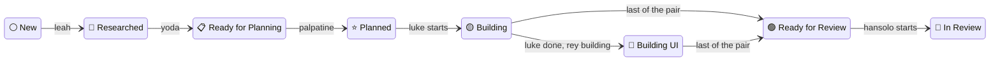

# Clean Agent Boundaries and Transitions Implementation Plan

> **For agentic workers:** REQUIRED SUB-SKILL: Use superpowers:subagent-driven-development (recommended) or superpowers:executing-plans to implement this plan task-by-task. Steps use checkbox (`- [ ]`) syntax for tracking.

**Goal:** An agent says in its own document when it started, what it achieved and who comes next; the harness reads that, renames the folder, starts the successor within a second of the process ending, warns before the clock runs out, and shows all of it on a two-bar terminal screen with a kill/extend dialog.

**Architecture:** Three new seams replace inference with statements. `Ledger` parses and renders the dated notes agents append to `spec.md`, `plan.md`, `plan-backend.md`, `plan-frontend.md` and `pull-requests.md`. `Dispatcher` is the loop: a one-second tick that polls running agents' documents, settles finished processes against the state machine, and starts what is dispatchable, persisting every stage to `.plans/tmp/agentilda-state.json` so a killed harness restarts where it stood. `Screen` and `Console` draw the table and take the keys; `Clock` writes the warnings and, sixty seconds past the deadline, the kill. `Child` replaces `TTY::Command` for agent processes so the harness owns the pid it kills.

**Tech Stack:** Ruby 4.0.6 under rbenv, RSpec with `PlansFixture` real-directory trees, `standardrb`, `tty-cursor`/`tty-screen`/`tty-box`/`pastel` (all already in the bundle), `aasm`.

**Spec:** `.plans/001.00-⚪️--clean-agent-bondaries-and-transitions/spec.md`, as settled in the grilling of 2026-09-05 (answers A1 to A20). The design document under `docs/specs/` is not a source for this plan.

## Global constraints

- Every Ruby command runs as `eval "$(rbenv init -)" && bundle exec ...`. There is no `.ruby-version` guard in the shell.
- Baseline before this work: `867 examples, 9 failures, 3 pending`. The 9 failures are all in `spec/agentilda/runner_spec.rb` "publishing once the agent renames its own folder" and `spec/agentilda/cli/run_spec.rb:196`, caused by nobody handling 🎨 since luke and rey were paired. Task 10 replaces those examples. Any other failure is yours.
- `standard` style. Endless methods, `Data.define` for values, YARD on public methods, comments that name the failure they prevent.
- STDOUT carries the deliverable, STDERR carries progress. Nothing new prints to STDOUT except the closing report.
- No em dashes, no unicode quotes, in code comments, prompts, docs or ledger text. Use a plain hyphen.
- Placeholder people are `Alan Turing <alan.turing@manchester.edu>` and `example.com`.
- The ledger grammar (A1): one `> [!NOTE]` block per agent per document, one entry per line, `[<ts>] [ agent: <name>   status: <Started|Completed|Almost completed|Interrupted|Blocked>, round N (<note>) ]`, and `[<ts>] [ next: <name> ]` only after `Completed`. Timestamp format `%Y-%m-%d %I:%M:%S %p %Z`.
- The harness is the only thing that renames a plan folder (A4). No agent prompt may say `git mv`.
- Successors start only after the predecessor's process has exited (A6).
- Models and efforts (A18): leah haiku/xhigh, yoda sonnet/xhigh, palpatine opus/xhigh, luke and rey fable/xhigh, hansolo opus/high, lando sonnet. Timeouts (A13): yoda 300, palpatine 600, luke and rey 1200, hansolo 300, leah 1200, lando unset.
- Kill (A16): `STOP` into the control file, 15 seconds, `SIGKILL`. Timeout (A9): `WARN` at T-10m and T-5m, `WRAP_UP` at T-1m, `STOP` at T-0, `SIGKILL` at T+60s.
- After a kill or timeout (A17) the harness checks the invariant of the state the agent was advancing to; when it holds the harness signs `Completed` for the agent with a bold `Interrupted` line above it.
- Commit after every task with a subject of 50 characters or fewer, imperative mood, the body explaining why. Commits end with `Co-Authored-By: Claude Fable 5.1 <noreply@anthropic.com>` and the session line the harness supplies.

______________________________________________________________________

## File structure

| File | Responsibility |
| :--- | :--- |
| `lib/agentilda/ledger.rb` (new) | The one regex, `Entry`, `Handoff`, `Problem`, `Reading`; parse a document, render a block, append a block, find an agent's trailing entry |
| `lib/agentilda/agent.rb` | Frontmatter gains `ledger:`, `rounds:`, `effort:`, `starts_as:`, `holds_at:`; `Agent#role` |
| `agents/*.md` | New frontmatter values; prompts lose `git mv`, gain nothing (the ledger paragraph comes from the executor) |
| `lib/agentilda/status.rb` | 📋 `:ready_for_planning`; ⭐️ Planned requires a heading in `plan.md`; `PLAN_HEADING` |
| `lib/agentilda/state_machine.rb` | Spine 🔎 → 📋 → ⭐️; `ready_to_plan` event; `submit` from 🟡 and 🔴 too |
| `lib/agentilda/linear/mapping.rb` | `ready_for_planning` placement |
| `lib/agentilda/pull_request.rb` | `PullRequests.upsert` keeps everything that is not the table |
| `lib/agentilda/child.rb` (new) | Spawn `claude`, stream its stdout, own its pid, kill it |
| `lib/agentilda/clock.rb` (new) | Deadline, the WARN/WRAP_UP/STOP moments, `extend!`, the expiry callback |
| `lib/agentilda/executor.rb` | Uses `Child` and `Clock`; `Handle` for kill/extend; `--brief`, `--effort`; `ledger_section`; `timeout_for` is a `min` |
| `lib/agentilda/transcript.rb` | `SendUserMessage` becomes `Progress#message` |
| `lib/agentilda/state_file.rb` (new) | `.plans/tmp/agentilda-state.json`: run heartbeat, stages, stranded detection, `.gitignore` line |
| `lib/agentilda/dispatcher.rb` (new) | The tick: poll, settle, promote, chain, rerun, verify-and-sign, dispatch, kill, extend |
| `lib/agentilda/runner.rb` | `Attempt` gains `round`, `file`, `model`; `Runner#call` drives the `Dispatcher`; publishing on the pair's last `Completed` |
| `lib/agentilda/screen.rb` (new) | Draws the two bars, the header, the rows, the dialog and the help onto a `TTY::Cursor` screen |
| `lib/agentilda/console.rb` (new) | Selection, pending changes, ENTER/ESC; the object the keyboard talks to |
| `lib/agentilda/keyboard.rb` | `s`, arrows, `k`, `x`, ENTER, ESC; help lists them |
| `lib/agentilda/cli/run/run.rb` | `--rounds` is a cap; `--chain` gone; state file; report per attempt |
| `lib/agentilda/brief.rb` | The prompt says fifty seconds |
| `README.md`, `docs/WORKFLOW.md` | 📋 in the pipeline, the agents table, the keys, the ledger |
| `.standard.yml` (new), `.gitignore` | `standardrb` stops walking up to `~/.standard.yml`; `.plans/tmp/` ignored |

______________________________________________________________________

### Task 1: The ledger

**Files:**

- Create: `lib/agentilda/ledger.rb`
- Modify: `lib/agentilda.rb` (add `ledger` to the require list, after `status`)
- Test: `spec/agentilda/ledger_spec.rb`

**Interfaces:**

- Produces: `Agentilda::Ledger::STATUSES`, `Agentilda::Ledger::Entry` (`at`, `agent`, `status`, `round`, `note`, `file`, `line`, `bold`), `Ledger::Handoff` (`at`, `next`, `file`, `line`), `Ledger::Problem` (`file`, `line`, `text`), `Ledger::Reading` (`entries`, `handoffs`, `problems`), `Ledger.parse(text, file:)`, `Ledger.read(dir, files)`, `Ledger.timestamp(time)`, `Ledger.parse_time(text)`, `Ledger.render(entry)`, `Ledger.render_handoff(handoff)`, `Ledger.block(*lines)`, `Ledger.append(path, *lines)`, `Ledger.last_for(reading, agent)`, `Ledger.handoff_after(reading, entry)`, `Ledger.stripped(text)`.

- [ ] **Step 1: Write the failing spec**

```ruby
# frozen_string_literal: true

RSpec.describe Agentilda::Ledger do
  let(:document) do
    <<~MARKDOWN
      # A Feature

      ## Research

      > [!NOTE]
      >
      > [2026-09-04 11:29:20 AM PDT] [ agent: leah-researcher   status: Started, round 1 ]

      What was found.

      > [!NOTE]
      >
      > [2026-09-04 11:44:03 AM PDT] [ agent: leah-researcher   status: Completed, round 1 ]
      > [2026-09-04 11:44:04 AM PDT] [ next: yoda-writer ]
    MARKDOWN
  end

  describe ".parse" do
    subject(:reading) { described_class.parse(document, file: "spec.md") }

    it "reads every entry in document order, with its file and line" do
      expect(reading.entries.map { |e| [e.agent, e.status, e.round, e.line] })
        .to eq([["leah-researcher", "Started", 1, 7], ["leah-researcher", "Completed", 1, 13]])
      expect(reading.entries.map(&:file).uniq).to eq(["spec.md"])
    end

    it "reads the handoff as its own kind of line" do
      expect(reading.handoffs.map { |h| [h.next, h.line] }).to eq([["yoda-writer", 14]])
    end

    it "parses the timestamp into a Time" do
      expect(reading.entries.first.at).to be_a(Time)
      expect(reading.entries.first.at.hour).to eq(11)
    end

    it "keeps a parenthesised note" do
      text = "> [2026-09-04 11:44:03 AM PDT] [ agent: hansolo-reviewer   status: Completed, round 2 (rejected 1/2) ]"
      entry = described_class.parse(text, file: "pull-requests.md").entries.first
      expect(entry.note).to eq("rejected 1/2")
    end

    it "accepts a bold status, and says the entry was bold" do
      text = "> [2026-09-04 11:52:07 AM PDT] [ agent: leah-researcher   status: **Interrupted, round 1 (killed by harness after 15s grace)** ]"
      entry = described_class.parse(text, file: "spec.md").entries.first
      aggregate_failures do
        expect(entry.status).to eq("Interrupted")
        expect(entry.note).to eq("killed by harness after 15s grace")
        expect(entry.bold).to be(true)
      end
    end

    # A closed vocabulary. A verb outside it is an error to show, not a
    # line to skip: an agent that writes "Done" has said nothing the
    # harness can act on, and silence here would look like a stall.
    it "reports a line that tries to be an entry and fails as a problem, not as nothing" do
      text = "> [2026-09-04 11:44:03 AM PDT] [ agent: leah-researcher   status: Done, round 1 ]"
      reading = described_class.parse(text, file: "spec.md")
      aggregate_failures do
        expect(reading.entries).to be_empty
        expect(reading.problems.map { |p| [p.file, p.line] }).to eq([["spec.md", 1]])
      end
    end

    it "ignores ordinary blockquotes" do
      reading = described_class.parse("> just a quote\n> [!NOTE]\n> another", file: "spec.md")
      expect(reading.entries + reading.handoffs + reading.problems).to be_empty
    end
  end

  describe ".read", :tree do
    it "reads the files in the order given and skips the ones that do not exist" do
      path = plans { |t| t.plan "001.00", :new, "x", files: {"spec.md" => document} }
      dir = File.join(path, "001.00-⚪️--x")
      reading = described_class.read(dir, %w[plan-backend.md spec.md])
      expect(reading.entries.map(&:file).uniq).to eq(["spec.md"])
    end
  end

  describe ".last_for" do
    it "returns the agent's latest entry by timestamp, then by file order, then by line" do
      early = "> [2026-09-04 11:00:00 AM PDT] [ agent: luke-backend   status: Completed, round 1 ]"
      late = "> [2026-09-04 11:30:00 AM PDT] [ agent: luke-backend   status: Started, round 1 ]"
      reading = described_class::Reading.new(
        entries: described_class.parse(late, file: "pull-requests.md").entries +
          described_class.parse(early, file: "plan-backend.md").entries,
        handoffs: [], problems: []
      )
      expect(described_class.last_for(reading, "luke-backend").status).to eq("Started")
    end

    it "is nil for an agent that never wrote" do
      reading = described_class.parse(document, file: "spec.md")
      expect(described_class.last_for(reading, "yoda-writer")).to be_nil
    end
  end

  describe ".handoff_after" do
    it "finds the next: line directly after a Completed entry in the same file" do
      reading = described_class.parse(document, file: "spec.md")
      completed = reading.entries.last
      expect(described_class.handoff_after(reading, completed).next).to eq("yoda-writer")
    end

    it "does not attach a next: line that follows a different entry" do
      text = <<~MD
        > [2026-09-04 11:44:03 AM PDT] [ agent: leah-researcher   status: Completed, round 1 ]
        > [2026-09-04 11:50:00 AM PDT] [ agent: yoda-writer   status: Started, round 1 ]
        > [2026-09-04 11:50:01 AM PDT] [ next: palpatine-planner ]
      MD
      reading = described_class.parse(text, file: "spec.md")
      expect(described_class.handoff_after(reading, reading.entries.first)).to be_nil
    end
  end

  describe ".render and .block" do
    it "round-trips an entry through the parser" do
      entry = described_class::Entry.new(at: Time.new(2026, 9, 4, 11, 29, 20), agent: "leah-researcher",
        status: "Started", round: 1, note: nil, file: "spec.md", line: 0, bold: false)
      text = described_class.render(entry)
      back = described_class.parse(text, file: "spec.md").entries.first
      expect(back.with(file: "spec.md", line: 1, at: back.at)).to eq(entry.with(line: 1, at: back.at))
      expect(text).to start_with("> [2026-09-04 11:29:20 AM ")
    end

    it "wraps lines in a NOTE alert with the blank quote line GitHub wants" do
      expect(described_class.block("> a", "> b")).to eq("> [!NOTE]\n>\n> a\n> b\n")
    end
  end

  describe ".append", :tree do
    it "appends a NOTE block, separated by a blank line, creating the file when missing" do
      path = File.join(plans_root, "pull-requests.md")
      described_class.append(path, "> one")
      described_class.append(path, "> two")
      expect(File.read(path)).to eq("> [!NOTE]\n>\n> one\n\n> [!NOTE]\n>\n> two\n")
    end
  end

  describe ".stripped" do
    it "removes ledger blocks so a document can be judged by what it says" do
      expect(described_class.stripped(document)).not_to include("[ agent:")
      expect(described_class.stripped(document)).to include("What was found.")
    end
  end
end
```

- [ ] **Step 2: Run it to see it fail**

Run: `eval "$(rbenv init -)" && bundle exec rspec spec/agentilda/ledger_spec.rb`
Expected: `uninitialized constant Agentilda::Ledger`

- [ ] **Step 3: Write the module**

```ruby
# frozen_string_literal: true

require "time"

module Agentilda
  # The dated notes an agent leaves in the document it owns.
  #
  # This is the only place in the codebase that knows the syntax. The
  # dispatcher reads it to learn whether an agent finished and who it named
  # next; the state file records it; the screen paints it. An agent writes
  # one entry when it starts and one when it stops, in a GitHub NOTE alert,
  # one entry per line:
  #
  #   > [!NOTE]
  #   >
  #   > [2026-09-04 11:29:20 AM PDT] [ agent: leah-researcher   status: Started, round 1 ]
  #   > [2026-09-04 11:44:03 AM PDT] [ agent: leah-researcher   status: Completed, round 1 ]
  #   > [2026-09-04 11:44:04 AM PDT] [ next: yoda-writer ]
  #
  # The verbs are a closed set. A line that looks like an entry but does not
  # parse is reported as a {Problem}, never dropped, because an agent that
  # wrote "Done" has said nothing the harness can act on and silence would
  # read as a stall.
  module Ledger
    # Everything an agent may claim. `Completed` is the only verb a `next:`
    # line may follow.
    STATUSES = ["Started", "Completed", "Almost completed", "Interrupted", "Blocked"].freeze

    # Local time with the zone spelled out, so an entry written on one
    # machine reads correctly on another.
    TIME_FORMAT = "%Y-%m-%d %I:%M:%S %p %Z"

    # An entry. `**` around the status is how the harness marks the one line
    # it writes itself, the Interrupted that precedes a signature.
    ENTRY = /\A>\s*\[(?<at>[^\]]+)\]\s*\[\s*agent:\s*(?<agent>[\w-]+)\s+status:\s*(?<bold>\*\*)?
      (?<status>#{STATUSES.map { |s| Regexp.escape(s) }.join("|")}),\s*round\s*(?<round>\d+)
      (?:\s*\((?<note>[^)]*)\))?\s*(?:\*\*)?\s*\]\s*\z/x

    # The handoff line.
    NEXT = /\A>\s*\[(?<at>[^\]]+)\]\s*\[\s*next:\s*(?<next>[\w-]+)\s*\]\s*\z/

    # A line that is trying to be one of the two above. Anything matching
    # this and neither of those is a {Problem}.
    ATTEMPT = /\A>\s*\[[^\]]+\]\s*\[/

    # The whole alert block, for {.stripped}.
    BLOCK = /^[ \t]*>[ \t]*\[!NOTE\][ \t]*\n(?:[ \t]*>.*\n?)*/

    # @!attribute [r] at
    #   @return [Time]
    # @!attribute [r] agent
    #   @return [String] the definition's name, `leah-researcher`
    # @!attribute [r] status
    #   @return [String] one of {STATUSES}
    # @!attribute [r] round
    #   @return [Integer]
    # @!attribute [r] note
    #   @return [String, nil] the parenthesised tail, `rejected 1/2`
    # @!attribute [r] file
    #   @return [String] the document it was read from
    # @!attribute [r] line
    #   @return [Integer] 1-based
    # @!attribute [r] bold
    #   @return [Boolean] written `**bold**`, which only the harness does
    Entry = Data.define(:at, :agent, :status, :round, :note, :file, :line, :bold) do
      def initialize(note: nil, bold: false, **rest) = super

      # @return [Boolean]
      def completed? = status == "Completed"

      # @return [Boolean] whether the agent gets another round
      def retry? = ["Almost completed", "Interrupted"].include?(status)

      # @return [Boolean]
      def blocked? = status == "Blocked"
    end

    # @!attribute [r] next
    #   @return [String] the agent named
    Handoff = Data.define(:at, :next, :file, :line)

    # @!attribute [r] text
    #   @return [String] the line as written
    Problem = Data.define(:file, :line, :text)

    # What one read of a plan folder yielded.
    Reading = Data.define(:entries, :handoffs, :problems) do
      # @return [Agentilda::Ledger::Reading]
      def self.empty = new(entries: [], handoffs: [], problems: [])

      # @param other [Agentilda::Ledger::Reading]
      # @return [Agentilda::Ledger::Reading]
      def +(other)
        self.class.new(entries: entries + other.entries, handoffs: handoffs + other.handoffs,
          problems: problems + other.problems)
      end
    end

    class << self
      # @param text [String] a whole document
      # @param file [String] its name, carried on every entry
      # @return [Agentilda::Ledger::Reading]
      def parse(text, file:)
        entries = []
        handoffs = []
        problems = []
        text.to_s.each_line.with_index(1) do |raw, line|
          stripped = raw.chomp
          if (m = ENTRY.match(stripped))
            entries << Entry.new(at: parse_time(m[:at]), agent: m[:agent], status: m[:status],
              round: m[:round].to_i, note: m[:note]&.strip, file:, line:, bold: !m[:bold].nil?)
          elsif (m = NEXT.match(stripped))
            handoffs << Handoff.new(at: parse_time(m[:at]), next: m[:next], file:, line:)
          elsif ATTEMPT.match?(stripped)
            problems << Problem.new(file:, line:, text: stripped.strip)
          end
        end
        Reading.new(entries:, handoffs:, problems:)
      end

      # Every document an agent may sign, in the order its definition lists
      # them. A missing file is not a problem; an agent that has not reached
      # `pull-requests.md` yet has not written it.
      #
      # @param dir [String] the plan folder
      # @param files [Array<String>]
      # @return [Agentilda::Ledger::Reading]
      def read(dir, files)
        files.each_with_index.reduce(Reading.empty) do |reading, (name, index)|
          path = File.join(dir, name)
          next reading unless File.file?(path)

          found = parse(File.read(path, encoding: "UTF-8"), file: name)
          reading + Reading.new(entries: found.entries.map { |e| e.with(file: name) },
            handoffs: found.handoffs, problems: found.problems)
        end
      end

      # @param time [Time]
      # @return [String]
      def timestamp(time = Time.now) = time.strftime(TIME_FORMAT)

      # Agents write what `date` prints, and `Time.strptime` cannot read a
      # zone abbreviation back into an offset. The abbreviation is dropped
      # and the time read as local, which is right on the machine that wrote
      # it and off by a zone anywhere else, which the tick tolerates: entries
      # are compared with each other, never with the wall clock.
      #
      # @param text [String]
      # @return [Time]
      def parse_time(text)
        Time.strptime(text.to_s.strip.sub(/\s+[A-Z]{2,5}\z/, ""), "%Y-%m-%d %I:%M:%S %p")
      rescue ArgumentError
        Time.at(0)
      end

      # @param entry [Agentilda::Ledger::Entry]
      # @return [String] one quoted line, no newline
      def render(entry)
        tail = entry.note ? " (#{entry.note})" : ""
        body = "#{entry.status}, round #{entry.round}#{tail}"
        body = "**#{body}**" if entry.bold
        "> [#{timestamp(entry.at)}] [ agent: #{entry.agent}   status: #{body} ]"
      end

      # @param handoff [Agentilda::Ledger::Handoff]
      # @return [String]
      def render_handoff(handoff) = "> [#{timestamp(handoff.at)}] [ next: #{handoff.next} ]"

      # @param lines [Array<String>] already quoted
      # @return [String] a NOTE alert, newline-terminated
      def block(*lines) = (["> [!NOTE]", ">"] + lines.flatten).join("\n") + "\n"

      # Append one block. Separated from what is there by a blank line so the
      # alert renders as its own block rather than merging into a paragraph.
      #
      # @param path [String]
      # @param lines [Array<String>]
      # @return [void]
      def append(path, *lines)
        existing = File.file?(path) ? File.read(path, encoding: "UTF-8") : ""
        glue = if existing.empty?
          ""
        elsif existing.end_with?("\n\n")
          ""
        elsif existing.end_with?("\n")
          "\n"
        else
          "\n\n"
        end
        File.write(path, existing + glue + block(*lines))
      end

      # The entry that tells the harness where this agent stands: the latest
      # by clock, then by the order its documents are listed, then by line.
      #
      # @param reading [Agentilda::Ledger::Reading]
      # @param agent [String]
      # @return [Agentilda::Ledger::Entry, nil]
      def last_for(reading, agent)
        files = reading.entries.map(&:file).uniq
        reading.entries.select { |e| e.agent == agent }
          .max_by { |e| [e.at, files.index(e.file), e.line] }
      end

      # The `next:` that belongs to an entry: same file, a later line, and no
      # other entry between the two. A handoff written under somebody else's
      # entry is not this agent's handoff.
      #
      # @param reading [Agentilda::Ledger::Reading]
      # @param entry [Agentilda::Ledger::Entry]
      # @return [Agentilda::Ledger::Handoff, nil]
      def handoff_after(reading, entry)
        candidates = reading.handoffs.select { |h| h.file == entry.file && h.line > entry.line }
        handoff = candidates.min_by(&:line) or return nil
        between = reading.entries.any? { |e| e.file == entry.file && e.line > entry.line && e.line < handoff.line }
        between ? nil : handoff
      end

      # @param text [String]
      # @return [String] the document without its ledger blocks
      def stripped(text) = text.to_s.gsub(BLOCK, "")
    end
  end
end
```

- [ ] **Step 4: Register it and run the spec**

In `lib/agentilda.rb`, add `ledger` to the `%w[...]` list on the line after `status`.

Run: `eval "$(rbenv init -)" && bundle exec rspec spec/agentilda/ledger_spec.rb`
Expected: all green.

- [ ] **Step 5: Commit**

```bash
git add lib/agentilda/ledger.rb lib/agentilda.rb spec/agentilda/ledger_spec.rb
git commit -m "Add the ledger agents sign their documents with"
```

______________________________________________________________________

### Task 2: Agent frontmatter

**Files:**

- Modify: `lib/agentilda/agent.rb`
- Modify: `agents/leah-researcher.md`, `agents/yoda-writer.md`, `agents/palpatine-planner.md`, `agents/luke-backend.md`, `agents/rey-frontend.md`, `agents/hansolo-reviewer.md`, `agents/lando-broker.md` (frontmatter only in this task)
- Test: `spec/agentilda/agents_spec.rb`

**Interfaces:**

- Produces: `Agent#ledger` (`Array<String>`), `Agent#rounds` (`Integer`, 1..5), `Agent#effort` (`String, nil`), `Agent#starts_as` (`Symbol, nil`), `Agent#holds_at` (`Symbol, nil`), `Agent#role` (`String`), `Agent::MAX_ROUNDS = 5`.

- [ ] **Step 1: Write the failing examples**

Append to `spec/agentilda/agents_spec.rb`, inside the top-level `describe`:

```ruby
  describe "the ledger, rounds, effort and the rename hooks" do
    let(:agents) { described_class.new }

    it "lists the documents each agent signs, in order" do
      aggregate_failures do
        expect(agents.find("leah-researcher").ledger).to eq(%w[spec.md])
        expect(agents.find("luke-backend").ledger).to eq(%w[plan-backend.md pull-requests.md])
        expect(agents.find("rey-frontend").ledger).to eq(%w[plan-frontend.md pull-requests.md])
        expect(agents.find("hansolo-reviewer").ledger).to eq(%w[pull-requests.md])
        expect(agents.find("lando-broker").ledger).to eq(%w[plan.md])
      end
    end

    it "defaults rounds to one and caps them at five" do
      Dir.mktmpdir do |dir|
        File.write(File.join(dir, "a.md"), "---\nname: a\nhandles: [new]\nrounds: 9\n---\nbody")
        File.write(File.join(dir, "b.md"), "---\nname: b\nhandles: [new]\n---\nbody")
        roster = described_class.new(dir:)
        expect(roster.find("a").rounds).to eq(described_class::MAX_ROUNDS)
        expect(roster.find("b").rounds).to eq(1)
      end
    end

    it "reads the model and effort the definitions declare" do
      aggregate_failures do
        expect(agents.find("leah-researcher").model).to eq("haiku")
        expect(agents.find("leah-researcher").effort).to eq("xhigh")
        expect(agents.find("hansolo-reviewer").effort).to eq("high")
        expect(agents.find("lando-broker").effort).to be_nil
      end
    end

    it "reads the timeouts as settled" do
      expect(agents.all.to_h { |a| [a.name, a.timeout] }).to include(
        "yoda-writer" => 300, "palpatine-planner" => 600, "luke-backend" => 1200,
        "rey-frontend" => 1200, "hansolo-reviewer" => 300, "leah-researcher" => 1200
      )
    end

    it "knows the state luke starts a plan into and the one it holds at while rey is still building" do
      luke = agents.find("luke-backend")
      expect([luke.starts_as, luke.holds_at]).to eq(%i[building building_ui])
      expect(agents.find("rey-frontend").starts_as).to be_nil
    end

    it "gives hansolo in_review as the state a review starts in" do
      expect(agents.find("hansolo-reviewer").starts_as).to eq(:in_review)
    end

    it "strips the name to the role for the screen" do
      expect(agents.find("palpatine-planner").role).to eq("planner")
    end
  end
```

- [ ] **Step 2: Run to see them fail**

Run: `eval "$(rbenv init -)" && bundle exec rspec spec/agentilda/agents_spec.rb`
Expected: `NoMethodError: undefined method 'ledger'` and friends.

- [ ] **Step 3: Extend `Agent` and `Agents#parse`**

In `lib/agentilda/agent.rb` replace the `Agent = Data.define(...)` block with:

```ruby
  # @!attribute [r] ledger
  #   @return [Array<String>] the documents this agent signs, in the order
  #     it reaches them; the last entry it wrote is where it stands
  # @!attribute [r] rounds
  #   @return [Integer] how many times it may be invoked on one plan in one
  #     state before the plan parks; a Completed never earns another
  # @!attribute [r] effort
  #   @return [String, nil] passed to `claude --effort`
  # @!attribute [r] starts_as
  #   @return [Symbol, nil] the state the harness renames the plan into the
  #     moment this agent is dispatched, where the topology permits it
  # @!attribute [r] holds_at
  #   @return [Symbol, nil] the state the plan takes when this agent completes
  #     while its partner on the same plan is still running
  Agent = Data.define(:name, :description, :handles, :advances_to, :model,
    :allowed_tools, :may, :network, :timeout, :prompt, :path,
    :ledger, :rounds, :effort, :starts_as, :holds_at) do
    def initialize(ledger: [], rounds: 1, effort: nil, starts_as: nil, holds_at: nil, **rest) = super

    # @return [Boolean] whether this agent changes anything on disk
    def read_only? = advances_to.nil?

    # @param status [Agentilda::Status]
    # @return [Boolean]
    def handles?(status) = handles.include?(status.key)

    # The word after the hyphen: `researcher`, `backend`. What the screen's
    # agent column shows, the name being too long for it.
    #
    # @return [String]
    def role = name.split("-", 2).last.to_s
  end
```

Add above `class Agents`:

```ruby
  # More rounds than this costs tokens and buys nothing: an agent that has
  # not finished in five tries is not going to on the sixth.
  Agent::MAX_ROUNDS = 5
```

In `Agents#parse` add to the `Agent.new(...)` call:

```ruby
        ledger: Array(meta["ledger"]).map(&:to_s),
        rounds: meta["rounds"].to_i.clamp(1, Agent::MAX_ROUNDS),
        effort: meta["effort"]&.to_s,
        starts_as: symbol_or_nil(meta["starts_as"]),
        holds_at: symbol_or_nil(meta["holds_at"]),
```

and the helper, private, under `parse`:

```ruby
    # @param value [Object, nil]
    # @return [Symbol, nil]
    def symbol_or_nil(value) = value.to_s.empty? ? nil : value.to_s.to_sym
```

Note `rounds: meta["rounds"].to_i.clamp(1, 5)` turns an absent key (`nil.to_i == 0`) into 1.

- [ ] **Step 4: Rewrite the seven frontmatter blocks**

Replace each file's frontmatter (the part between the `---` lines) with the following. Bodies stay untouched in this task.

`agents/leah-researcher.md`:

```yaml
name: leah-researcher
description: Researches a topic across many sources at once and expands a bare spec.md into something planners can work from.
handles: [new]
advances_to: researched
model: haiku
effort: xhigh
network: true
timeout: 1200
ledger: [spec.md]
allowed_tools: [Read, Grep, Glob, Bash, Write, Edit, Task, WebSearch, WebFetch]
writes: [spec.md, blocked.md]
```

`agents/yoda-writer.md`:

```yaml
name: yoda-writer
description: Turns a researched spec.md into a complete specification and leaves a blank plan.md for the planner.
handles: [researched, retroactive]
advances_to: ready_for_planning
model: sonnet
effort: xhigh
timeout: 300
ledger: [spec.md]
allowed_tools: [Read, Grep, Glob, Bash, Write, Edit, Task, Skill, WebSearch, WebFetch]
writes: [spec.md, plan.md, blocked.md]
```

`agents/palpatine-planner.md`:

```yaml
name: palpatine-planner
description: Turns a signed-off specification into concurrently executable work units.
handles: [ready_for_planning]
advances_to: planned
model: opus
effort: xhigh
timeout: 600
ledger: [plan.md]
allowed_tools: [Read, Grep, Glob, Bash, Write, Edit, Skill]
writes: [plan.md, plan-backend.md, plan-frontend.md, blocked.md]
```

`agents/luke-backend.md`:

```yaml
name: luke-backend
description: Builds the back-end half of a plan, paired with rey-frontend working the front-end half at the same time, in the same worktree, toward one joint pull request.
handles: [planned, building, rejected]
advances_to: ready_for_review
starts_as: building
holds_at: building_ui
model: fable
effort: xhigh
timeout: 1200
ledger: [plan-backend.md, pull-requests.md]
allowed_tools: [Read, Grep, Glob, Bash, Write, Edit, Task, SendMessage, ListAgents]
writes: ["**/*"]
```

`agents/rey-frontend.md`:

```yaml
name: rey-frontend
description: Builds the front-end half of a plan, paired with luke-backend working the back-end half at the same time, in the same worktree, toward one joint pull request.
handles: [planned, building, rejected]
advances_to: ready_for_review
model: fable
effort: xhigh
timeout: 1200
ledger: [plan-frontend.md, pull-requests.md]
allowed_tools: [Read, Grep, Glob, Bash, Write, Edit, Skill, Task, SendMessage, ListAgents]
writes: ["**/*"]
```

`agents/hansolo-reviewer.md`:

```yaml
name: hansolo-reviewer
description: Adversarially checks a plan's documents and diff against what was asked.
handles: [ready_for_review, in_review]
advances_to: approved
starts_as: in_review
model: opus
effort: high
timeout: 300
ledger: [pull-requests.md]
allowed_tools: [Read, Grep, Glob, Bash, Write, Edit]
may: [gh pr review, gh pr comment]
writes: [rewrite.md, pull-requests.md]
```

`agents/lando-broker.md`:

```yaml
name: lando-broker
description: Folds answered blocks into the documents they were stopping, and retires blocked.md once the last question clears.
handles: [blocked, product_blocked]
advances_to: planned
model: sonnet
ledger: [plan.md]
allowed_tools: [Read, Grep, Glob, Bash, Write, Edit]
writes: [spec.md, plan.md, blocked.md]
```

- [ ] **Step 5: Run the spec, then the whole suite**

Run: `eval "$(rbenv init -)" && bundle exec rspec spec/agentilda/agents_spec.rb`
Expected: green.

Run: `eval "$(rbenv init -)" && bundle exec rspec`
Expected: the executor example "runs the model the agent's frontmatter declares" now fails because yoda is `sonnet`; change its expectation to `["--model", "sonnet"]`. Expected count afterwards: baseline failures only (the 9 named above), plus whichever `runner_spec` examples assume palpatine handles `planned`. Leave those; Task 10 rewrites `runner_spec.rb` whole.

- [ ] **Step 6: Commit**

```bash
git add lib/agentilda/agent.rb agents/ spec/agentilda/agents_spec.rb spec/agentilda/executor_spec.rb
git commit -m "Give agents a ledger, rounds, effort and rename hooks"
```

______________________________________________________________________

### Task 3: 📋 Ready for Planning

**Files:**

- Modify: `lib/agentilda/status.rb`
- Modify: `lib/agentilda/state_machine.rb`
- Modify: `lib/agentilda/linear/mapping.rb`
- Test: `spec/agentilda/state_machine_spec.rb`, `spec/agentilda/linear/mapping_spec.rb` (existing "every status placed once" example must stay green)

**Interfaces:**

- Produces: `Agentilda::PLAN_HEADING`, status `:ready_for_planning` with emoji `📋`, event `:ready_to_plan`, `StateMachine::SPINE[:researched] == :ready_for_planning`.

- [ ] **Step 1: Write the failing examples**

Append inside `RSpec.describe Agentilda::StateMachine`:

```ruby
  describe "📋 Ready for Planning" do
    it "sits on the spine between researched and planned" do
      expect(described_class::SPINE[:researched]).to eq(:ready_for_planning)
      expect(described_class::SPINE[:ready_for_planning]).to eq(:planned)
    end

    it "is justified by a spec and a plan.md that holds no plan yet", :tree do
      path = plans { |t|
        t.plan "020.00", :researched, "qualified", files: {
          "spec.md" => "#{spec_body}\n## Research\n\nFound.\n", "plan.md" => ""
        }
      }
      subject = Agentilda::Tree.new(dir: path).subjects.first
      expect(subject.best_fit.key).to eq(:ready_for_planning)
    end

    it "does not let a blank plan.md pass for ⭐️ Planned", :tree do
      path = plans { |t| t.plan "020.00", :planned, "qualified", files: {"spec.md" => spec_body, "plan.md" => ""} }
      subject = Agentilda::Tree.new(dir: path).subjects.first
      expect(subject.violation).to include("plan.md", "no work units")
    end

    it "treats a plan.md holding only a ledger note as still blank", :tree do
      note = Agentilda::Ledger.block("> [2026-09-04 11:29:20 AM PDT] [ agent: palpatine-planner   status: Started, round 1 ]")
      path = plans { |t| t.plan "020.00", :ready_for_planning, "q", files: {"spec.md" => spec_body, "plan.md" => note} }
      subject = Agentilda::Tree.new(dir: path).subjects.first
      expect(subject.best_fit.key).to eq(:ready_for_planning)
    end

    it "becomes ⭐️ once plan.md has a heading", :tree do
      path = plans { |t| t.plan "020.00", :ready_for_planning, "q", files: {"spec.md" => spec_body, "plan.md" => "# Plan\n\n## Unit 1\n"} }
      subject = Agentilda::Tree.new(dir: path).subjects.first
      expect(subject.best_fit.key).to eq(:planned)
    end

    # The 020.00 transcript: yoda finished, the folder was renamed forward,
    # and the resync renamed it straight back because nothing could enter
    # ⭐️ without a plan.md that only palpatine writes. With 📋 between them
    # the resync leaves yoda's work standing.
    it "keeps a folder yoda finished at 📋 through a resync", :tree do
      path = plans { |t|
        t.plan "020.00", :ready_for_planning, "qualified-at", files: {
          "spec.md" => "#{spec_body}\n## Research\n\nFound.\n\n## Goal\n\nShip.\n", "plan.md" => ""
        }
      }
      tree = Agentilda::Tree.new(dir: path)
      Agentilda::Resync::Dirs.new(tree:).call(commit: true)
      expect(tree.reload.subjects.first.status.key).to eq(:ready_for_planning)
    end

    it "lets the pair submit straight from 🟡 and from 🔴" do
      expect(described_class.inbound[:ready_for_review]).to include(:building, :rejected, :building_ui)
    end
  end
```

- [ ] **Step 2: Run to see them fail**

Run: `eval "$(rbenv init -)" && bundle exec rspec spec/agentilda/state_machine_spec.rb`
Expected: failures naming `:ready_for_planning`.

- [ ] **Step 3: Add the status and tighten ⭐️**

In `lib/agentilda/status.rb`, after `RESEARCH_CHAPTER`, add:

```ruby
  # What proves `plan.md` holds a plan rather than the blank file
  # `yoda-writer` leaves for `palpatine-planner`: any section heading. The
  # ledger notes are stripped first, so an agent's `Started` line does not
  # count as a plan.
  PLAN_HEADING = /^[ \t]{0,3}\#{1,3}[ \t]+\S/
```

Change the `:planned` entry to:

```ruby
    Status.new(
      key: :ready_for_planning, emoji: "📋", label: "Ready for Planning", requires: %w[spec.md plan.md],
      note: "the specification is finished; `plan.md` exists and is still blank, waiting for the planner",
      invariant: lambda { |s|
        body = Ledger.stripped(s.read("plan.md"))
        "Ready for Planning, but `plan.md` already holds a plan" if body.match?(PLAN_HEADING)
      }
    ),
    Status.new(
      key: :planned, emoji: "⭐️", label: "Planned", requires: %w[spec.md plan.md],
      note: "specified and planned; nobody has started building",
      invariant: lambda { |s|
        body = Ledger.stripped(s.read("plan.md"))
        "Planned, but `plan.md` has no work units yet" unless body.match?(PLAN_HEADING)
      }
    ),
```

In `lib/agentilda/state_machine.rb`:

- `SPINE`: change `researched: :planned` to `researched: :ready_for_planning,` and add `ready_for_planning: :planned,` after it.
- `PREFERENCE`: change `... building planned\n      researched new` to `... building planned ready_for_planning\n      researched new`.
- Add an event before `event :plan`:

```ruby
      # The specification is done and the planner has not started. Entered
      # by the harness when `yoda-writer` completes; `resync` reaches it on
      # a blank `plan.md`. Without it ⭐️ Planned required a file only the
      # agent handling ⭐️ Planned writes, and nothing could enter it.
      event :ready_to_plan, guard: :justified? do
        transitions from: %i[researched new retroactive shit blocked product_blocked deferred],
          to: :ready_for_planning
      end
```

- `event :plan` from list: add `ready_for_planning` at the front.
- `event :submit` from list becomes `%i[building building_ui rejected rolled_back]`. Update its comment: the pair lands one pull request, and whichever half finishes last carries the plan to review from wherever the folder stands.
- `event :block`, `:block_on_product`, `:defer` from lists: add `ready_for_planning` after `planned`.

In `lib/agentilda/linear/mapping.rb` add to `PLACEMENTS` after `researched`:

```ruby
      ready_for_planning: Placement.new(type: "backlog", name: "Backlog", labels: %w[spec-ready]),
```

- [ ] **Step 4: Run the machine, Linear, docs and diagram specs**

Run: `eval "$(rbenv init -)" && bundle exec rspec spec/agentilda/state_machine_spec.rb spec/agentilda/linear spec/agentilda/documentation_spec.rb spec/agentilda/diagram_spec.rb spec/agentilda/resync spec/agentilda/cli/docs_states_spec.rb`
Expected: green. If `documentation_spec` or `diagram_spec` assert a literal list of states, add 📋 in spine order.

Also fix `spec/agentilda/runner_spec.rb:31` fixture: `t.plan "001.00", :planned, ..., files: {..., "plan.md" => "# P"}` is still ⭐️ because `# P` is a heading. Leave it.

- [ ] **Step 5: Commit**

```bash
git add lib/agentilda/status.rb lib/agentilda/state_machine.rb lib/agentilda/linear/mapping.rb spec/agentilda/state_machine_spec.rb spec/agentilda/documentation_spec.rb spec/agentilda/diagram_spec.rb
git commit -m "Insert Ready for Planning between researched and planned"
```

______________________________________________________________________

### Task 4: `pull-requests.md` keeps its ledger

**Files:**

- Modify: `lib/agentilda/pull_request.rb`
- Modify: `lib/agentilda/runner.rb` (`record_pull_request` only)
- Test: `spec/agentilda/pull_requests_render_spec.rb`

**Interfaces:**

- Produces: `PullRequests.upsert(path, rows)` where `rows` is the same `Array<Hash>` `render` takes. Replaces the first pull request table in the file, or inserts one after the H1 (or at the top) when there is none, and leaves every other line, ledger blocks included, as it was.

- [ ] **Step 1: Write the failing examples**

Append to `spec/agentilda/pull_requests_render_spec.rb`:

```ruby
  describe ".upsert", :tree do
    let(:path) { File.join(plans_root, "pull-requests.md") }
    let(:rows) { [{number: 9, title: "[004.00](A) Needs a Reviewer", url: "https://github.com/example/repo/pull/9", state: "Open 🟡", body: ""}] }

    it "writes a whole document when the file does not exist" do
      described_class.upsert(path, rows)
      expect(described_class.new(dir: plans_root).all.map(&:number)).to eq(["9"])
    end

    # luke and rey sign pull-requests.md before any pull request exists. The
    # harness then records the pull request it opened, and used to rewrite
    # the file whole, which deleted their signatures.
    it "keeps ledger notes that were in the file before the table" do
      Agentilda::Ledger.append(path, "> [2026-09-04 11:29:20 AM PDT] [ agent: luke-backend   status: Started, round 1 ]")
      described_class.upsert(path, rows)
      text = File.read(path)
      aggregate_failures do
        expect(text).to include("agent: luke-backend")
        expect(described_class.new(dir: plans_root).all.map(&:number)).to eq(["9"])
      end
    end

    it "replaces an existing table in place, keeping what is above and below it" do
      File.write(path, "# Pull Requests\n\n| Pull Request Number | Pull Request Name | Status |\n| --: | :-- | --: |\n| 3 | [old](https://github.com/example/repo/pull/3) | Open 🟡 |\n\n> [!NOTE]\n>\n> [2026-09-04 11:29:20 AM PDT] [ agent: rey-frontend   status: Completed, round 1 ]\n")
      described_class.upsert(path, rows + [{number: 3, title: "old", url: "https://github.com/example/repo/pull/3", state: "Open 🟡", body: ""}])
      text = File.read(path)
      aggregate_failures do
        expect(text.scan("Pull Request Number").size).to eq(1)
        expect(text).to include("agent: rey-frontend")
        expect(described_class.new(dir: plans_root).all.map(&:number)).to contain_exactly("9", "3")
      end
    end
  end
```

- [ ] **Step 2: Run to see them fail**

Run: `eval "$(rbenv init -)" && bundle exec rspec spec/agentilda/pull_requests_render_spec.rb`
Expected: `NoMethodError: undefined method 'upsert'`.

- [ ] **Step 3: Implement `upsert`**

In `PullRequests`, after `self.render`:

```ruby
    # The table alone, for splicing into a file that already says other
    # things: the ledger blocks luke and rey write before a pull request
    # exists. Rewriting the whole file deleted their signatures.
    #
    # @param prs [Array<Hash>]
    # @return [String] header, rule and rows, newline-terminated
    def self.table(prs)
      rows = prs.map { |pr| "| #{pr[:number]} | [#{escape(pr[:title])}](#{pr[:url]}) | #{pr[:state]} |" }
      ["| Pull Request Number | Pull Request Name | Status |",
        "| ------------------: | :---------------- | -----: |", *rows].join("\n") + "\n"
    end

    # Write the table into +path+ without touching anything else there.
    #
    # @param path [String]
    # @param prs [Array<Hash>]
    # @return [void]
    def self.upsert(path, prs)
      return File.write(path, render(prs)) unless File.file?(path)

      lines = File.read(path, encoding: "UTF-8").lines
      start = lines.index { |l| l.strip.start_with?("|") && lines[lines.index(l) + 1].to_s.strip.start_with?("|") }
      if start
        stop = start
        stop += 1 while lines[stop + 1]&.strip&.start_with?("|")
        lines[start..stop] = [table(prs)]
      else
        at = lines.index { |l| l.start_with?("# ") }
        insertion = ["\n", table(prs)]
        at ? lines.insert(at + 1, *insertion) : lines.unshift("# Pull Requests\n", *insertion, "\n")
      end
      File.write(path, lines.join)
    end
```

In `Runner#record_pull_request` replace the final `File.write(...)` with:

```ruby
      PullRequests.upsert(File.join(path, PullRequests::FILENAME), rows)
```

- [ ] **Step 4: Run and commit**

Run: `eval "$(rbenv init -)" && bundle exec rspec spec/agentilda/pull_requests_render_spec.rb spec/agentilda/pull_request_spec.rb`
Expected: green.

```bash
git add lib/agentilda/pull_request.rb lib/agentilda/runner.rb spec/agentilda/pull_requests_render_spec.rb
git commit -m "Keep ledger notes when recording a pull request"
```

______________________________________________________________________

### Task 5: `Child` and `Clock`

**Files:**

- Create: `lib/agentilda/child.rb`, `lib/agentilda/clock.rb`
- Modify: `lib/agentilda.rb` (add `child` and `clock` after `control`)
- Modify: `lib/agentilda/control.rb` (add `Control.write(path, word)` and `Control::WARN`)
- Test: `spec/agentilda/child_spec.rb`, `spec/agentilda/clock_spec.rb`

**Interfaces:**

- Produces: `Child.spawn(argv, chdir: nil)` returning an object with `pid`, `each_chunk { |text| }`, `wait` (a `Process::Status`), `kill(signal = "KILL")`, `alive?`. `Clock.new(seconds:, control:, on_expire:, now:)` with `start`, `stop`, `tick`, `remaining`, `phase` (`:calm`, `:warned`, `:wrap_up`, `:stopped`, `:expired`), `extend!(seconds)`, `Clock::WARNINGS`, `Clock::GRACE`. `Control.write(path, text)`.

- [ ] **Step 1: Write the failing child spec**

```ruby
# frozen_string_literal: true

RSpec.describe Agentilda::Child do
  it "streams the child's stdout and reports its exit" do
    child = described_class.spawn(["ruby", "-e", "print 'a'; $stdout.flush; print 'b'"])
    chunks = []
    child.each_chunk { |text| chunks << text }
    status = child.wait
    aggregate_failures do
      expect(chunks.join).to eq("ab")
      expect(status).to be_success
      expect(child.pid).to be_a(Integer)
    end
  end

  it "kills a process that will not end on its own" do
    child = described_class.spawn(["ruby", "-e", "sleep 30"])
    expect(child).to be_alive
    child.kill
    status = child.wait
    aggregate_failures do
      expect(status).not_to be_success
      expect(child).not_to be_alive
    end
  end

  it "runs in the directory asked for" do
    Dir.mktmpdir do |dir|
      child = described_class.spawn(["ruby", "-e", "print Dir.pwd"], chdir: dir)
      out = +""
      child.each_chunk { |text| out << text }
      child.wait
      expect(File.realpath(out)).to eq(File.realpath(dir))
    end
  end
end
```

- [ ] **Step 2: Write the failing clock spec**

```ruby
# frozen_string_literal: true

RSpec.describe Agentilda::Clock do
  let(:control) { File.join(Dir.mktmpdir, "control") }
  let(:expired) { [] }
  let(:now) { {t: 0.0} }

  subject(:clock) do
    described_class.new(seconds: 1200, control:, on_expire: -> { expired << :yes }, now: -> { now[:t] })
  end

  before { File.write(control, "") }

  def at(seconds)
    now[:t] = seconds.to_f
    clock.tick
    File.read(control).strip
  end

  it "says nothing while there is plenty of time" do
    expect(at(0)).to eq("")
    expect(clock.phase).to eq(:calm)
  end

  it "warns ten and five minutes out, then asks for a wrap-up at one" do
    aggregate_failures do
      expect(at(600)).to eq("WARN: 10 minutes left")
      expect(at(900)).to eq("WARN: 5 minutes left")
      expect(clock.phase).to eq(:warned)
      expect(at(1140)).to eq("WRAP_UP: 1 minute left, write to disk now")
      expect(clock.phase).to eq(:wrap_up)
    end
  end

  it "writes STOP at zero and expires sixty seconds later, once" do
    at(1200)
    expect(File.read(control).strip).to eq("STOP")
    expect(clock.phase).to eq(:stopped)
    at(1259)
    expect(expired).to be_empty
    at(1260)
    at(1300)
    aggregate_failures do
      expect(expired).to eq([:yes])
      expect(clock.phase).to eq(:expired)
    end
  end

  # A five minute agent must not be told "10 minutes left" at t=0.
  it "skips warnings whose moment passed before the clock started" do
    short = described_class.new(seconds: 300, control:, on_expire: -> {}, now: -> { now[:t] })
    now[:t] = 0.0
    short.tick
    expect(File.read(control).strip).to eq("")
    now[:t] = 240.0
    short.tick
    expect(File.read(control).strip).to eq("WRAP_UP: 1 minute left, write to disk now")
  end

  it "counts down, never below zero" do
    now[:t] = 1000.0
    expect(clock.remaining).to eq(200)
    now[:t] = 5000.0
    expect(clock.remaining).to eq(0)
  end

  # `x` after the warnings: the file is cleared so the agent's next poll
  # sees a reprieve, and every moment fires again against the new deadline.
  it "extends the deadline, clears the file, and re-arms the warnings" do
    at(1140)
    clock.extend!(600)
    aggregate_failures do
      expect(File.read(control).strip).to eq("")
      expect(clock.phase).to eq(:calm)
      expect(clock.remaining).to eq(660)
      expect(at(1200)).to eq("WARN: 10 minutes left")
      expect(at(1740)).to eq("WRAP_UP: 1 minute left, write to disk now")
    end
  end
end
```

- [ ] **Step 3: Run both to see them fail**

Run: `eval "$(rbenv init -)" && bundle exec rspec spec/agentilda/child_spec.rb spec/agentilda/clock_spec.rb`
Expected: uninitialized constants.

- [ ] **Step 4: Write `Child`**

```ruby
# frozen_string_literal: true

module Agentilda
  # One `claude` process the harness started and therefore owns.
  #
  # `TTY::Command` never exposes the pid it spawned, so the executor used to
  # find its child by scraping `ps` for a fresh `claude` under this process
  # and could never safely signal it. Kill (`k`) and the sixty-second
  # backstop after STOP both need a pid that is certainly ours, so the
  # process is spawned here and the pid kept.
  #
  # stderr is folded into the same pipe as stdout: `claude` prints the cause
  # of a failure there, and the transcript keeps non-JSON lines for exactly
  # that reason.
  class Child
    # @param argv [Array<String>]
    # @param chdir [String, nil]
    # @return [Agentilda::Child]
    def self.spawn(argv, chdir: nil)
      reader, writer = IO.pipe
      options = {out: writer, err: writer, in: File::NULL}
      options[:chdir] = chdir if chdir
      pid = Process.spawn(*argv, **options)
      writer.close
      new(pid:, reader:)
    end

    # @param pid [Integer]
    # @param reader [IO]
    def initialize(pid:, reader:)
      @pid = pid
      @reader = reader
      @status = nil
    end

    # @return [Integer]
    attr_reader :pid

    # Read until the process closes its end. Runs on the caller's thread;
    # the executor reads on the same thread it always did.
    #
    # @yieldparam text [String] whatever arrived, possibly a partial line
    # @return [void]
    def each_chunk
      loop { yield @reader.readpartial(65_536) }
    rescue EOFError, IOError
      @reader.close unless @reader.closed?
    end

    # @return [Process::Status]
    def wait
      @status ||= begin
        _, status = Process.wait2(pid)
        status
      end
    rescue Errno::ECHILD
      @status
    end

    # @param signal [String]
    # @return [void]
    def kill(signal = "KILL")
      Process.kill(signal, pid)
    rescue Errno::ESRCH
      # Already gone, which is what was wanted.
    end

    # @return [Boolean]
    def alive?
      return false if @status

      Process.kill(0, pid)
      true
    rescue Errno::ESRCH
      false
    end
  end
end
```

- [ ] **Step 5: Write `Clock` and the `Control` additions**

```ruby
# frozen_string_literal: true

module Agentilda
  # The advisory clock one invocation runs against.
  #
  # It never terminates the agent on its own. It writes into the control file
  # the agent polls: a warning ten and five minutes out, a wrap-up request at
  # one, STOP at zero. Only a process still alive {GRACE} seconds after STOP
  # is killed, and that is the executor's act on this clock's say-so, so the
  # agent has every chance to write its ledger line first.
  #
  # `now` is injectable so the moments can be tested without sleeping.
  class Clock
    # Seconds before the deadline, and what the control file says then.
    # A moment already in the past when the clock starts is skipped: a five
    # minute agent told "10 minutes left" at t=0 has been lied to.
    WARNINGS = [
      [600, "WARN: 10 minutes left"],
      [300, "WARN: 5 minutes left"],
      [60, "WRAP_UP: 1 minute left, write to disk now"]
    ].freeze

    # Seconds after STOP before {#on_expire} fires.
    GRACE = 60

    # @param seconds [Integer] the budget
    # @param control [String] the invocation's control file
    # @param on_expire [Proc] called once, GRACE seconds after STOP
    # @param now [Proc] a monotonic clock reading
    def initialize(seconds:, control:, on_expire:, now: -> { UI.monotonic })
      @control = control
      @on_expire = on_expire
      @now = now
      @mutex = Mutex.new
      arm(seconds)
    end

    # @return [Integer] whole seconds left, floored at zero
    def remaining = [@deadline - @now.call, 0].max.round

    # @return [Symbol] :calm, :warned, :wrap_up, :stopped or :expired
    attr_reader :phase

    # Evaluate every moment once. Idempotent within a phase.
    #
    # @return [void]
    def tick
      @mutex.synchronize do
        left = @deadline - @now.call
        WARNINGS.each do |before, text|
          next if @fired.include?(before) || left > before

          @fired << before
          Control.write(@control, text)
          @phase = (before == 60) ? :wrap_up : :warned
        end
        if left <= 0 && !@fired.include?(:stop)
          @fired << :stop
          Control.write(@control, Control::STOP)
          @phase = :stopped
        end
        if @fired.include?(:stop) && !@fired.include?(:expired) && left <= -GRACE
          @fired << :expired
          @phase = :expired
          @on_expire.call
        end
      end
    end

    # @return [self]
    def start
      @thread ||= Thread.new do
        Thread.current.report_on_exception = false
        loop do
          tick
          break if phase == :expired

          sleep(1)
        end
      end
      self
    end

    # @return [void]
    def stop
      @thread&.kill
      @thread = nil
    end

    # Ten more minutes, or however many. The file is emptied so the next poll
    # reads a reprieve, and every moment is re-armed against the new deadline.
    #
    # @param seconds [Integer]
    # @return [void]
    def extend!(seconds)
      @mutex.synchronize do
        @deadline += seconds
        @fired = []
        @phase = :calm
        Control.write(@control, "")
      end
    end

    private

    # @param seconds [Integer]
    # @return [void]
    def arm(seconds)
      @deadline = @now.call + seconds
      @fired = WARNINGS.map(&:first).select { |before| before >= seconds }
      @phase = :calm
    end
  end
end
```

In `lib/agentilda/control.rb` add after `STOP = "STOP"`:

```ruby
    # The clock's warnings start with this; the agent's prompt explains them.
    WARN = "WARN"
```

and a public class method after `release`:

```ruby
      # One line into one file, from the clock. Not a broadcast: a warning is
      # about one agent's own deadline.
      #
      # @param path [String]
      # @param text [String]
      # @return [void]
      def write(path, text)
        File.write(path, text.empty? ? "" : "#{text}\n")
      rescue SystemCallError
        # The invocation finished and released its file; nothing to warn.
      end
```

Register `child` and `clock` in `lib/agentilda.rb` after `control`.

- [ ] **Step 6: Run, then commit**

Run: `eval "$(rbenv init -)" && bundle exec rspec spec/agentilda/child_spec.rb spec/agentilda/clock_spec.rb spec/agentilda/control_spec.rb`
Expected: green.

```bash
git add lib/agentilda/child.rb lib/agentilda/clock.rb lib/agentilda/control.rb lib/agentilda.rb spec/agentilda/child_spec.rb spec/agentilda/clock_spec.rb
git commit -m "Own the agent process and warn before its deadline"
```

______________________________________________________________________

### Task 6: The executor

**Files:**

- Modify: `lib/agentilda/executor.rb`
- Modify: `lib/agentilda/transcript.rb` (`Progress#message`, `SendUserMessage`)
- Test: `spec/agentilda/executor_spec.rb`, `spec/agentilda/transcript_spec.rb`

**Interfaces:**

- Consumes: `Child`, `Clock`, `Control.write`, `Agent#effort`, `Agent#ledger`, `Agent#rounds`.
- Produces: `Executor.new(root:, spawn: Child.method(:spawn), timeout: 900, ...)` (the `command:` keyword goes). `Executor#call(agent, subject, root:, round: 1, successor: nil, handle: nil, &on_progress)`. `Executor::Handle` with `child`, `clock`, `control`, `pid`, `remaining`, `phase`, `kill!(grace:)`, `extend!(seconds)`, `killed` (`nil`, `:key`, `:timeout`). `Executor::Result` gains `killed` and `pid`. `Executor#timeout_for(agent) = [agent.timeout, @timeout].compact.min`. `Executor#ledger_section(agent, round:, successor:)`. Argv gains `--brief` always and `--effort <level>` when the agent declares one. `Transcript::Progress#message`.

- [ ] **Step 1: Replace the executor examples that name `TTY::Command`**

In `spec/agentilda/executor_spec.rb` change the subject and the double:

```ruby
  subject(:executor) { described_class.new(root:, spawn:) }

  # The seam. Nothing here starts a process; the fake plays back a stream.
  let(:stream) { [] }
  let(:exit_status) { instance_double(Process::Status, success?: true) }
  let(:fake_child) do
    child = instance_double(Agentilda::Child, pid: 4242, alive?: false, kill: nil, wait: exit_status)
    allow(child).to receive(:each_chunk) { |&block| stream.each { |chunk| block.call(chunk) } }
    child
  end
  let(:spawn) { ->(_argv, chdir: nil) { fake_child } }
```

Replace every `described_class.new(root:, command:, ...)` with `described_class.new(root:, spawn:, ...)`. Delete the examples for `claim_child` and `release_child` and the `TTY::Command::TimeoutExceeded` / `ExitError` paths (they will no longer exist). Then add:

```ruby
  describe "the clock" do
    it "takes the tighter of the agent's own budget and --timeout" do
      leah = agents.find("leah-researcher") # 1200 in frontmatter
      aggregate_failures do
        expect(described_class.new(root:, spawn:, timeout: 900).timeout_for(leah)).to eq(900)
        expect(described_class.new(root:, spawn:, timeout: 1800).timeout_for(leah)).to eq(1200)
      end
    end

    it "does not hand a timeout to the process; the clock is advisory" do
      argv = executor.invocation(agent, subject_plan)
      expect(argv.join(" ")).not_to include("timeout")
    end
  end

  describe "the argv" do
    it "starts every agent with --brief so it can talk back" do
      expect(executor.invocation(agent, subject_plan)).to include("--brief")
    end

    it "passes the agent's effort when it declares one" do
      expect(executor.invocation(agent, subject_plan).each_cons(2).to_a).to include(["--effort", "xhigh"])
    end

    it "passes no effort for an agent that declares none" do
      argv = executor.invocation(agents.find("lando-broker"), subject_plan)
      expect(argv).not_to include("--effort")
    end
  end

  describe "the ledger section" do
    let(:prompt) { executor.invocation(agent, subject_plan, round: 2, successor: "palpatine-planner")[2] }

    it "tells the agent the exact lines to write, with its own name, round and successor" do
      aggregate_failures do
        expect(prompt).to include("agent: yoda-writer   status: Started, round 2 ]")
        expect(prompt).to include("agent: yoda-writer   status: Completed, round 2 ]")
        expect(prompt).to include("[ next: palpatine-planner ]")
        expect(prompt).to include("spec.md")
      end
    end

    it "names the date command that produces the timestamp" do
      expect(prompt).to include('date "+%Y-%m-%d %I:%M:%S %p %Z"')
    end

    it "explains the warnings the control file will carry" do
      expect(prompt).to include("WARN:", "WRAP_UP:", "STOP")
    end
  end

  describe "#call with a handle" do
    let(:handle) { described_class::Handle.new }

    it "exposes the child and the clock to the caller while the agent runs" do
      seen = nil
      allow(fake_child).to receive(:each_chunk) { seen = [handle.pid, handle.remaining.class] }
      executor.call(agent, subject_plan, handle:)
      expect(seen).to eq([4242, Integer])
    end

    it "reports a key kill as such, and does not count it as success" do
      allow(fake_child).to receive(:each_chunk) { handle.kill!(grace: 0) }
      allow(fake_child).to receive(:alive?).and_return(true)
      result = executor.call(agent, subject_plan, handle:)
      aggregate_failures do
        expect(result.killed).to eq(:key)
        expect(result.ok).to be(false)
        expect(fake_child).to have_received(:kill).with("KILL")
      end
    end

    it "writes STOP before it kills" do
      control_text = nil
      allow(fake_child).to receive(:each_chunk) {
        handle.kill!(grace: 0)
        control_text = File.read(handle.control)
      }
      executor.call(agent, subject_plan, handle:)
      expect(control_text.strip).to eq("STOP")
    end
  end
```

And in `spec/agentilda/transcript_spec.rb`:

```ruby
  describe "what the agent says to the harness" do
    it "keeps the last SendUserMessage as the progress message" do
      seen = []
      transcript = described_class.new { |p| seen << p.message }
      transcript.push(%({"type":"assistant","message":{"content":[{"type":"tool_use","name":"SendUserMessage","input":{"message":"halfway through the schema"}}]}}\n))
      expect(seen.last).to eq("halfway through the schema")
    end
  end
```

- [ ] **Step 2: Run to see them fail**

Run: `eval "$(rbenv init -)" && bundle exec rspec spec/agentilda/executor_spec.rb spec/agentilda/transcript_spec.rb`
Expected: `unknown keyword: :spawn` and `undefined method 'message'`.

- [ ] **Step 3: Rewrite the executor's process handling**

In `lib/agentilda/executor.rb`:

Delete `CHILDREN_MUTEX`, `@claimed_children`, `self.claim_child`, `self.release_child`, `STDOUT_SECTION`, `STDERR_SECTION`, `self.failure_reason`, `self.tail`, `#reason_for`, and the `Aborted` class. Keep `REASON_LIMIT` for the note clip.

Change `Result` to:

```ruby
    # @!attribute [r] killed
    #   @return [Symbol, nil] :timeout when the clock's backstop fired, :key
    #     when somebody pressed k, nil otherwise
    # @!attribute [r] pid
    #   @return [Integer, nil]
    Result = Data.define(:ok, :note, :up, :down, :subagents, :delegated, :seconds, :killed, :pid) do
      def initialize(killed: nil, pid: nil, **rest) = super

      # @return [Array(Boolean, String)]
      def to_ary = [ok, note]
    end
```

Add the handle, after `Result`:

```ruby
    # What the dispatcher holds on a running invocation, so a keypress can
    # reach it: the process, its clock and its control file.
    #
    # Filled in by {#call} once the child exists. Every method tolerates the
    # gap before that, because the keyboard does not wait.
    class Handle
      # @return [Agentilda::Child, nil]
      attr_accessor :child

      # @return [Agentilda::Clock, nil]
      attr_accessor :clock

      # @return [String, nil]
      attr_accessor :control

      # @return [Symbol, nil] why the process was killed, once it was
      attr_reader :killed

      # @return [Integer, nil]
      def pid = child&.pid

      # @return [Integer, nil]
      def remaining = clock&.remaining

      # @return [Symbol, nil]
      def phase = clock&.phase

      # STOP, a grace period, then SIGKILL if it is still there. The grace is
      # what lets an agent mid-write finish the line.
      #
      # @param grace [Integer] seconds
      # @param reason [Symbol] :key or :timeout
      # @return [void]
      def kill!(grace: 15, reason: :key)
        @killed ||= reason
        Control.write(control, Control::STOP) if control
        sleep(grace) if grace.positive?
        child&.kill("KILL") if child&.alive?
      end

      # @param seconds [Integer]
      # @return [void]
      def extend!(seconds) = clock&.extend!(seconds)
    end
```

Change the constructor signature to `def initialize(root:, spawn: Child.method(:spawn), timeout: 900, dry_run: false, trace_dir: TRACE_DIR, instructions: nil, model: nil, max_tokens: nil, interactive: false)` and store `@spawn = spawn`. Keep `interactive` as a stored flag (the keyboard help uses it) but stop gating the control file on it: every invocation gets one now, because the clock writes into it.

Replace `timeout_for`:

```ruby
    # The clock this agent runs against: the tighter of its own frontmatter
    # and `--timeout`. A flag that could only loosen was useless the day
    # somebody wanted a quick run.
    #
    # @param agent [Agentilda::Agent]
    # @return [Integer]
    def timeout_for(agent) = [agent.timeout, @timeout].compact.min
```

Replace `#call`:

```ruby
    # @param agent [Agentilda::Agent]
    # @param subject [Agentilda::Subject]
    # @param root [String] the checkout the agent works in
    # @param round [Integer] which attempt on this plan this is
    # @param successor [String, nil] who the agent names on its `next:` line
    # @param handle [Agentilda::Executor::Handle, nil] filled in for the caller
    # @return [Agentilda::Executor::Result]
    # @yieldparam progress [Agentilda::Transcript::Progress]
    def call(agent, subject, root: @root, round: 1, successor: nil, handle: nil, &on_progress)
      started = UI.monotonic
      if @dry_run
        return Result.new(ok: true, note: "dry run - would invoke #{agent.name}", up: 0, down: 0,
          subagents: 0, delegated: 0, seconds: 0.0)
      end

      handle ||= Handle.new
      before = head(root)
      trace = trace_path(agent, subject)
      transcript = Transcript.new(trace:, &on_progress)
      control = Control.register(@trace_dir, "#{subject.feature.ordinal}-#{agent.name}")
      handle.control = control
      argv = invocation(agent, subject, root:, control:, round:, successor:)

      child = @spawn.call(argv, chdir: root)
      handle.child = child
      transcript.pid = child.pid
      clock = Clock.new(seconds: timeout_for(agent), control:,
        on_expire: -> { handle.kill!(grace: 0, reason: :timeout) })
      handle.clock = clock
      clock.start

      child.each_chunk do |out|
        transcript.push(out)
        abort_if_over(transcript, handle)
      end
      status = child.wait
      transcript.finish
      clock.stop
      Control.release(control)

      if handle.killed
        return spent(transcript, started, ok: false, pid: child.pid, killed: handle.killed,
          note: "#{killed_note(handle.killed, clock)}, last seen #{transcript.activity || "starting up"} - trace: #{trace}")
      end
      unless status.success?
        return failure(transcript, started, "claude exited #{status.exitstatus}: #{said(transcript)} - trace: #{trace}", pid: child.pid)
      end
      if transcript.failed?
        return failure(transcript, started, "claude reported: #{transcript.error} - trace: #{trace}", pid: child.pid)
      end

      violation = boundary_violation(before, root)
      return failure(transcript, started, violation, pid: child.pid) if violation

      spent(transcript, started, ok: true, pid: child.pid,
        note: "completed#{" - #{transcript.tools} tool calls" if transcript.tools.positive?}")
    end
```

Replace `failure` and `spent`:

```ruby
    # @return [Agentilda::Executor::Result]
    def failure(transcript, started, note, pid: nil) = spent(transcript, started, ok: false, note:, pid:)

    # @return [Agentilda::Executor::Result]
    def spent(transcript, started, ok:, note:, pid: nil, killed: nil)
      Result.new(ok:, note:, up: transcript.up, down: transcript.down,
        subagents: transcript.spawned, delegated: transcript.delegated,
        seconds: UI.monotonic - started, killed:, pid:)
    end

    # @param transcript [Agentilda::Transcript]
    # @return [String] the last few plain lines, clipped
    def said(transcript)
      text = (transcript.failed? ? transcript.error : transcript.plain.last(3).join(" ")).to_s.strip
      return "said nothing" if text.empty?

      (text.length > REASON_LIMIT) ? "#{text[0, REASON_LIMIT - 1]}..." : text
    end

    # @param reason [Symbol]
    # @param clock [Agentilda::Clock]
    # @return [String]
    def killed_note(reason, clock)
      (reason == :timeout) ? "timed out (killed #{Clock::GRACE}s after STOP)" : "killed from the keyboard"
    end
```

Replace `abort_if_over`:

```ruby
    # The token budget crossed, or the grace period after `q` spent. Both go
    # through the handle so the kill is the same kill a keypress makes.
    #
    # @param transcript [Agentilda::Transcript]
    # @param handle [Agentilda::Executor::Handle]
    # @return [void]
    def abort_if_over(transcript, handle)
      spent = transcript.up + transcript.down
      if @max_tokens&.positive? && spent > @max_tokens
        handle.kill!(grace: 0, reason: :key)
      elsif Control.overdue?
        handle.kill!(grace: 0, reason: :key)
      end
    end
```

Change `invocation` to take `round: 1, successor: nil` and pass them to `prompt_for`; add `"--brief"` to the base argv after `"--include-partial-messages"`, and after the model line:

```ruby
      argv += ["--effort", agent.effort] if agent.effort
```

In `prompt_for`, add `round:` and `successor:` parameters and insert `#{ledger_section(agent, round:, successor:)}` right after `#{operator_instructions}`. Add the section:

```ruby
    # The one paragraph every agent gets, identically, about the ledger. It
    # lives here rather than in seven definition files so the wording cannot
    # drift between agents, and so the names, the round and the successor are
    # the harness's facts rather than the agent's guesses.
    #
    # @param agent [Agentilda::Agent]
    # @param round [Integer]
    # @param successor [String, nil]
    # @return [String]
    def ledger_section(agent, round:, successor:)
      documents = agent.ledger.map { |f| "`#{f}`" }.join(", then ")
      handoff = successor ? "\n    > [<now>] [ next: #{successor} ]" : ""
      <<~SECTION

        ## The ledger - write this at the start and at the end

        You sign the document you are working in: #{documents}. Get `<now>` from
        `date "+%Y-%m-%d %I:%M:%S %p %Z"`. Before you do any work, append:

            > [!NOTE]
            >
            > [<now>] [ agent: #{agent.name}   status: Started, round #{round} ]

        When you finish, append:

            > [!NOTE]
            >
            > [<now>] [ agent: #{agent.name}   status: Completed, round #{round} ]#{handoff}

        Write `Completed` only if your assignment is genuinely done. Otherwise write
        `Almost completed`, `Interrupted` or `Blocked` in its place and NO `next:` line.
        The harness renames the plan folder and starts the next agent from these
        lines; you never rename the folder yourself. A short note in parentheses
        after the round is welcome, e.g. `Completed, round 1 (approved)`.
      SECTION
    end
```

Rewrite `time_budget_section` so it describes the advisory clock:

```ruby
    def time_budget_section(agent)
      seconds = timeout_for(agent)
      return "" unless seconds&.positive?

      minutes = (seconds / 60.0).round
      "\n## Time budget - #{seconds} seconds\n\n" \
        "You have about #{minutes} minute#{"s" unless minutes == 1} of wall clock. The control " \
        "file below tells you how it is going: `WARN: 10 minutes left`, `WARN: 5 minutes left`, " \
        "`WRAP_UP: 1 minute left, write to disk now`, then `STOP`. Sixty seconds after STOP " \
        "the process is killed, and anything unwritten is lost. Write each result to disk as " \
        "you reach it, and write your closing ledger line before anything else once you see " \
        "WRAP_UP.#{concurrency_advice(agent)}\n"
    end
```

And `control_section` no longer returns `""` for nil; the file always exists. Its text: "Read this file before each significant step. Empty means carry on. A line starting WARN: tells you how much time is left. WRAP_UP: means finish the essential remainder now. STOP means write what you have, write your ledger line, and end your turn."

- [ ] **Step 4: Teach the transcript `SendUserMessage`**

In `Transcript`:

- `Progress = Data.define(:activity, :up, :down, :subagents, :pid, :message)` with `def initialize(pid: nil, message: nil, **rest) = super`.
- `@message = nil` in the constructor; `attr_reader :message`.
- `progress` passes `message: @message`.
- In `tool_calls`, before counting, capture: for each `tool_use` block named `SendUserMessage`, set `@message = block.dig("input", "message").to_s.strip` when non-empty. Simplest: in `handle` for `"assistant"`, call `capture_message(event)` first:

```ruby
    # `--brief` gives the agent SendUserMessage, and what it sends is the
    # one line on the screen the agent itself chose. It outranks the tool
    # phrase until the agent sends another.
    #
    # @param event [Hash]
    # @return [void]
    def capture_message(event)
      blocks = event.dig("message", "content")
      return unless blocks.is_a?(Array)

      blocks.each do |block|
        next unless block.is_a?(Hash) && block["type"] == "tool_use" && block["name"] == "SendUserMessage"

        text = block.dig("input", "message").to_s.strip
        @message = clip(text) unless text.empty?
      end
    end
```

- `VERBS` gains `"SendUserMessage" => "saying"`.

- [ ] **Step 5: Run and commit**

Run: `eval "$(rbenv init -)" && bundle exec rspec spec/agentilda/executor_spec.rb spec/agentilda/transcript_spec.rb spec/agentilda/control_spec.rb`
Expected: green.

```bash
git add lib/agentilda/executor.rb lib/agentilda/transcript.rb spec/agentilda/executor_spec.rb spec/agentilda/transcript_spec.rb
git commit -m "Run agents as owned children on an advisory clock"
```

______________________________________________________________________

### Task 7: The state file

**Files:**

- Create: `lib/agentilda/state_file.rb`
- Modify: `lib/agentilda.rb` (add `state_file` after `ledger`)
- Test: `spec/agentilda/state_file_spec.rb`

**Interfaces:**

- Produces: `StateFile::DIRNAME = "tmp"`, `StateFile::FILENAME = "agentilda-state.json"`, `StateFile.for(tree)` (path `<plans>/tmp/agentilda-state.json`), `StateFile.new(path:, pid: Process.pid)`, `#load`, `#save`, `#begin_run!(root:)`, `#heartbeat!`, `#record(ordinal, agent:, round:, **fields)` (merges into the stage keyed by agent and round; creates it), `#stages(ordinal)`, `#stranded` (stages with `status == "Started"` written by a run whose pid is dead), `#previous_run_dead?`, `#plans`, `StateFile.ensure_ignored!(root)` returning `true` when it added a line to `.gitignore`.

- [ ] **Step 1: Write the failing spec**

```ruby
# frozen_string_literal: true

require "json"

RSpec.describe Agentilda::StateFile, :tree do
  subject(:state) { described_class.new(path:, pid: 4242) }

  let(:path) { File.join(plans_root, described_class::DIRNAME, described_class::FILENAME) }

  it "lives under .plans/tmp" do
    tree = Agentilda::Tree.new(dir: plans_root)
    expect(described_class.for(tree)).to eq(path)
  end

  it "starts empty, saves atomically, and loads what it saved" do
    state.begin_run!(root: "/repo")
    state.record("001.00", agent: "leah-researcher", round: 1, status: "Started", model: "haiku")
    state.save
    loaded = described_class.new(path:, pid: 4242).load
    aggregate_failures do
      expect(loaded.stages("001.00").first).to include("agent" => "leah-researcher", "status" => "Started", "model" => "haiku")
      expect(JSON.parse(File.read(path)).dig("run", "pid")).to eq(4242)
      expect(Dir.children(File.dirname(path))).to eq([described_class::FILENAME])
    end
  end

  it "merges later fields into the same stage rather than adding a second one" do
    state.record("001.00", agent: "leah-researcher", round: 1, status: "Started")
    state.record("001.00", agent: "leah-researcher", round: 1, status: "Completed", up: 12)
    expect(state.stages("001.00").size).to eq(1)
    expect(state.stages("001.00").first).to include("status" => "Completed", "up" => 12)
  end

  it "keeps a second round as its own stage" do
    state.record("001.00", agent: "leah-researcher", round: 1, status: "Interrupted")
    state.record("001.00", agent: "leah-researcher", round: 2, status: "Started")
    expect(state.stages("001.00").map { |s| s["round"] }).to eq([1, 2])
  end

  # A harness that died leaves Started stages behind; the next one must
  # know they are stranded rather than still running.
  it "reports stages a dead run left Started as stranded" do
    dead = described_class.new(path:, pid: 999_999_999)
    dead.begin_run!(root: "/repo")
    dead.record("001.00", agent: "yoda-writer", round: 1, status: "Started")
    dead.record("002.00", agent: "leah-researcher", round: 1, status: "Completed")
    dead.save

    fresh = described_class.new(path:, pid: 4242).load
    aggregate_failures do
      expect(fresh).to be_previous_run_dead
      expect(fresh.stranded.map { |ordinal, stage| [ordinal, stage["agent"]] }).to eq([["001.00", "yoda-writer"]])
    end
  end

  it "does not call a live run's Started stages stranded" do
    state.begin_run!(root: "/repo")
    state.record("001.00", agent: "yoda-writer", round: 1, status: "Started")
    state.save
    fresh = described_class.new(path:, pid: 4242).load
    expect(fresh.stranded).to be_empty
  end

  describe ".ensure_ignored!" do
    it "adds .plans/tmp/ to .gitignore once, and says so" do
      root = File.dirname(plans_root)
      system("git", "-C", root, "init", "-q")
      aggregate_failures do
        expect(described_class.ensure_ignored!(root)).to be(true)
        expect(File.read(File.join(root, ".gitignore"))).to include(".plans/tmp/\n")
        expect(described_class.ensure_ignored!(root)).to be(false)
      end
    end

    it "does nothing outside a repository" do
      expect(described_class.ensure_ignored!(File.dirname(plans_root))).to be(false)
    end
  end
end
```

- [ ] **Step 2: Run to see it fail, then write the class**

```ruby
# frozen_string_literal: true

require "json"

module Agentilda
  # Where a run stands, written every second, so a harness that dies leaves
  # the next one something to restart from.
  #
  # The ledger inside each document is the record humans read and the
  # dispatcher acts on; this is the index of it, plus what the ledger cannot
  # hold: which run wrote what, process ids, tokens, and whether the run
  # that wrote a `Started` is still alive. It sits under `.plans/tmp/`
  # rather than the system temp dir because a reboot must not lose it, and
  # it is gitignored because it is about one machine's run, not the plan.
  class StateFile
    DIRNAME = "tmp"
    FILENAME = "agentilda-state.json"

    # The line {.ensure_ignored!} adds.
    IGNORE = "#{Agentilda::PLANS_DIR}/#{DIRNAME}/"

    # @param tree [Agentilda::Tree]
    # @return [String]
    def self.for(tree) = File.join(tree.dir, DIRNAME, FILENAME)

    # Add the ignore line once. Editing somebody's `.gitignore` is a thing
    # to announce, which is why this returns whether it did.
    #
    # @param root [String] repository root
    # @return [Boolean] true when a line was added
    def self.ensure_ignored!(root)
      return false unless system("git", "-C", root, "rev-parse", "--git-dir", out: File::NULL, err: File::NULL)
      return false if system("git", "-C", root, "check-ignore", "-q", IGNORE, out: File::NULL, err: File::NULL)

      path = File.join(root, ".gitignore")
      existing = File.file?(path) ? File.read(path) : ""
      glue = existing.empty? || existing.end_with?("\n") ? "" : "\n"
      File.write(path, "#{existing}#{glue}#{IGNORE}\n")
      true
    end

    # @param path [String]
    # @param pid [Integer] this run's process id
    def initialize(path:, pid: Process.pid)
      @path = path
      @pid = pid
      @data = {"run" => {}, "plans" => {}}
      @mutex = Mutex.new
    end

    # @return [String]
    attr_reader :path

    # @return [self]
    def load
      @mutex.synchronize do
        @data = JSON.parse(File.read(path)) if File.file?(path)
        @data = {"run" => {}, "plans" => {}} unless @data.is_a?(Hash) && @data["plans"].is_a?(Hash)
      end
      self
    rescue JSON::ParserError
      self
    end

    # Written whole to a sibling and renamed over, so a reader never sees
    # half a file.
    #
    # @return [void]
    def save
      @mutex.synchronize do
        FileUtils.mkdir_p(File.dirname(path))
        temp = "#{path}.#{@pid}.tmp"
        File.write(temp, JSON.pretty_generate(@data))
        File.rename(temp, path)
      end
    end

    # @param root [String]
    # @return [void]
    def begin_run!(root:)
      @mutex.synchronize do
        @data["run"] = {"pid" => @pid, "root" => root, "started_at" => Time.now.iso8601,
                        "heartbeat_at" => Time.now.iso8601}
      end
    end

    # @return [void]
    def heartbeat!
      @mutex.synchronize { @data["run"]["heartbeat_at"] = Time.now.iso8601 }
    end

    # @param ordinal [String]
    # @param agent [String]
    # @param round [Integer]
    # @param fields [Hash] anything else worth keeping: status, model, file,
    #   pid, up, down, state, next, exit
    # @return [void]
    def record(ordinal, agent:, round:, **fields)
      @mutex.synchronize do
        plan = (@data["plans"][ordinal.to_s] ||= {"stages" => []})
        stage = plan["stages"].find { |s| s["agent"] == agent && s["round"] == round }
        unless stage
          stage = {"agent" => agent, "round" => round, "run_pid" => @pid}
          plan["stages"] << stage
        end
        fields.each { |key, value| stage[key.to_s] = value }
      end
    end

    # @param ordinal [String]
    # @return [Array<Hash>]
    def stages(ordinal) = @mutex.synchronize { (@data.dig("plans", ordinal.to_s, "stages") || []).map(&:dup) }

    # @return [Array<String>] every ordinal with a stage recorded
    def plans = @mutex.synchronize { @data["plans"].keys }

    # @return [Boolean] whether the run that last wrote this file is gone
    def previous_run_dead?
      previous = @data.dig("run", "pid")
      return false if previous.nil? || previous == @pid

      Process.kill(0, previous)
      false
    rescue Errno::ESRCH, Errno::EPERM
      true
    end

    # Stages a dead run left `Started`. Each is an agent that was cut off
    # mid-flight and has to be re-run, with the harness's own Interrupted
    # line written so the document agrees with this file.
    #
    # @return [Array<Array(String, Hash)>] ordinal and stage
    def stranded
      return [] unless previous_run_dead?

      @mutex.synchronize do
        @data["plans"].flat_map { |ordinal, plan|
          plan["stages"].select { |s| s["status"] == "Started" && s["run_pid"] != @pid }
            .map { |s| [ordinal, s.dup] }
        }
      end
    end
  end
end
```

Register `state_file` in `lib/agentilda.rb` after `ledger`.

- [ ] **Step 3: Run and commit**

Run: `eval "$(rbenv init -)" && bundle exec rspec spec/agentilda/state_file_spec.rb`
Expected: green.

```bash
git add lib/agentilda/state_file.rb lib/agentilda.rb spec/agentilda/state_file_spec.rb
git commit -m "Persist run state under .plans/tmp for restarts"
```

______________________________________________________________________

### Task 8: The dispatcher, and the runner around it

**Files:**

- Create: `lib/agentilda/board.rb`, `lib/agentilda/dispatcher.rb`
- Modify: `lib/agentilda/runner.rb`
- Modify: `lib/agentilda.rb` (add `board` after `tally`, `dispatcher` after `executor`, before `runner`)
- Test: `spec/agentilda/runner_spec.rb` (rewritten whole), `spec/agentilda/dispatcher_spec.rb`

**Interfaces:**

- Consumes: `Ledger`, `StateFile`, `Executor#call(agent, subject, root:, round:, successor:, handle:)`, `Executor::Handle`, `Agent#ledger/rounds/starts_as/holds_at/advances_to`, `StateMachine#may?/promote!`, `PullRequests.upsert`.
- Produces: `Board` and `Board::Row` (the screen's model), `Dispatcher.new(runner:, state:, rounds: nil, sleeper:, on_board: nil)`, `Dispatcher#run` (returns `Array<Runner::Attempt>`), `#tick`, `#running` (`Array<Dispatcher::Job>`), `#board`, `#kill(key)`, `#extend(key, seconds)`, `Dispatcher::Job` (`key`, `task`, `handle`, `started_at`, `file`, `status`, `message`, `up`, `down`). `Runner.new(tree:, executor:, agents:, isolation:, jobs:, worktree:, plans:, publisher:, dry_run:, rounds:, state:, sleeper:, on_board:)`, `Runner#call` returning attempts, `Runner::Attempt` with `round`, `file`, `model`, `status`; `Runner#attempts`, `#prepare`, `#in_scope`, `#publish`, `#dry_run?`, `#executor`, `#agents`.

- [ ] **Step 1: Write the board**

```ruby
# frozen_string_literal: true

module Agentilda
  # What the screen draws: everything about the run, as values, refreshed
  # once a second by the dispatcher. The screen paints it and knows nothing
  # about threads; the dispatcher builds it and knows nothing about cells.
  #
  # @!attribute [r] rows
  #   @return [Array<Agentilda::Board::Row>] one per agent invocation still
  #     worth showing: running, or finished within the last few seconds
  Board = Data.define(:started_at, :status, :plans, :up, :down, :rows, :root, :running,
    :live_up, :live_down, :selected, :dialog, :help, :hidden) do
    def initialize(selected: nil, dialog: nil, help: false, hidden: 0, **rest) = super
  end

  # @!attribute [r] key
  #   @return [String] `"001.00/leah-researcher"`, what selection and the
  #     keyboard address a row by
  # @!attribute [r] file
  #   @return [String] the document holding the agent's latest ledger line
  # @!attribute [r] pr
  #   @return [Hash, nil] `{number:, url:, rejected:}` once the plan is at
  #     the review stage
  # @!attribute [r] state
  #   @return [Symbol] :running, :done, :failed or :stuck
  # @!attribute [r] phase
  #   @return [Symbol, nil] the clock's phase while running
  # @!attribute [r] frame
  #   @return [Integer] spinner frame counter
  Board::Row = Data.define(:key, :at, :ordinal, :file, :agent, :role, :round, :rounds, :model,
    :remaining, :phase, :up, :down, :message, :state, :pr, :frame, :bold) do
    def initialize(pr: nil, phase: nil, remaining: nil, frame: 0, bold: false, message: nil, **rest) = super

    # @return [Boolean]
    def running? = state == :running
  end
end
```

- [ ] **Step 2: Write the failing dispatcher spec**

The executor doubles here write ledger lines the way real agents do, so every decision the dispatcher makes is driven by a document on disk.

```ruby
# frozen_string_literal: true

RSpec.describe Agentilda::Dispatcher, :tree do
  let(:tree) { Agentilda::Tree.new(dir: plans_root) }
  let(:agents) { Agentilda::Agents.new }
  let(:state) { Agentilda::StateFile.new(path: Agentilda::StateFile.for(tree)) }
  let(:calls) { [] }
  let(:stamp) { "2026-09-04 11:29:20 AM PDT" }

  # An executor that behaves like a real agent: signs Started, does its
  # work, signs its outcome. Each fake is keyed by agent name.
  def executor_with(&behaviour)
    lambda { |agent, subject, round: 1, **|
      calls << [agent.name, subject.feature.ordinal.to_s, round]
      file = File.join(subject.feature.path, agent.ledger.first)
      Agentilda::Ledger.append(file, "> [#{stamp}] [ agent: #{agent.name}   status: Started, round #{round} ]")
      outcome = behaviour.call(agent, subject, round)
      Agentilda::Ledger.append(file, "> [#{stamp}] [ agent: #{agent.name}   status: #{outcome}, round #{round} ]") if outcome
      Agentilda::Executor::Result.new(ok: true, note: "completed", up: 10, down: 2, subagents: 0, delegated: 0, seconds: 1.0)
    }
  end

  def runner_with(executor, **options)
    Agentilda::Runner.new(tree:, executor:, agents:, isolation: :shared, jobs: 2, state:,
      sleeper: ->(_) {}, **options)
  end

  def path_of(ordinal) = tree.reload.find(Agentilda::Ordinal.parse(ordinal)).feature.path

  describe "the 020.00 regression" do
    let!(:built) do
      plans { |t| t.plan "020.00", :researched, "qualified-at", files: {"spec.md" => "#{spec_body}\n## Research\n\nFound.\n"} }
    end

    # yoda finishes, leaves a blank plan.md, signs Completed and names
    # palpatine. The harness renames to 📋, starts palpatine, palpatine
    # writes a plan and signs, the harness renames to ⭐️, luke and rey
    # start. Nobody is invoked twice and the run does not exit green with
    # the plan unmoved.
    it "moves yoda's finished work to 📋 and starts palpatine, then the pair" do
      executor = executor_with do |agent, subject, _round|
        case agent.name
        when "yoda-writer"
          File.write(File.join(subject.feature.path, "plan.md"), "")
          "Completed"
        when "palpatine-planner"
          File.write(File.join(subject.feature.path, "plan.md"), "# Plan\n\n## Unit 1\n")
          "Completed"
        else
          nil
        end
      end
      runner_with(executor).call

      aggregate_failures do
        expect(calls.map(&:first)).to eq(%w[yoda-writer palpatine-planner luke-backend rey-frontend])
        expect(calls.count { |name, _, _| name == "yoda-writer" }).to eq(1)
        expect(tree.reload.find(Agentilda::Ordinal.parse("020.00")).status.key).to eq(:building)
      end
    end

    it "records each promotion on the attempt that earned it" do
      executor = executor_with do |agent, subject, _|
        File.write(File.join(subject.feature.path, "plan.md"), "") if agent.name == "yoda-writer"
        (agent.name == "yoda-writer") ? "Completed" : nil
      end
      attempts = runner_with(executor).call
      yoda = attempts.find { |a| a.agent == "yoda-writer" }
      expect([yoda.from, yoda.to]).to eq(%i[researched ready_for_planning])
    end
  end

  describe "handoffs" do
    let!(:built) { plans { |t| t.plan "001.00", :new, "relay", files: {"spec.md" => spec_body} } }

    it "starts the named successor only after the predecessor exited" do
      order = []
      executor = lambda { |agent, subject, round: 1, **|
        order << [:start, agent.name]
        file = File.join(subject.feature.path, "spec.md")
        if agent.name == "leah-researcher"
          File.write(file, "#{spec_body}\n## Research\n\nFound.\n")
          Agentilda::Ledger.append(file, "> [#{stamp}] [ agent: leah-researcher   status: Completed, round 1 ]",
            "> [#{stamp}] [ next: yoda-writer ]")
        end
        order << [:end, agent.name]
        Agentilda::Executor::Result.new(ok: true, note: "completed", up: 0, down: 0, subagents: 0, delegated: 0, seconds: 0.0)
      }
      runner_with(executor).call
      expect(order.first(3)).to eq([[:start, "leah-researcher"], [:end, "leah-researcher"], [:start, "yoda-writer"]])
    end

    it "refuses a next: that names an agent who does not handle the new state, and says so" do
      executor = lambda { |agent, subject, round: 1, **|
        file = File.join(subject.feature.path, "spec.md")
        File.write(file, "#{spec_body}\n## Research\n\nFound.\n")
        Agentilda::Ledger.append(file, "> [#{stamp}] [ agent: leah-researcher   status: Completed, round 1 ]",
          "> [#{stamp}] [ next: hansolo-reviewer ]")
        Agentilda::Executor::Result.new(ok: true, note: "completed", up: 0, down: 0, subagents: 0, delegated: 0, seconds: 0.0)
      }
      attempts = runner_with(executor, agents: agents.only("leah-researcher")).call
      expect(attempts.first.note).to include("next: names hansolo-reviewer", "does not handle")
    end
  end

  describe "outcomes other than Completed" do
    let!(:built) { plans { |t| t.plan "001.00", :new, "again", files: {"spec.md" => spec_body} } }

    it "re-runs an Almost completed agent while it has rounds, then parks the plan" do
      Dir.mktmpdir do |dir|
        File.write(File.join(dir, "leah.md"), "---\nname: leah-researcher\nhandles: [new]\nadvances_to: researched\nrounds: 2\nledger: [spec.md]\n---\nbody")
        two = Agentilda::Agents.new(dir:)
        executor = executor_with { |_, _, _| "Almost completed" }
        attempts = Agentilda::Runner.new(tree:, executor:, agents: two, isolation: :shared, jobs: 1, state:, sleeper: ->(_) {}).call
        aggregate_failures do
          expect(calls.map(&:last)).to eq([1, 2])
          expect(attempts.last.note).to include("no rounds left")
        end
      end
    end

    it "never re-runs a Completed agent whose promotion was refused, and reports the refusal" do
      executor = executor_with { |_, _, _| "Completed" } # no Research chapter written
      attempts = runner_with(executor, agents: agents.only("leah-researcher")).call
      aggregate_failures do
        expect(calls.size).to eq(1)
        expect(attempts.first.ok).to be(false)
        expect(attempts.first.note).to include("Researched", "no `## Research` chapter")
      end
    end

    it "parks a Blocked plan at ⭕️ when blocked.md names a question" do
      executor = executor_with do |_, subject, _|
        File.write(File.join(subject.feature.path, "blocked.md"), "## B1\n\nWhich?\n")
        "Blocked"
      end
      runner_with(executor, agents: agents.only("leah-researcher")).call
      expect(tree.reload.find(Agentilda::Ordinal.parse("001.00")).status.key).to eq(:blocked)
    end

    it "parks a product block at 🅱️ when the note says so" do
      executor = lambda { |agent, subject, round: 1, **|
        File.write(File.join(subject.feature.path, "blocked.md"), "## B1\n\nWhich colour?\n")
        Agentilda::Ledger.append(File.join(subject.feature.path, "spec.md"),
          "> [#{stamp}] [ agent: leah-researcher   status: Blocked, round 1 (product) ]")
        Agentilda::Executor::Result.new(ok: true, note: "completed", up: 0, down: 0, subagents: 0, delegated: 0, seconds: 0.0)
      }
      runner_with(executor, agents: agents.only("leah-researcher")).call
      expect(tree.reload.find(Agentilda::Ordinal.parse("001.00")).status.key).to eq(:product_blocked)
    end
  end

  describe "verify and sign" do
    let!(:built) { plans { |t| t.plan "001.00", :new, "cut-off", files: {"spec.md" => spec_body} } }

    # The agent did the work and was killed before its closing line. The
    # invariant of 🔎 holds, so the harness signs on its behalf, in bold,
    # and the plan moves.
    it "signs Completed for a killed agent whose work is on disk" do
      executor = lambda { |agent, subject, round: 1, **|
        file = File.join(subject.feature.path, "spec.md")
        File.write(file, "#{spec_body}\n## Research\n\nFound.\n")
        Agentilda::Ledger.append(file, "> [#{stamp}] [ agent: leah-researcher   status: Started, round 1 ]")
        Agentilda::Executor::Result.new(ok: false, note: "killed", up: 0, down: 0, subagents: 0, delegated: 0, seconds: 0.0, killed: :key)
      }
      attempts = runner_with(executor, agents: agents.only("leah-researcher")).call
      text = File.read(File.join(path_of("001.00"), "spec.md"))
      aggregate_failures do
        expect(text).to include("status: **Interrupted, round 1 (killed by harness after 15s grace)**")
        expect(text).to include("status: Completed, round 1 (signed by harness: work verified on disk)")
        expect(tree.reload.find(Agentilda::Ordinal.parse("001.00")).status.key).to eq(:researched)
        expect(attempts.first.to).to eq(:researched)
      end
    end

    it "writes only Interrupted, and re-runs, when the work is not there" do
      Dir.mktmpdir do |dir|
        File.write(File.join(dir, "leah.md"), "---\nname: leah-researcher\nhandles: [new]\nadvances_to: researched\nrounds: 2\nledger: [spec.md]\n---\nbody")
        two = Agentilda::Agents.new(dir:)
        executor = lambda { |agent, subject, round: 1, **|
          calls << round
          Agentilda::Executor::Result.new(ok: false, note: "timed out", up: 0, down: 0, subagents: 0, delegated: 0, seconds: 0.0, killed: :timeout)
        }
        Agentilda::Runner.new(tree:, executor:, agents: two, isolation: :shared, jobs: 1, state:, sleeper: ->(_) {}).call
        text = File.read(File.join(path_of("001.00"), "spec.md"))
        aggregate_failures do
          expect(calls).to eq([1, 2])
          expect(text.scan("Interrupted").size).to eq(2)
          expect(text).not_to include("signed by harness")
        end
      end
    end
  end

  describe "the pair" do
    let!(:built) do
      plans { |t| t.plan "001.00", :planned, "both", files: {"spec.md" => spec_body, "plan.md" => "# Plan\n\n## U1\n"} }
    end

    it "renames to 🟡 when luke starts, holds at 🎨 when luke finishes first, and goes 🟢 when rey does" do
      seen = []
      executor = lambda { |agent, subject, round: 1, **|
        seen << [agent.name, subject.status.key]
        file = File.join(subject.feature.path, "pull-requests.md")
        Agentilda::Ledger.append(file, "> [#{stamp}] [ agent: #{agent.name}   status: Completed, round 1 ]")
        # rey takes longer, so luke completes while rey is still running
        sleep(0.2) if agent.name == "rey-frontend"
        Agentilda::Executor::Result.new(ok: true, note: "completed", up: 0, down: 0, subagents: 0, delegated: 0, seconds: 0.0)
      }
      runner = Agentilda::Runner.new(tree:, executor:, agents:, isolation: :shared, jobs: 2, state:, sleeper: ->(s) { sleep(0.05) })
      allow(runner).to receive(:isolated?).and_return(true) # let two run at once without a worktree
      runner.call
      aggregate_failures do
        expect(seen.map(&:last)).to eq(%i[building building])
        expect(tree.reload.find(Agentilda::Ordinal.parse("001.00")).status.key).to eq(:ready_for_review)
      end
    end
  end

  describe "the reviewer's verdicts" do
    let!(:built) do
      plans { |t|
        t.plan "001.00", :ready_for_review, "judged", files: {"spec.md" => spec_body, "plan.md" => "# P\n\n## U\n"},
          prs: [t.open(7, "[001.00](A) Judged")]
      }
    end

    def hansolo(note)
      lambda { |agent, subject, round: 1, **|
        Agentilda::Ledger.append(File.join(subject.feature.path, "pull-requests.md"),
          "> [#{stamp}] [ agent: hansolo-reviewer   status: Completed, round #{round} (#{note}) ]")
        Agentilda::Executor::Result.new(ok: true, note: "completed", up: 0, down: 0, subagents: 0, delegated: 0, seconds: 0.0)
      }
    end

    it "moves a rejection to 🔴" do
      runner_with(hansolo("rejected 1/2"), agents: agents.only("hansolo-reviewer")).call
      expect(tree.reload.find(Agentilda::Ordinal.parse("001.00")).status.key).to eq(:rejected)
    end

    it "leaves an approval at 👀 and treats the plan as finished for this run" do
      attempts = runner_with(hansolo("approved"), agents: agents.only("hansolo-reviewer")).call
      aggregate_failures do
        expect(tree.reload.find(Agentilda::Ordinal.parse("001.00")).status.key).to eq(:in_review)
        expect(attempts.size).to eq(1)
        expect(attempts.first.note).to include("approved")
      end
    end
  end

  describe "restarting after a dead harness" do
    let!(:built) { plans { |t| t.plan "001.00", :new, "resumed", files: {"spec.md" => spec_body} } }

    it "writes the harness Interrupted line for a stranded stage and re-runs the agent" do
      dead = Agentilda::StateFile.new(path: Agentilda::StateFile.for(tree), pid: 999_999_999)
      dead.begin_run!(root: File.dirname(plans_root))
      dead.record("001.00", agent: "leah-researcher", round: 1, status: "Started", state: "new")
      dead.save

      executor = executor_with { |_, _, _| nil }
      runner_with(executor, agents: agents.only("leah-researcher"), state: Agentilda::StateFile.new(path: dead.path)).call
      text = File.read(File.join(path_of("001.00"), "spec.md"))
      aggregate_failures do
        expect(text).to include("Interrupted, round 1 (harness died)")
        expect(calls.map(&:last)).to eq([2])
      end
    end
  end

  describe "a dry run" do
    let!(:built) { plans { |t| t.plan "001.00", :new, "preview", files: {"spec.md" => spec_body} } }

    it "invokes each eligible agent once, writes no ledger, renames nothing, saves no state" do
      executor = Agentilda::Executor.new(root: File.dirname(plans_root), dry_run: true)
      attempts = runner_with(executor, dry_run: true).call
      aggregate_failures do
        expect(attempts.map(&:agent)).to eq(%w[leah-researcher])
        expect(File.read(File.join(path_of("001.00"), "spec.md"))).not_to include("[ agent:")
        expect(File).not_to exist(state.path)
      end
    end
  end
end
```

- [ ] **Step 3: Run it to see it fail**

Run: `eval "$(rbenv init -)" && bundle exec rspec spec/agentilda/dispatcher_spec.rb`
Expected: `uninitialized constant Agentilda::Dispatcher`.

- [ ] **Step 4: Write the dispatcher**

```ruby
# frozen_string_literal: true

module Agentilda
  # The loop. One tick a second: reap what finished and settle it against
  # the ledger, poll what is running for its latest line, start what is
  # dispatchable, heartbeat the state file, hand the screen a board.
  #
  # Nothing here guesses. An agent that finished says so in its document;
  # the state machine says whether the folder may move; the state file says
  # what an earlier run left behind. When the three disagree the row goes
  # red with the reason, and nobody is re-run to paper over it.
  class Dispatcher
    # One running invocation.
    Job = Struct.new(:key, :task, :thread, :handle, :started_at, :file, :status, :message,
      :up, :down, :result, :from, :frame, keyword_init: true) do
      # @return [Boolean]
      def finished? = !thread.alive?
    end

    # How long a settled row stays on the screen.
    LINGER = 10

    # Seconds a kill waits between STOP and SIGKILL.
    KILL_GRACE = 15

    # @param runner [Agentilda::Runner]
    # @param state [Agentilda::StateFile, nil] nil under a dry run
    # @param rounds [Integer, nil] `--rounds`, a cap that only tightens
    # @param sleeper [Proc] how a tick waits; the suite passes a no-op
    # @param on_board [Proc, nil] receives a {Board} each tick
    def initialize(runner:, state: nil, rounds: nil, sleeper: ->(seconds) { sleep(seconds) }, on_board: nil)
      @runner = runner
      @state = state
      @rounds_cap = rounds
      @sleeper = sleeper
      @on_board = on_board
      @running = []
      @recent = []
      @attempts = []
      @history = Hash.new { |h, k| h[k] = [] }
      @finished_plans = []
      @preferred = {}
      @started_at = UI.monotonic
      @mutex = Mutex.new
    end

    # @return [Array<Agentilda::Dispatcher::Job>]
    attr_reader :running

    # @return [Array<Agentilda::Runner::Attempt>]
    attr_reader :attempts

    # @return [Array<Agentilda::Runner::Attempt>]
    def run
      resume_stranded
      loop do
        tick
        break if done?

        @sleeper.call(1)
      end
      @attempts
    end

    # One cycle. Public so the suite can drive it by hand.
    #
    # @return [void]
    def tick
      reap
      poll
      @running.each { |job| job.handle.kill!(grace: 0) } if Control.overdue?
      dispatch unless Control.quit?
      persist
      @on_board&.call(board)
    end

    # @return [Boolean]
    def done? = @running.empty? && (Control.quit? || next_dispatchable.nil?)

    # `k` from the console: STOP, {KILL_GRACE} seconds, SIGKILL, on a thread
    # so the tick is not held for fifteen seconds.
    #
    # @param key [String] a row's key
    # @return [void]
    def kill(key)
      job = @running.find { |j| j.key == key } or return
      Thread.new { job.handle.kill!(grace: KILL_GRACE) }
    end

    # `x` from the console.
    #
    # @param key [String]
    # @param seconds [Integer]
    # @return [void]
    def extend(key, seconds)
      @running.find { |j| j.key == key }&.handle&.extend!(seconds)
    end

    # @return [Agentilda::Board]
    def board
      up = @attempts.sum(&:up) + @running.sum { |j| j.up.to_i }
      down = @attempts.sum(&:down) + @running.sum { |j| j.down.to_i }
      Board.new(started_at: @started_at, status: run_status,
        plans: (@running.map { |j| j.task.subject.feature.ordinal.to_s } + @recent.map { |r| r[:row].ordinal }).uniq,
        up:, down:, rows: rows, root: @runner.root, running: @running.size,
        live_up: @running.sum { |j| j.up.to_i }, live_down: @running.sum { |j| j.down.to_i })
    end

    private

    # @return [Symbol]
    def run_status
      return :quitting if Control.quit?
      return :wrapping_up if @running.any? { |j| %i[wrap_up stopped].include?(j.handle.phase) }

      :running
    end

    # @return [Array<Agentilda::Board::Row>]
    def rows
      now = UI.monotonic
      @recent.reject! { |r| now - r[:at] > LINGER }
      @running.map { |job| row_for(job) } + @recent.map { |r| r[:row] }
    end

    # @param job [Agentilda::Dispatcher::Job]
    # @return [Agentilda::Board::Row]
    def row_for(job)
      task = job.task
      job.frame = job.frame.to_i + 1
      Board::Row.new(key: job.key, at: Time.now, ordinal: task.subject.feature.ordinal.to_s,
        file: job.file || task.agent.ledger.first.to_s, agent: task.agent.name, role: task.agent.role,
        round: task.round, rounds: rounds_for(task.agent), model: model_for(task.agent),
        remaining: job.handle.remaining, phase: job.handle.phase, up: job.up.to_i, down: job.down.to_i,
        message: job.message, state: :running, pr: pr_for(task), frame: job.frame)
    end

    # @param task [Agentilda::Runner::Task]
    # @return [Hash, nil]
    def pr_for(task)
      return nil unless task.agent.ledger.include?("pull-requests.md")

      subject = Tree.new(dir: @runner.tree.dir).find(task.subject.feature.ordinal) or return nil
      pull = subject.pull_requests.find(&:open?) or return nil
      {number: pull.number, url: pull.url, rejected: subject.status.key == :rejected}
    end

    # @param agent [Agentilda::Agent]
    # @return [Integer]
    def rounds_for(agent) = [agent.rounds, @rounds_cap].compact.min

    # @param agent [Agentilda::Agent]
    # @return [String]
    def model_for(agent)
      executor = @runner.executor
      (executor.respond_to?(:model) && executor.model) || agent.model || "default"
    end

    # ---- starting ---------------------------------------------------------

    # Started stages a dead run left behind get the harness's own line and a
    # place in history, so eligibility treats them as an Interrupted round.
    #
    # @return [void]
    def resume_stranded
      return unless @state

      @state.load
      @state.stranded.each do |ordinal, stage|
        subject = @runner.tree.reload.find(Ordinal.parse(ordinal)) or next
        agent = @runner.agents.find(stage["agent"]) or next
        write_interrupted(subject, agent, stage["round"], "harness died")
        remember(ordinal, agent.name, subject.status.key, "Interrupted", stage["round"])
        @state.record(ordinal, agent: agent.name, round: stage["round"], status: "Interrupted", exit: "harness died")
      end
      @state.begin_run!(root: @runner.root)
    end

    # @return [void]
    def dispatch
      while @running.size < @runner.jobs && (pair = next_dispatchable)
        start(*pair)
      end
    end

    # The next agent and plan to start, honouring a `next:` an agent wrote
    # over definition order.
    #
    # @return [Array(Agentilda::Agent, Agentilda::Subject), nil]
    def next_dispatchable
      @runner.tree.reload
      @runner.in_scope.each do |subject|
        next if StateMachine::SETTLED.include?(subject.status.key)
        next if @finished_plans.include?(subject.feature.ordinal.to_s)

        candidates = @runner.agents.for_status(subject.status)
        preferred = @preferred[subject.feature.ordinal.to_s]
        candidates = candidates.sort_by { |a| (a.name == preferred) ? 0 : 1 } if preferred
        agent = candidates.find { |a| eligible?(a, subject) }
        return [agent, subject] if agent
      end
      nil
    end

    # @param agent [Agentilda::Agent]
    # @param subject [Agentilda::Subject]
    # @return [Boolean]
    def eligible?(agent, subject)
      ordinal = subject.feature.ordinal.to_s
      return false if @running.any? { |j| j.task.agent.name == agent.name && j.task.subject.feature.ordinal.to_s == ordinal }

      past = @history[[ordinal, agent.name]].select { |h| h[:state] == subject.status.key }
      return true if past.empty?
      return false if %w[Completed Blocked].include?(past.last[:status])

      past.size < rounds_for(agent)
    end

    # @param agent [Agentilda::Agent]
    # @param subject [Agentilda::Subject]
    # @return [void]
    def start(agent, subject)
      ordinal = subject.feature.ordinal.to_s
      round = @history[[ordinal, agent.name]].count { |h| h[:state] == subject.status.key } + 1
      from = subject.status.key
      subject = rename_on_start(subject, agent) unless @runner.dry_run?
      task = @runner.prepare(agent, subject, round)
      handle = Executor::Handle.new
      job = Job.new(key: "#{ordinal}/#{agent.name}", task:, handle:, started_at: UI.monotonic,
        from:, up: 0, down: 0, frame: 0)
      successor = @runner.agents.for_status(STATUS_BY_KEY.fetch(agent.advances_to)).first&.name if agent.advances_to && STATUS_BY_KEY.key?(agent.advances_to)
      remember(ordinal, agent.name, from, "Started", round)
      @state&.record(ordinal, agent: agent.name, round:, status: "Started", state: from.to_s,
        model: model_for(agent), file: agent.ledger.first, started_at: Time.now.iso8601)
      UI.log("started", **task.log_fields)
      job.thread = Thread.new do
        Thread.current.report_on_exception = false
        job.result = begin
          @runner.executor.call(agent, subject, root: task.root, round:, successor:, handle:) { |progress|
            job.up = progress.up
            job.down = progress.down
            job.message = progress.message || progress.activity
          }
        rescue => e
          e
        end
      end
      @running << job
    end

    # `starts_as`: the folder moves the moment the agent is dispatched, where
    # the topology allows, so luke's start is what makes a plan 🟡.
    #
    # @return [Agentilda::Subject] fresh, under whichever name it now has
    def rename_on_start(subject, agent)
      target = agent.starts_as
      return subject unless target && subject.machine.may?(target)

      subject.machine.promote!(target)
      Tree.new(dir: @runner.tree.dir).find(subject.feature.ordinal) || subject
    end

    # ---- polling ----------------------------------------------------------

    # @return [void]
    def poll
      @running.each do |job|
        reading = read_ledger(job.task)
        entry = Ledger.last_for(reading, job.task.agent.name)
        job.file = entry&.file || job.file
        job.status = entry&.status
        @state&.record(job.task.subject.feature.ordinal.to_s, agent: job.task.agent.name, round: job.task.round,
          status: entry&.status || "Started", file: job.file, up: job.up, down: job.down, pid: job.handle.pid)
      end
    end

    # @param task [Agentilda::Runner::Task]
    # @return [Agentilda::Ledger::Reading]
    def read_ledger(task)
      subject = Tree.new(dir: @runner.tree.dir).find(task.subject.feature.ordinal) or return Ledger::Reading.empty
      Ledger.read(subject.feature.path, task.agent.ledger)
    end

    # ---- settling ---------------------------------------------------------

    # @return [void]
    def reap
      @running.select(&:finished?).each do |job|
        @running.delete(job)
        attempt = settle(job)
        @attempts << attempt
        @recent << {at: UI.monotonic, row: row_for(job).with(state: attempt.ok ? :done : :failed,
          message: attempt.note, remaining: nil, phase: nil, bold: !attempt.ok)}
        UI.log(attempt.ok ? "finished: #{attempt.note}" : "failed: #{attempt.note}", **job.task.log_fields)
      end
    end

    # @param job [Agentilda::Dispatcher::Job]
    # @return [Agentilda::Runner::Attempt]
    def settle(job)
      task = job.task
      agent = task.agent
      ordinal = task.subject.feature.ordinal.to_s
      result = job.result
      base = attempt_for(job)
      return crashed(base, result) if result.is_a?(Exception)
      return base.with(note: result.note) if @runner.dry_run?

      reading = read_ledger(task)
      entry = Ledger.last_for(reading, agent.name)
      entry = nil if entry && entry.round != task.round
      problems = reading.problems.map { |p| "#{p.file}:#{p.line} unreadable ledger line" }

      attempt = if result.killed || (result.ok && (entry.nil? || entry.status == "Started"))
        verify_and_sign(job, base, reason_for(result))
      elsif !result.ok
        remember(ordinal, agent.name, job.from, "Interrupted", task.round)
        base.with(ok: false, note: result.note)
      elsif entry.completed?
        complete(job, base, entry, reading)
      elsif entry.blocked?
        park(job, base, entry)
      else
        remember(ordinal, agent.name, job.from, entry.status, task.round)
        base.with(status: entry.status, note: retry_note(agent, entry))
      end
      attempt = attempt.with(note: "#{attempt.note}; #{problems.join(", ")}") unless problems.empty?
      @state&.record(ordinal, agent: agent.name, round: task.round, status: attempt.status || "Completed",
        exit: attempt.ok ? "ok" : attempt.note, ended_at: Time.now.iso8601, up: attempt.up, down: attempt.down)
      attempt
    end

    # @param result [Agentilda::Executor::Result]
    # @return [String]
    def reason_for(result)
      case result.killed
      when :key then "killed by harness after #{KILL_GRACE}s grace"
      when :timeout then "timed out, killed #{Clock::GRACE}s after STOP"
      else "no closing ledger line"
      end
    end

    # @return [String]
    def retry_note(agent, entry)
      left = rounds_for(agent) - entry.round
      left.positive? ? "#{entry.status}; #{left} round#{"s" unless left == 1} left" : "#{entry.status}; no rounds left"
    end

    # The agent stopped without saying it finished. If the state it was
    # advancing to is justified by what is on disk, the work happened and
    # the harness signs for it, in bold, saying why it had to.
    #
    # @return [Agentilda::Runner::Attempt]
    def verify_and_sign(job, base, reason)
      task = job.task
      agent = task.agent
      subject = fresh(task) or return base.with(ok: false, note: "plan folder vanished")
      write_interrupted(subject, agent, task.round, reason)
      target = agent.advances_to
      if target && subject.machine.may?(target)
        successor = @runner.agents.for_status(STATUS_BY_KEY.fetch(target)).first&.name
        lines = [Ledger.render(Ledger::Entry.new(at: Time.now, agent: agent.name, status: "Completed",
          round: task.round, note: "signed by harness: work verified on disk", file: "", line: 0))]
        lines << Ledger.render_handoff(Ledger::Handoff.new(at: Time.now, next: successor, file: "", line: 0)) if successor
        Ledger.append(File.join(subject.feature.path, agent.ledger.first), *lines)
        entry = Ledger.last_for(read_ledger(task), agent.name)
        complete(job, base.with(note: "#{reason}; signed by harness"), entry, read_ledger(task))
      else
        remember(subject.feature.ordinal.to_s, agent.name, job.from, "Interrupted", task.round)
        base.with(ok: false, status: "Interrupted", note: "#{reason}; #{retry_note(agent, Ledger::Entry.new(at: Time.now, agent: agent.name, status: "Interrupted", round: task.round, file: "", line: 0))}")
      end
    end

    # @return [void]
    def write_interrupted(subject, agent, round, reason)
      line = Ledger.render(Ledger::Entry.new(at: Time.now, agent: agent.name, status: "Interrupted",
        round:, note: reason, file: "", line: 0, bold: true))
      Ledger.append(File.join(subject.feature.path, agent.ledger.first), line)
    end

    # A Completed entry: move the folder, publish if that made it reviewable,
    # and honour the `next:` line.
    #
    # @return [Agentilda::Runner::Attempt]
    def complete(job, base, entry, reading)
      task = job.task
      agent = task.agent
      ordinal = task.subject.feature.ordinal.to_s
      subject = fresh(task) or return base.with(ok: false, note: "plan folder vanished")
      remember(ordinal, agent.name, job.from, "Completed", task.round)
      verdict = verdict_of(entry)
      partner_running = @running.any? { |j| j.task.subject.feature.ordinal.to_s == ordinal }
      target = target_for(agent, verdict, partner_running)

      if verdict == :approved
        @finished_plans << ordinal
        return base.with(status: "Completed", note: "#{base.note}; approved, awaiting merge")
      end

      attempt = base.with(status: "Completed")
      if target
        if subject.machine.may?(target)
          subject.machine.promote!(target)
          attempt = attempt.with(to: target, note: "#{base.note}#{" (#{entry.note})" if entry.note}")
          attempt = publish_if_reviewable(task, target, attempt)
        else
          return attempt.with(ok: false, note: "ledger says Completed but #{STATUS_BY_KEY.fetch(target)} is not justified: #{STATUS_BY_KEY.fetch(target).violation(subject)}")
        end
      end

      handoff = Ledger.handoff_after(reading, entry)
      attempt = honour(handoff, subject, attempt) if handoff
      attempt
    end

    # @param entry [Agentilda::Ledger::Entry]
    # @return [Symbol, nil] :rejected, :approved, :slop, :product or nil
    def verdict_of(entry)
      note = entry.note.to_s.downcase
      return :rejected if note.include?("reject")
      return :approved if note.include?("approv")
      return :slop if note.include?("slop") || note.include?("rewrite")
      return :product if note.include?("product")

      nil
    end

    # @return [Symbol, nil] where the folder goes
    def target_for(agent, verdict, partner_running)
      case verdict
      when :rejected then :rejected
      when :slop then :shit
      else partner_running ? agent.holds_at : agent.advances_to
      end
    end

    # @return [Agentilda::Runner::Attempt]
    def publish_if_reviewable(task, target, attempt)
      return attempt unless target == :ready_for_review

      subject = fresh(task) or return attempt
      publication = @runner.publish(task, subject)
      if publication&.published?
        attempt.with(note: "#{attempt.note}; opened #{publication.url}")
      elsif publication&.refusal
        attempt.with(note: "#{attempt.note}; publish refused: #{publication.refusal}")
      else
        attempt
      end
    end

    # A `next:` that names someone who handles the plan's new state is
    # honoured by preferring them; one that does not is reported, and the
    # state's own agents take it, because a wrong name must not stall a plan.
    #
    # @return [Agentilda::Runner::Attempt]
    def honour(handoff, subject, attempt)
      current = fresh_by(subject.feature.ordinal) || subject
      named = @runner.agents.find(handoff.next)
      if named&.handles?(current.status)
        @preferred[current.feature.ordinal.to_s] = named.name
        attempt
      else
        who = named ? "does not handle #{current.status}" : "is not an agent"
        attempt.with(note: "#{attempt.note}; next: names #{handoff.next}, who #{who}")
      end
    end

    # @return [Agentilda::Runner::Attempt]
    def park(job, base, entry)
      task = job.task
      subject = fresh(task) or return base.with(ok: false, note: "plan folder vanished")
      remember(subject.feature.ordinal.to_s, task.agent.name, job.from, "Blocked", task.round)
      target = (verdict_of(entry) == :product) ? :product_blocked : :blocked
      if subject.machine.may?(target)
        subject.machine.promote!(target)
        base.with(to: target, status: "Blocked", note: "blocked; see blocked.md")
      else
        base.with(ok: false, status: "Blocked", note: "ledger says Blocked but #{STATUS_BY_KEY.fetch(target).violation(subject)}")
      end
    end

    # @return [Agentilda::Runner::Attempt]
    def crashed(base, error)
      remember(base.ordinal, base.agent, base.from, "Interrupted", base.round)
      base.with(ok: false, note: error.message.lines.first.to_s.strip)
    end

    # @param job [Agentilda::Dispatcher::Job]
    # @return [Agentilda::Runner::Attempt]
    def attempt_for(job)
      task = job.task
      result = job.result
      spend = ->(field) { result.respond_to?(field) ? result.public_send(field) : 0 }
      Runner::Attempt.new(ordinal: task.subject.feature.ordinal.to_s, agent: task.agent.name, from: job.from,
        to: job.from, ok: result.respond_to?(:ok) ? !!result.ok : false,
        note: result.respond_to?(:note) ? result.note.to_s : "", up: spend.call(:up), down: spend.call(:down),
        subagents: spend.call(:subagents), delegated: spend.call(:delegated), seconds: spend.call(:seconds),
        round: task.round, file: job.file || task.agent.ledger.first.to_s, model: model_for(task.agent), status: job.status)
    end

    # @return [Agentilda::Subject, nil] the plan read fresh from the main tree
    def fresh(task) = fresh_by(task.subject.feature.ordinal)

    # @return [Agentilda::Subject, nil]
    def fresh_by(ordinal) = Tree.new(dir: @runner.tree.dir).find(ordinal)

    # @return [void]
    def remember(ordinal, agent, state, status, round)
      @mutex.synchronize { @history[[ordinal.to_s, agent]] << {state:, status:, round:} }
    end

    # @return [void]
    def persist
      return unless @state

      @state.heartbeat!
      @state.save
    end
  end
end
```

- [ ] **Step 5: Rewrite the runner around it**

`lib/agentilda/runner.rb` becomes:

```ruby
# frozen_string_literal: true

module Agentilda
  # Drives specialist agents over a `.plans` tree until nothing is left to
  # dispatch.
  #
  # The loop itself is {Dispatcher}. This holds what the loop needs about
  # the run: the tree and its scope, the roster, the executor, how many run
  # at once, where each plan is checked out, and how a finished plan is
  # published. Blocked plans (⭕️ 🅱️) are stepped around, never assigned.
  class Runner
    # What one agent did to one plan.
    Attempt = Data.define(:ordinal, :agent, :from, :to, :ok, :note, :up, :down, :subagents,
      :delegated, :seconds, :round, :file, :model, :status) do
      def initialize(round: 1, file: "", model: nil, status: nil, **rest) = super

      # @return [Boolean] whether the plan actually moved
      def advanced? = ok && from != to
    end

    # One unit of work: an agent, a plan, and the checkout it happens in.
    Task = Data.define(:agent, :subject, :root, :checkout, :round) do
      # @return [Hash] columns for the log
      def log_fields
        {plan: subject.feature.ordinal.to_s, status: subject.status.to_s,
         agent: agent.name, round: format("%02d", round)}
      end
    end

    # @param rounds [Integer, nil] `--rounds`, capping each agent's own
    # @param state [Agentilda::StateFile, nil]
    # @param sleeper [Proc]
    # @param on_board [Proc, nil]
    def initialize(tree:, executor:, agents: Agents.new, isolation: :shared, jobs: 1, worktree: nil,
      plans: nil, publisher: nil, dry_run: false, rounds: nil, state: nil,
      sleeper: ->(seconds) { sleep(seconds) }, on_board: nil)
      @tree = tree
      @executor = executor
      @agents = agents
      @isolation = isolation
      @worktree = worktree
      @plans = plans
      @publisher = publisher
      @dry_run = dry_run
      @rounds = rounds
      @state = dry_run ? nil : state
      @sleeper = sleeper
      @on_board = on_board
      @attempts = []
      @jobs = isolated? ? jobs : 1
    end

    attr_reader :jobs, :worktree, :tree, :attempts, :executor, :agents

    # @return [Boolean]
    def isolated? = @isolation == :worktree

    # @return [Boolean]
    def dry_run? = @dry_run

    # @return [String] the repository root
    def root = isolated? ? worktree.root : shared_root

    # @param subject [Agentilda::Subject]
    # @return [Boolean]
    def in_scope?(subject) = @plans.nil? || @plans.include?(subject.feature.ordinal)

    # @return [Array<Agentilda::Subject>]
    def in_scope = tree.subjects.select { |s| in_scope?(s) }

    # Run until nothing is dispatchable.
    #
    # @return [Array<Agentilda::Runner::Attempt>]
    def call
      @attempts = Dispatcher.new(runner: self, state: @state, rounds: @rounds, sleeper: @sleeper, on_board: @on_board).run
    end

    # @return [Array<Agentilda::Subject>]
    def blocked = in_scope.select { |s| %i[blocked product_blocked].include?(s.status.key) }

    # @return [Boolean]
    def settled? = in_scope.all? { |s| StateMachine::SETTLED.include?(s.status.key) }

    # @return [Agentilda::Runner::Task]
    def prepare(agent, subject, round)
      return Task.new(agent:, subject:, root: shared_root, checkout: nil, round:) unless isolated?

      checkout = worktree.checkout_for(subject.feature)
      Task.new(agent:, subject:, root: checkout.path, checkout:, round:)
    end

    # @return [Agentilda::Publisher::Publication, nil]
    def publish(task, subject)
      return nil unless @publisher && task.checkout&.dirty?

      publication = @publisher.publish(checkout: task.checkout, subject:)
      record_pull_request(subject.feature.path, publication) if publication.published?
      publication
    end

    private

    # @return [String]
    def shared_root = File.dirname(tree.dir)

    # @return [void]
    def record_pull_request(path, publication)
      number = publication.url.to_s[%r{/pull/(\d+)}, 1]
      rows = PullRequests.new(dir: path).all.map { |pr|
        {number: pr.number, title: pr.title, url: pr.url, state: pr.state, body: ""}
      }
      rows << {number:, title: publication.title, url: publication.url, state: "Open 🟡", body: ""}
      PullRequests.upsert(File.join(path, PullRequests::FILENAME), rows)
    end
  end
end
```

`Worktree#root` must exist; check `lib/agentilda/worktree.rb` and add `attr_reader :root` if it is not public.

- [ ] **Step 6: Rewrite `runner_spec.rb`**

Delete the "chaining", "termination", "progress is read from disk", and "publishing once the agent renames" blocks; they describe the loop that no longer exists and are covered by `dispatcher_spec.rb`. Keep: "offers each plan to the agent that handles its state" (expectations become `["leah-researcher", "000.00"], ["yoda-writer", "000.01"], ["luke-backend", "001.00"], ["rey-frontend", "001.00"]`, because ⭐️ Planned now goes to the pair), "researches before it writes", "starts nothing once q has quit" (assert `attempts` empty), "never offers a blocked plan", "leaves finished plans alone", "reports blocked plans", "#settled?", "--plan scoping", and "an executor that raises mid-round" (assert the crashed attempt is `ok: false` with the exception's message). Every `described_class.new(...)` gains `sleeper: ->(_) {}` and drops `max_rounds:`/`chain:`. The `record` helper's executor must accept `round:, successor:, handle:` keywords: `->(agent, subject, **) { record(agent, subject) }` already does.

- [ ] **Step 7: Run both specs and commit**

Run: `eval "$(rbenv init -)" && bundle exec rspec spec/agentilda/dispatcher_spec.rb spec/agentilda/runner_spec.rb`
Expected: green.

```bash
git add lib/agentilda/board.rb lib/agentilda/dispatcher.rb lib/agentilda/runner.rb lib/agentilda.rb spec/agentilda/dispatcher_spec.rb spec/agentilda/runner_spec.rb
git commit -m "Dispatch agents from the ledger instead of rounds"
```

Also, in `Dispatcher#settle`, just before the `@state&.record(...)` line, add the read that makes `to` true whatever renamed the folder, `starts_as` included:

```ruby
      attempt = attempt.with(to: fresh(task)&.status&.key || attempt.to)
```

______________________________________________________________________

### Task 9: The screen

**Files:**

- Create: `lib/agentilda/screen.rb`
- Modify: `lib/agentilda.rb` (add `screen` after `board`), `agentilda.gemspec` (add `spec.add_dependency "tty-cursor"`; it is already in the lock through tty-spinner, this makes the direct use honest), `lib/agentilda.rb` requires (`require "tty/cursor"`)
- Test: `spec/agentilda/screen_spec.rb`

**Interfaces:**

- Consumes: `Board`, `Board::Row`, `UI.paint`, `UI.fit`, `UI.abbreviate`, `UI.countdown`.
- Produces: `Screen.new(output:, width:, height:)`, `#open`, `#close`, `#draw(board)`, `#render(board)` (the frame as a String, no cursor codes), `Screen::COLUMNS`, `Screen::SPINNER`, `Screen::FILE_STYLES`, `Screen.hyperlink(text, url)`.

- [ ] **Step 1: Write the failing spec**

```ruby
# frozen_string_literal: true

RSpec.describe Agentilda::Screen do
  subject(:screen) { described_class.new(output:, width: -> { 120 }, height: -> { 30 }) }

  let(:output) { CapturedStream.new }
  let(:row) do
    Agentilda::Board::Row.new(key: "001.00/leah-researcher", at: Time.new(2026, 9, 4, 11, 29, 20),
      ordinal: "001.00", file: "spec.md", agent: "leah-researcher", role: "researcher", round: 1, rounds: 2,
      model: "haiku", remaining: 761, phase: :calm, up: 1_500_000, down: 11_000,
      message: "reading plan.md", state: :running, frame: 3)
  end
  let(:board) do
    Agentilda::Board.new(started_at: 0.0, status: :running, plans: %w[001.00], up: 2_700_000, down: 22_000,
      rows: [row], root: "/repo/qualified-at", running: 1, live_up: 1_500_000, live_down: 11_000)
  end

  def frame = strip_ansi(screen.render(board))

  it "draws the top bar, a blank line, the header, a rule, the rows, a rule, a blank line and the bottom bar" do
    lines = frame.lines.map(&:chomp)
    aggregate_failures do
      expect(lines[0]).to include("plans in work: 001.00", "tokens: ↑ 2.7M", "↓ 22k")
      expect(lines[1]).to eq("")
      expect(lines[2]).to include("timestamp", "plan", "file", "agent", "model")
      expect(lines[3]).to start_with(" " + "─" * 118)
      expect(lines[4]).to include("11:29:20", "001.00", "spec.md", "researcher [R:1/2]", "haiku", "12:41", "↑1.5M", "↓11k", "reading plan.md")
      expect(lines[5]).to start_with(" " + "─" * 118)
      expect(lines[6]).to eq("")
      expect(lines[7]).to include("working in /repo/qualified-at", "agents running: 1", "↑ 1.5M", "↓ 11k")
    end
  end

  it "keeps every line inside the terminal width" do
    expect(frame.lines.map { |l| Agentilda::UI.display_width(l.chomp) }.max).to be <= 120
  end

  it "paints files by name and the status on yellow, when colour is on" do
    allow(Agentilda::UI).to receive(:color?).and_return(true)
    text = screen.render(board)
    pastel = Pastel.new(enabled: true)
    aggregate_failures do
      expect(text).to include(pastel.green("spec.md".ljust(described_class::COLUMNS[:file])))
      expect(text).to include(pastel.decorate("reading plan.md".ljust(described_class.status_width(120)), :white, :bold, :on_yellow))
    end
  end

  it "shows a pull request number as a link, red when the plan was rejected" do
    allow(Agentilda::UI).to receive(:color?).and_return(true)
    judged = board.with(rows: [row.with(file: "pull-requests.md", pr: {number: "43", url: "https://github.com/x/y/pull/43", rejected: true})])
    text = screen.render(judged)
    aggregate_failures do
      expect(text).to include("\e]8;;https://github.com/x/y/pull/43\e\\")
      expect(text).to include(Pastel.new(enabled: true).red("#43"))
    end
  end

  it "turns the countdown amber once warned and red once wrapping up, and reads [wrapping] after STOP" do
    allow(Agentilda::UI).to receive(:color?).and_return(true)
    pastel = Pastel.new(enabled: true)
    aggregate_failures do
      expect(screen.render(board.with(rows: [row.with(phase: :warned)]))).to include(pastel.yellow("12:41 "))
      expect(screen.render(board.with(rows: [row.with(phase: :wrap_up, remaining: 59)]))).to include(pastel.red(" 0:59 "))
      expect(strip_ansi(screen.render(board.with(rows: [row.with(phase: :stopped, remaining: 0)])))).to include("[wrapping]")
    end
  end

  it "marks a finished row with a tick and a failed one with a cross" do
    done = strip_ansi(screen.render(board.with(rows: [row.with(state: :done, message: "done")])))
    failed = strip_ansi(screen.render(board.with(rows: [row.with(state: :failed, message: "claude exited 1")])))
    expect(done).to include("✓")
    expect(failed).to include("✖", "claude exited 1")
  end

  it "says how many rows are hidden when there are more than fit" do
    many = board.with(rows: Array.new(40) { |i| row.with(key: "#{i}", ordinal: format("%03d.00", i)) })
    text = strip_ansi(screen.render(many))
    expect(text).to match(/\+\d+ more/)
    expect(text.lines.size).to be <= 30
  end

  it "inverts the selected row" do
    allow(Agentilda::UI).to receive(:color?).and_return(true)
    text = screen.render(board.with(selected: row.key))
    expect(text).to include("\e[7m")
  end

  it "draws the dialog and the help over the table when asked" do
    text = strip_ansi(screen.render(board.with(dialog: "kill: yes\nextend: +10m", help: false)))
    expect(text).to include("kill: yes", "extend: +10m", "ENTER", "ESC")
  end

  describe ".hyperlink" do
    it "wraps text in an OSC 8 link" do
      expect(described_class.hyperlink("#7", "https://example.com/pull/7")).to eq("\e]8;;https://example.com/pull/7\e\\#7\e]8;;\e\\")
    end
  end
end
```

- [ ] **Step 2: Run to see it fail, then write the screen**

```ruby
# frozen_string_literal: true

require "tty/cursor"

module Agentilda
  # The run, drawn. Two bars, a header, a rule, one row per agent, a rule.
  #
  # Redrawn whole once a second from a {Board}, which is why it can be
  # tested against a string: {#render} builds the frame, {#draw} puts it on
  # the terminal. Every column is a fixed number of cells and every cell is
  # cut with {UI.fit}, because an emoji is two cells wide and a column that
  # sizes itself drifts sideways every time a number grows.
  class Screen
    # Cells per column. The status column takes what is left.
    COLUMNS = {at: 8, ordinal: 6, file: 16, agent: 18, model: 7, timer: 8, tokens: 13}.freeze

    # Between columns.
    SEPARATOR = " | "

    # One cell of margin on both sides, bars included.
    MARGIN = 1

    SPINNER = %w[⠋ ⠙ ⠹ ⠸ ⠼ ⠴ ⠦ ⠧ ⠇ ⠏].freeze

    # What each document is painted as. A pull request number is painted by
    # {#file_cell} from the row's `pr` instead.
    FILE_STYLES = {
      "spec.md" => %i[green],
      "plan.md" => %i[yellow],
      "plan-backend.md" => %i[yellow bold],
      "plan-frontend.md" => %i[cyan],
      "pull-requests.md" => %i[magenta]
    }.freeze

    # Rows of the frame that are not agent rows: bars, blanks, header, rules.
    CHROME = 8

    # @param text [String]
    # @param url [String]
    # @return [String] an OSC 8 hyperlink most terminals make clickable
    def self.hyperlink(text, url) = "\e]8;;#{url}\e\\#{text}\e]8;;\e\\"

    # @param width [Integer] terminal columns
    # @return [Integer] cells the status column gets
    def self.status_width(width)
      fixed = COLUMNS.values.sum + SEPARATOR.length * COLUMNS.size + MARGIN * 2
      [width - fixed, 10].max
    end

    # @param output [IO]
    # @param width [Proc] terminal columns, read on every draw
    # @param height [Proc] terminal rows
    def initialize(output: $stderr, width: -> { TTY::Screen.width }, height: -> { TTY::Screen.height })
      @output = output
      @width = width
      @height = height
      @cursor = TTY::Cursor
    end

    # @return [void]
    def open = @output.print(@cursor.hide, @cursor.clear_screen)

    # @return [void]
    def close = @output.print(@cursor.show, @cursor.move_to(0, @height.call - 1), "\n")

    # @param board [Agentilda::Board]
    # @return [void]
    def draw(board)
      @output.print(@cursor.move_to(0, 0), @cursor.clear_screen_down, render(board))
      @output.flush
    end

    # @param board [Agentilda::Board]
    # @return [String] the whole frame
    def render(board)
      width = @width.call
      visible, hidden = split(board.rows)
      lines = [top_bar(board, width), "", header(width), rule(width)]
      lines += visible.map { |row| line(row, width, selected: board.selected == row.key) }
      lines << pad(" +#{hidden} more", width) if hidden.positive?
      lines += [rule(width), "", bottom_bar(board, width)]
      lines << overlay(board.dialog, "Agent", width) if board.dialog
      lines << overlay(board.help, "Keys", width) if board.help
      lines.join("\n") + "\n"
    end

    private

    # Running rows first, then the ones that just finished; what does not
    # fit is counted rather than scrolled off.
    #
    # @return [Array(Array<Agentilda::Board::Row>, Integer)]
    def split(rows)
      room = [@height.call - CHROME - 1, 1].max
      ordered = rows.sort_by { |r| [r.running? ? 0 : 1, -r.at.to_f] }
      [ordered.first(room), [ordered.size - room, 0].max]
    end

    # @return [String]
    def top_bar(board, width)
      elapsed = UI.monotonic - board.started_at
      status = case board.status
      when :quitting then UI.paint("quitting", :red, :on_white)
      when :wrapping_up then UI.paint("wrapping up", :red, :on_white)
      else UI.paint("running", :green, :on_white)
      end
      clock = UI.paint(format("%d:%02d", elapsed / 60, elapsed % 60), :black, :on_white)
      plans = UI.paint("plans in work: #{board.plans.join(", ")}", :black, :on_white)
      bar("[ #{status} #{clock} ] [ #{plans} ] [ #{tokens("tokens", board.up, board.down)} ]", width)
    end

    # @return [String]
    def bottom_bar(board, width)
      left = UI.paint("working in #{board.root}", :black, :on_white)
      running = UI.paint("agents running: #{board.running}", (board.running.positive? ? :green : :black), :on_white)
      bar("[ #{left} | #{running} | #{tokens("live", board.live_up, board.live_down)} ]", width)
    end

    # Up magenta, down cyan, on grey, as asked.
    #
    # @return [String]
    def tokens(label, up, down)
      UI.paint("#{label}: ", :black, :on_white) +
        UI.paint(" ↑ #{UI.abbreviate(up)} ", :magenta, :on_bright_black) +
        UI.paint(" ↓ #{UI.abbreviate(down)} ", :cyan, :on_bright_black)
    end

    # A white bar the full width, one cell in from each edge.
    #
    # @return [String]
    def bar(content, width)
      inner = width - MARGIN * 2
      plain = strip(content)
      filler = UI.paint(" " * [inner - UI.display_width(plain), 0].max, :black, :on_white)
      " " * MARGIN + content + filler + " " * MARGIN
    end

    # @return [String]
    def header(width)
      cells = [["timestamp", :at], ["plan", :ordinal], ["file", :file], ["agent [R:n/m]", :agent],
        ["model", :model], ["time", :timer], ["tokens", :tokens]].map { |text, key| UI.fit(text, COLUMNS[key]) }
      pad(" " * MARGIN + UI.paint((cells + ["what the agent says"]).join(SEPARATOR), :bold), width)
    end

    # @return [String]
    def rule(width) = " " * MARGIN + "─" * (width - MARGIN * 2)

    # @return [String]
    def line(row, width, selected:)
      cells = [
        UI.paint(UI.fit(row.at.strftime("%H:%M:%S"), COLUMNS[:at]), :bright_black),
        UI.fit(row.ordinal, COLUMNS[:ordinal]),
        file_cell(row),
        UI.fit("#{row.role} [R:#{row.round}/#{row.rounds}]", COLUMNS[:agent]),
        UI.fit(row.model.to_s, COLUMNS[:model]),
        timer_cell(row),
        UI.paint(UI.fit("↑#{UI.abbreviate(row.up)}", 7), :magenta) + UI.paint(UI.fit("↓#{UI.abbreviate(row.down)}", 6), :cyan),
        status_cell(row, width)
      ]
      text = " " * MARGIN + cells.join(SEPARATOR)
      selected ? UI.paint(text, :inverse) : text
    end

    # @return [String]
    def file_cell(row)
      if row.pr
        label = UI.fit("##{row.pr[:number]}", COLUMNS[:file])
        painted = UI.paint(label, row.pr[:rejected] ? :red : :bright_blue)
        row.pr[:url] ? self.class.hyperlink(painted, row.pr[:url]) : painted
      else
        UI.paint(UI.fit(row.file, COLUMNS[:file]), *FILE_STYLES.fetch(row.file, [:white]))
      end
    end

    # The spinner, then the countdown. Amber once warned, red from the
    # wrap-up, and the word the design asked for after STOP.
    #
    # @return [String]
    def timer_cell(row)
      mark = case row.state
      when :running then SPINNER[row.frame % SPINNER.size]
      when :done then UI.paint("✓", :green)
      else UI.paint("✖", :red, :bold)
      end
      text = if row.state != :running
        UI.fit("", COLUMNS[:timer] - 2)
      elsif row.phase == :stopped || row.phase == :expired
        UI.paint(UI.fit("[wrapping]", COLUMNS[:timer] - 2), :red, :bold)
      elsif row.remaining.nil?
        UI.fit("", COLUMNS[:timer] - 2)
      else
        clock = UI.fit(format("%d:%02d", row.remaining / 60, row.remaining % 60), COLUMNS[:timer] - 2)
        colour = case row.phase
        when :wrap_up then :red
        when :warned then :yellow
        else :bright_black
        end
        UI.paint(clock, colour)
      end
      "#{mark} #{text}"
    end

    # Bold white on yellow, reaching one cell before the edge.
    #
    # @return [String]
    def status_cell(row, width)
      text = UI.fit(row.message.to_s, self.class.status_width(width))
      styles = row.state == :failed ? %i[white bold on_red] : %i[white bold on_yellow]
      styles = %i[red bold] if row.bold && row.state != :running
      UI.paint(text, *styles)
    end

    # @return [String] the text cut to the width, margins kept
    def pad(text, width) = UI.fit(text, width)

    # A centred box over the table. The next frame draws over it, which is
    # all the dismissal a dialog needs once ESC has cleared the board's
    # `dialog` field.
    #
    # @return [String]
    def overlay(text, title, width)
      body = text.to_s + "\n\n[ENTER] apply   [ESC] discard"
      lines = body.lines
      box_width = [lines.map { |l| UI.display_width(l.chomp) }.max.to_i + 6, width].min
      box_height = lines.size + 4
      TTY::Box.frame(
        top: [(@height.call - box_height) / 2, 0].max, left: [(width - box_width) / 2, 0].max,
        width: box_width, height: box_height, padding: 1,
        title: {top_left: " #{title} "}, enable_color: UI.color?,
        style: UI.color? ? {border: {fg: :cyan}} : {}
      ) { body }
    end

    # @return [String] text without escape sequences, for measuring
    def strip(text) = text.gsub(/\e\[[0-9;]*[a-zA-Z]|\e\]8;;[^\e]*\e\\/, "")
  end
end
```

The help overlay shows the key list; when `board.help` is a String it is rendered with the same `overlay`, titled "Keys", and its footer line reads `[ESC] close` instead. Implement by passing a `footer:` keyword to `overlay` (default `"[ENTER] apply   [ESC] discard"`).

- [ ] **Step 3: Run and commit**

Run: `eval "$(rbenv init -)" && bundle exec rspec spec/agentilda/screen_spec.rb`
Expected: green.

```bash
git add lib/agentilda/screen.rb lib/agentilda.rb agentilda.gemspec Gemfile.lock spec/agentilda/screen_spec.rb
git commit -m "Draw the run as two bars and a table"
```

______________________________________________________________________

### Task 10: The console and the keys

**Files:**

- Create: `lib/agentilda/console.rb`
- Modify: `lib/agentilda/keyboard.rb`
- Modify: `lib/agentilda.rb` (add `console` after `screen`)
- Test: `spec/agentilda/console_spec.rb`, `spec/agentilda/keyboard_spec.rb`

**Interfaces:**

- Consumes: `Dispatcher#kill(key)`, `Dispatcher#extend(key, seconds)`, `Screen#draw`, `Board`.
- Produces: `Console.new(screen:)`, `#attach(dispatcher)`, `#paint(board)`, `#select_next`, `#select_prev`, `#toggle_kill`, `#extend`, `#apply`, `#escape`, `#toggle_help`, `#selected`, `#pending`, `#dialog?`, `#help?`, `Console::EXTENSION = 600`. `Keyboard.listen(input:, sink:)`, `Keyboard#handle(key)` with the new keys, `Keyboard::BINDINGS` listing them.

- [ ] **Step 1: Write the failing console spec**

```ruby
# frozen_string_literal: true

RSpec.describe Agentilda::Console do
  subject(:console) { described_class.new(screen:) }

  let(:screen) { instance_double(Agentilda::Screen, draw: nil) }
  let(:dispatcher) { instance_double(Agentilda::Dispatcher, kill: nil, extend: nil) }
  let(:rows) do
    %w[001.00/leah-researcher 002.00/yoda-writer 003.00/palpatine-planner].each_with_index.map do |key, i|
      Agentilda::Board::Row.new(key:, at: Time.now, ordinal: key[0, 6], file: "spec.md", agent: key.split("/").last,
        role: "x", round: 1, rounds: 1, model: "opus", up: 0, down: 0, message: nil, state: (i == 2) ? :done : :running)
    end
  end
  let(:board) do
    Agentilda::Board.new(started_at: 0.0, status: :running, plans: [], up: 0, down: 0, rows:, root: "/r",
      running: 2, live_up: 0, live_down: 0)
  end

  before do
    console.attach(dispatcher)
    console.paint(board)
  end

  it "s selects the first running row, then cycles, skipping finished rows" do
    console.select_next
    expect(console.selected).to eq("001.00/leah-researcher")
    console.select_next
    expect(console.selected).to eq("002.00/yoda-writer")
    console.select_next
    expect(console.selected).to eq("001.00/leah-researcher")
  end

  it "arrows move the selection both ways" do
    console.select_next
    console.select_prev
    expect(console.selected).to eq("002.00/yoda-writer")
  end

  it "k and x open the dialog with pending changes and touch nothing yet" do
    console.select_next
    console.toggle_kill
    console.extend
    console.extend
    aggregate_failures do
      expect(console).to be_dialog
      expect(console.pending).to eq(kill: true, extend: 1200)
      expect(dispatcher).not_to have_received(:kill)
      expect(dispatcher).not_to have_received(:extend)
    end
  end

  it "ENTER applies the pending changes to the selected agent and closes the dialog" do
    console.select_next
    console.toggle_kill
    console.extend
    console.apply
    aggregate_failures do
      expect(dispatcher).to have_received(:kill).with("001.00/leah-researcher")
      expect(dispatcher).to have_received(:extend).with("001.00/leah-researcher", 600)
      expect(console).not_to be_dialog
      expect(console.pending).to eq(kill: false, extend: 0)
    end
  end

  it "ESC discards the dialog, then clears the selection, then does nothing" do
    console.select_next
    console.toggle_kill
    console.escape
    expect(console).not_to be_dialog
    expect(console.pending).to eq(kill: false, extend: 0)
    expect(console.selected).to eq("001.00/leah-researcher")
    console.escape
    expect(console.selected).to be_nil
    expect { console.escape }.not_to raise_error
  end

  it "k without a selection selects the first running row first" do
    console.toggle_kill
    expect(console.selected).to eq("001.00/leah-researcher")
    expect(console).to be_dialog
  end

  it "paints the board with the selection, the dialog text and the help flag" do
    console.select_next
    console.toggle_kill
    console.toggle_help
    console.paint(board)
    expect(screen).to have_received(:draw).with(having_attributes(selected: "001.00/leah-researcher",
      dialog: a_string_including("kill: yes"), help: a_string_including("kill")))
  end
end
```

- [ ] **Step 2: Add keyboard examples**

In `spec/agentilda/keyboard_spec.rb`:

```ruby
  describe "the console keys" do
    let(:sink) { instance_double(Agentilda::Console, select_next: nil, select_prev: nil, toggle_kill: nil, extend: nil, apply: nil, escape: nil, toggle_help: nil) }
    let(:keyboard) { described_class.new(input: StringIO.new, sink:) }

    it "routes s, the arrows, k, x, ENTER and ESC to the console" do
      %w[s k x].zip(%i[select_next toggle_kill extend]).each { |key, method| keyboard.handle(key); expect(sink).to have_received(method) }
      keyboard.handle("\e[A")
      keyboard.handle("\e[B")
      keyboard.handle("\r")
      keyboard.handle("\e")
      aggregate_failures do
        expect(sink).to have_received(:select_prev)
        expect(sink).to have_received(:select_next).twice
        expect(sink).to have_received(:apply)
        expect(sink).to have_received(:escape)
      end
    end

    it "h shows the help through the console when there is one" do
      keyboard.handle("h")
      expect(sink).to have_received(:toggle_help)
    end

    it "lists every key in the help" do
      expect(described_class.new(input: StringIO.new).help).to include("s", "k", "x", "ENTER", "ESC")
    end
  end
```

Change the existing "h and ? pop the bindings" example so it holds for a keyboard with no sink (it still pops `UI.popup`).

- [ ] **Step 3: Write the console**

```ruby
# frozen_string_literal: true

module Agentilda
  # What the keys do to the screen, and to the running agents.
  #
  # Selection and the dialog live here, never on the screen: the screen
  # draws whatever board it is handed, and this decides what the board
  # says. Pending changes are visible only in the dialog and take effect
  # only on ENTER, so a stray `k` kills nobody.
  class Console
    # Seconds each `x` adds.
    EXTENSION = 600

    # @param screen [Agentilda::Screen]
    def initialize(screen:)
      @screen = screen
      @dispatcher = nil
      @board = nil
      @selected = nil
      @dialog = false
      @help = false
      @pending = {kill: false, extend: 0}
      @mutex = Mutex.new
    end

    # @return [String, nil] the selected row's key
    attr_reader :selected

    # @return [Hash] `{kill: Boolean, extend: Integer}`
    attr_reader :pending

    # @return [Boolean]
    def dialog? = @dialog

    # @return [Boolean]
    def help? = @help

    # The dispatcher exists only once the run starts, after the keyboard is
    # already listening, so it arrives late.
    #
    # @param dispatcher [Agentilda::Dispatcher]
    # @return [void]
    def attach(dispatcher) = @dispatcher = dispatcher

    # Called by the dispatcher each tick.
    #
    # @param board [Agentilda::Board]
    # @return [void]
    def paint(board)
      @mutex.synchronize do
        @board = board
        @selected = nil if @selected && board.rows.none? { |r| r.key == @selected && r.running? }
        @screen.draw(board.with(selected: @selected, dialog: (dialog_text if @dialog), help: (help_text if @help)))
      end
    end

    # @return [void]
    def select_next = move(1)

    # @return [void]
    def select_prev = move(-1)

    # @return [void]
    def toggle_kill
      select_next unless @selected
      return unless @selected

      @pending[:kill] = !@pending[:kill]
      @dialog = true
    end

    # @return [void]
    def extend
      select_next unless @selected
      return unless @selected

      @pending[:extend] += EXTENSION
      @dialog = true
    end

    # ENTER.
    #
    # @return [void]
    def apply
      return unless @dialog && @selected && @dispatcher

      @dispatcher.kill(@selected) if @pending[:kill]
      @dispatcher.extend(@selected, @pending[:extend]) if @pending[:extend].positive?
      UI.log("applied to #{@selected}: #{dialog_text.tr("\n", ", ")}")
      close_dialog
    end

    # ESC: the dialog first, then the help, then the selection.
    #
    # @return [void]
    def escape
      if @dialog
        close_dialog
      elsif @help
        @help = false
      else
        @selected = nil
      end
    end

    # @return [void]
    def toggle_help = @help = !@help

    private

    # @return [void]
    def close_dialog
      @dialog = false
      @pending = {kill: false, extend: 0}
    end

    # @param step [Integer]
    # @return [void]
    def move(step)
      keys = (@board&.rows || []).select(&:running?).map(&:key)
      return @selected = nil if keys.empty?

      index = keys.index(@selected)
      @selected = index.nil? ? keys.first : keys[(index + step) % keys.size]
    end

    # @return [String]
    def dialog_text
      row = @board&.rows&.find { |r| r.key == @selected }
      who = row ? "#{row.ordinal} #{row.agent}" : @selected.to_s
      extension = @pending[:extend].positive? ? "+#{@pending[:extend] / 60}m" : "none"
      "#{who}\n\nkill: #{@pending[:kill] ? "yes" : "no"}\nextend: #{extension}"
    end

    # @return [String]
    def help_text = Keyboard.new(input: $stdin).help
  end
end
```

- [ ] **Step 4: Extend the keyboard**

In `lib/agentilda/keyboard.rb`:

```ruby
    BINDINGS = [
      ["h  ?", "this help"],
      ["s", "select the next running agent; arrows move the selection"],
      ["k", "mark the selected agent to be killed (STOP, 15s, then kill -9)"],
      ["x", "extend the selected agent's clock by 10 minutes, per press"],
      ["ENTER", "apply the pending changes in the dialog"],
      ["ESC", "discard the dialog, then clear the selection"],
      ["w", "ask every running agent to wrap up as fast as possible"],
      ["n", "ask agents to write out what they have and stop; the loop continues"],
      ["q", "write out, stop everything, and quit after a #{Control::GRACE}s grace"],
      ["ctrl-c", "interrupt the run, as ever"]
    ].freeze

    # @param input [IO]
    # @param sink [Agentilda::Console, nil] where the table keys go; nil
    #   when there is no screen, in which case they do nothing
    def self.listen(input: $stdin, sink: nil)
      return nil unless input.tty?

      new(input:, sink:).start
    end

    def initialize(input: $stdin, sink: nil)
      @input = input
      @sink = sink
    end
```

`start` reads keys through `read_key` instead of `getch`, so an arrow arrives whole:

```ruby
    # ESC alone and ESC-[-A are the same first byte. Wait a few
    # milliseconds for the rest before deciding it was a bare ESC.
    #
    # @return [String]
    def read_key
      key = @input.getch
      return key unless key == "\e"

      if IO.select([@input], nil, nil, 0.05)
        rest = @input.read_nonblock(2, exception: false)
        return "\e#{rest}" if rest.is_a?(String)
      end
      key
    end
```

and `handle` gains:

```ruby
      when "h", "?" then @sink ? @sink.toggle_help : UI.popup("Keys", help)
      when "s", "\e[B" then @sink&.select_next
      when "\e[A" then @sink&.select_prev
      when "k" then @sink&.toggle_kill
      when "x" then @sink&.extend
      when "\r", "\n" then @sink&.apply
      when "\e" then @sink&.escape
```

- [ ] **Step 5: Run and commit**

Run: `eval "$(rbenv init -)" && bundle exec rspec spec/agentilda/console_spec.rb spec/agentilda/keyboard_spec.rb`
Expected: green.

```bash
git add lib/agentilda/console.rb lib/agentilda/keyboard.rb lib/agentilda.rb spec/agentilda/console_spec.rb spec/agentilda/keyboard_spec.rb
git commit -m "Select, kill and extend agents from the keyboard"
```

______________________________________________________________________

### Task 11: `agentilda run`

**Files:**

- Modify: `lib/agentilda/cli/run/run.rb`
- Modify: `lib/agentilda/tally.rb` (`rounds:` becomes optional; the summary counts invocations)
- Modify: `lib/agentilda/runner.rb` (`call` yields the dispatcher before running)
- Test: `spec/agentilda/cli/run_spec.rb`, `spec/agentilda/tally_spec.rb`

**Interfaces:**

- Consumes: `Runner`, `Dispatcher`, `StateFile`, `Screen`, `Console`, `Keyboard.listen(sink:)`.
- Produces: `run --rounds N` as a cap; no `--chain`; the report as one line per attempt; `.plans/tmp/` ignored and announced.

- [ ] **Step 1: Change the run examples**

In `spec/agentilda/cli/run_spec.rb`:

- Delete the "chaining defaults" block.
- In "--commit": `expect(out).to include("round 1", "001.00\tluke-backend")` becomes `expect(out).to include("attempts", "001.00\tluke-backend")` and `expect(out).to include("1 round")` becomes `expect(out).to include("1 invocation")`. Note the fixture is 🟡 with `plan.md` `# Plan`; the stub executor writes no ledger, so the dispatcher verifies 🟢 (not justified, no pull request) and reports `Interrupted; no rounds left`, `ok: false`. Change that example's expectations: status `1`, `err` includes `1 failed`. Add a new example that stubs the executor to sign `Completed` and expects exit `0`:

```ruby
    it "exits zero when the agent signs Completed and the folder moves" do
      with_executor { |subject|
        File.write(File.join(subject.feature.path, "plan-backend.md"), "> [2026-09-04 11:29:20 AM PDT] [ agent: luke-backend   status: Completed, round 1 ]\n")
        File.write(File.join(subject.feature.path, "plan-frontend.md"), "> [2026-09-04 11:29:20 AM PDT] [ agent: rey-frontend   status: Completed, round 1 ]\n")
        File.write(File.join(subject.feature.path, "pull-requests.md"), "| Pull Request Number | Pull Request Name | Status |\n| --: | :-- | --: |\n| 1 | [x](https://github.com/example/repo/pull/1) | Open 🟡 |\n")
        [true, "completed"]
      }
      out, _err, status = run(commit: true)
      expect(out).to include("building -> ready_for_review")
      expect(status).to eq(0)
    end
```

  (`with_executor` must return an `Executor::Result`, not an array; change the helper to wrap: `Agentilda::Executor::Result.new(ok: r[0], note: r[1], up: 0, down: 0, subagents: 0, delegated: 0, seconds: 0.0)`.)

- "shows a plan that actually moved as from -> to": the ⭐️ fixture now moves at dispatch because luke `starts_as` building; expect `"planned -> building"` still, and `err` to include `1 advanced`.
- "--rounds": add an example that `--rounds 1` reaches the runner as `rounds: 1` (spy on `Agentilda::Runner.new`).
- Add: `it "adds .plans/tmp/ to .gitignore once and says so"` using `system("git", "-C", root, "init", "-q")` then `run(commit: true)` and expecting `err` to include `.plans/tmp/`.
- In `spec/agentilda/tally_spec.rb`, any expectation on `"N rounds"` becomes `"N invocations"`.

- [ ] **Step 2: Rewrite the command**

In `lib/agentilda/cli/run/run.rb`:

- Replace the `rounds` and `chain` options:

```ruby
      option :rounds, desc: "Cap on rounds per agent per plan; each agent declares its own, at most 5 " \
        "(default: the agent's own)"
```

- Remove the `chain` computation and every use of `chain:`.
- After `root` is known and before the runner is built:

```ruby
        state = StateFile.new(path: StateFile.for(tree))
        if commit?(options) && StateFile.ensure_ignored!(root) && !quiet?(options)
          info("Added #{StateFile::IGNORE} to .gitignore: the run keeps its state there.")
        end
```

- Build the screen and console only on a terminal:

```ruby
        Control.reset!
        console = (Console.new(screen: Screen.new) if UI.animate? && commit?(options))
        keyboard = Keyboard.listen(sink: console)
        UI.line("keys: h for help - s select, k kill, x extend, w wrap up, n stop, q quit") if keyboard && console.nil? && !quiet?(options)
```

- The runner:

```ruby
        runner = Runner.new(
          tree:, agents:, isolation:, jobs:, plans:, state:,
          worktree: (::Agentilda::Worktree.new(root:) if isolation == :worktree),
          rounds: (options[:rounds] || config[:rounds])&.to_i,
          executor: Executor.new(root:, timeout:, dry_run: !commit?(options),
            instructions: options[:prompt], model: options[:model],
            max_tokens: (options[:max_tokens] || config[:max_tokens])&.to_i,
            interactive: !keyboard.nil? && commit?(options)),
          dry_run: !commit?(options),
          publisher: publisher_for(root, isolation, options),
          on_board: (console ? console.method(:paint) : nil)
        )

        started = UI.monotonic
        attempts = begin
          console&.screen&.open
          runner.call { |dispatcher| console&.attach(dispatcher) }
        ensure
          console&.screen&.close
          keyboard&.stop
        end
        report(runner, attempts, options, seconds: UI.monotonic - started)
        exit(failures(attempts).empty? ? 0 : 1)
```

  `Console` gains `attr_reader :screen`. `Runner#call` becomes:

```ruby
    def call
      dispatcher = Dispatcher.new(runner: self, state: @state, rounds: @rounds, sleeper: @sleeper, on_board: @on_board)
      yield dispatcher if block_given?
      @attempts = dispatcher.run
    end
```

- `failures(attempts) = attempts.reject(&:ok)`.
- `report`:

```ruby
      def report(runner, attempts, options, seconds: 0.0)
        puts "attempts"
        attempts.each do |a|
          mark = if !a.ok
            "FAIL"
          elsif a.advanced?
            "#{a.from} -> #{a.to}"
          else
            "no change"
          end
          puts "  #{a.ordinal}\t#{a.agent}\t[R:#{a.round}]\t#{mark}\t#{a.note}"
        end

        tally = Tally.new(attempts:, seconds:)
        puts("", tally.render) if commit?(options)

        return if quiet?(options)
        ...
        advanced = attempts.count(&:advanced?)
        summary = ["#{attempts.size} invocation#{"s" unless attempts.size == 1}", "#{advanced} advanced"]
```

  The rest of `report` (blocked, failures, dry-run warning) stays, with `rounds` replaced by `attempts` throughout.

- In `Tally`: `def initialize(attempts:, seconds:, rounds: nil)`; `summary` replaces `"#{rounds} round#{...}"` with `"#{attempts.size} invocation#{"s" unless attempts.size == 1}"`.

- [ ] **Step 3: Run and commit**

Run: `eval "$(rbenv init -)" && bundle exec rspec spec/agentilda/cli/run_spec.rb spec/agentilda/tally_spec.rb`
Expected: green.

```bash
git add lib/agentilda/cli/run/run.rb lib/agentilda/runner.rb lib/agentilda/tally.rb lib/agentilda/console.rb spec/agentilda/cli/run_spec.rb spec/agentilda/tally_spec.rb
git commit -m "Run the dispatcher from the CLI with the screen"
```

______________________________________________________________________

### Task 12: Prompts, the briefer, and the documents

**Files:**

- Modify: `agents/leah-researcher.md`, `agents/yoda-writer.md`, `agents/palpatine-planner.md`, `agents/luke-backend.md`, `agents/rey-frontend.md`, `agents/hansolo-reviewer.md`, `agents/lando-broker.md` (bodies)
- Modify: `lib/agentilda/brief.rb`
- Modify: `README.md`, `docs/WORKFLOW.md` (regenerated)
- Test: `spec/agentilda/brief_spec.rb`, `spec/agentilda/agents_spec.rb`

- [ ] **Step 1: Write the failing examples**

In `spec/agentilda/agents_spec.rb`:

```ruby
  describe "the prompts" do
    let(:agents) { described_class.new }

    # A4: the harness renames. A prompt that still says `git mv` would race it.
    it "never tells an agent to rename its own folder" do
      agents.all.each do |agent|
        expect(agent.prompt).not_to include("git mv"), "#{agent.name} still renames its folder"
      end
    end

    it "tells luke and rey to sign pull-requests.md" do
      %w[luke-backend rey-frontend].each do |name|
        expect(agents.find(name).prompt).to include("pull-requests.md")
      end
    end

    it "tells hansolo the verdict words and the two-rejection rule" do
      prompt = agents.find("hansolo-reviewer").prompt
      expect(prompt).to include("(rejected 1/2)", "(rejected 2/2)", "(approved)", "(slop)", "👍🏼 to deploy")
    end

    it "tells yoda to leave a blank plan.md" do
      expect(agents.find("yoda-writer").prompt).to include("plan.md")
    end
  end
```

In `spec/agentilda/brief_spec.rb`:

```ruby
  it "tells the drafter it has fifty seconds, ten fewer than the kill" do
    expect(brief.invocation[2]).to include("50 seconds")
    expect(described_class::TIMEOUT).to eq(60)
  end
```

- [ ] **Step 2: Edit the prompts**

`agents/luke-backend.md` and `agents/rey-frontend.md`: in "Finishing", delete the bullet that begins "Rename the plan folder" (the whole bullet including its fenced `git mv` block and the sentence after it). Replace it with:

```markdown
- Sign `pull-requests.md` with your `Completed` ledger line (create the file with a `# Pull Requests` heading if it does not exist yet). Your `Started` line went into `plan-backend.md` (or `plan-frontend.md`) while you planned your half; the moment you write code, add a `Started` line to `pull-requests.md` too. The harness renames the folder and opens the pull request when the last of you signs `Completed`; you never rename anything.
```

  In each "When to stop" section, after "Write `blocked.md` ...": add "and sign your document `Blocked, round N (technical)` or `(product)`".

`agents/yoda-writer.md`: replace "## Done when" with:

```markdown
## Done when

You stop writing the spec when it is clear as day what we are building and what this spec does not cover. A competent implementer could build this without asking you anything, and `palpatine-planner` can write a competent `plan.md` without asking any questions.

Then create an empty `plan.md` next to `spec.md` (`touch plan.md`). That blank file is what the harness reads as "ready for planning"; the planner fills it. Sign `spec.md` with your `Completed` line and `next: palpatine-planner`.
```

  In "When to stop and block instead", replace the two bullets about the folder becoming ⭕️/🅱️ with: "Sign `spec.md` with `Blocked, round N (technical)` for an engineering decision or `Blocked, round N (product)` for a product one; the harness parks the folder accordingly."

`agents/leah-researcher.md`: in "Stop and block rather than guess", replace "Say which kind each block is: ... makes the folder 🅱️." with "Sign `spec.md` with `Blocked, round N (technical)` or `Blocked, round N (product)`; the harness parks the folder." Leave the closing paragraph about 🔎 but change "the folder moves" to "the harness moves the folder".

`agents/palpatine-planner.md`: in "When you cannot decompose without a decision", add the same Blocked sentence. Add under "Write three plans": "`plan.md` already exists and is blank; write into it."

`agents/hansolo-reviewer.md`: append:

```markdown
## Verdicts, and how you record them

Your ledger line in `pull-requests.md` carries the verdict in its note, and the harness acts on the word:

- `Completed, round N (rejected 1/2)` on your first rejection of a pull request, `(rejected 2/2)` on the second. Request the changes on GitHub with `gh pr review --request-changes` and say exactly what fails. The folder becomes 🔴 and the pair fixes it.
- You may reject a pull request twice. On the third look you either approve or scrap it.
- `Completed, round N (approved)`: approve with `gh pr review --approve` and comment "👍🏼 to deploy" with `gh pr comment`. The folder stays 👀 until a human merges. Nothing here merges.
- `Completed, round N (slop)`: write `rewrite.md` saying why, and the folder becomes 💩.

If `pull-requests.md` lists several pull requests, judge each; the plan is done only when every one is approved.
```

  Delete the sentence in the opening paragraph about changing "the status to `shit`" and the item 6 instruction to change the status; the verdict word does it.

`agents/lando-broker.md`: replace "Do not rename the plan folder. `resync dirs` reads ..." with "Do not rename the plan folder; the harness does, from your `Completed` line in `plan.md`."

- [ ] **Step 3: The briefer**

In `lib/agentilda/brief.rb`, add after the opening sentence of `prompt`:

```ruby
        You have 50 seconds. Explore the codebase for the first thirty and
        write for the last twenty; the process is killed at sixty and an
        unwritten draft is lost.
```

- [ ] **Step 4: README and WORKFLOW**

In `README.md`:

- The pipeline block at the top: add `📋 Ready for Planning ──▶` between 🔎 and ⭐️.
- The agents table:

| Agent | Handles | Advances to | Signs | Does |
| :-- | :-- | :-- | :-- | :-- |
| `leah-researcher` | ⚪️ | 🔎 | `spec.md` | fans out parallel research, writes the `## Research` chapter |
| `yoda-writer` | 🔎, 🕰️ | 📋 | `spec.md` | writes Goal/Non-Goals/Conclusion, leaves a blank `plan.md` |
| `palpatine-planner` | 📋 | ⭐️ | `plan.md` | decomposes the spec into concurrent work units, three plans |
| `luke-backend` | ⭐️, 🟡, 🔴 | 🟢 (🟡 on start, 🎨 while rey builds) | `plan-backend.md`, `pull-requests.md` | back end: data, domain, API, tests |
| `rey-frontend` | ⭐️, 🟡, 🔴 | 🟢 | `plan-frontend.md`, `pull-requests.md` | interface against the contract; proves the halves join |
| `hansolo-reviewer` | 🟢, 👀 | 🔴 / 👀 approved / 💩 | `pull-requests.md` | adversarial review; two rejections at most, never merges |
| `lando-broker` | ⭕️, 🅱️ | ⭐️ | `plan.md` | folds answered blocks into spec.md/plan.md |

- Replace "### Chaining: one plan, several agents, one round" with "### The ledger: how an agent hands off" describing the entry grammar, the `next:` line, that the harness renames, and the state file under `.plans/tmp/`.
- "### The keyboard, while a run is in flight": add `s`, arrows, `k`, `x`, ENTER, ESC.
- "### Timeouts": describe WARN/WRAP_UP/STOP and the sixty-second kill; `--timeout` only tightens; `--rounds` caps; remove `--chain`.
- Add a mermaid state diagram of the spine with 📋:



Regenerate `docs/WORKFLOW.md`: run `./exe/agentilda docs --help` to confirm the output flag, then `eval "$(rbenv init -)" && ./exe/agentilda docs -o docs/WORKFLOW.md` (or whatever the flag is). Run `mdformat --wrap no README.md docs/WORKFLOW.md .plans/001.00-*/plan.md` if `mdformat` is on the PATH from `~/.venv`; if it is not, say so in the commit body rather than installing it.

- [ ] **Step 5: Run and commit**

Run: `eval "$(rbenv init -)" && bundle exec rspec spec/agentilda/agents_spec.rb spec/agentilda/brief_spec.rb spec/agentilda/documentation_spec.rb`
Expected: green.

```bash
git add agents/ lib/agentilda/brief.rb README.md docs/WORKFLOW.md spec/agentilda/agents_spec.rb spec/agentilda/brief_spec.rb
git commit -m "Teach the agents to sign and stop renaming"
```

______________________________________________________________________

### Task 13: Lint, the whole suite, and the pull request

**Files:**

- Create: `.standard.yml`
- Modify: whatever `standardrb --fix` touches

- [ ] **Step 1: Give the repo its own standard config**

```yaml
# Stops standardrb walking up to ~/.standard.yml, which pulls in plugins
# this bundle does not carry.
ruby_version: 3.4
ignore:
  - "vendor/**/*"
  - "docs/**/*"
```

- [ ] **Step 2: Lint**

Run: `eval "$(rbenv init -)" && bundle exec standardrb --fix && bundle exec standardrb`
Expected: no offences. Fix by hand what `--fix` cannot.

- [ ] **Step 3: The whole suite**

Run: `eval "$(rbenv init -)" && bundle exec rspec`
Expected: `0 failures`; coverage printed at or above 95%. If any of the 3 pending examples is now implementable, leave it pending; it predates this work.

- [ ] **Step 4: A real dry run against this repository**

Run: `eval "$(rbenv init -)" && ./exe/agentilda run` from the repo root.
Expected: the plan of work lists `001.00` under `leah-researcher`, nothing is renamed, `.plans/tmp` is not created.

- [ ] **Step 5: Commit, push, open the pull request, verify**

```bash
git add .standard.yml
git commit -m "Add a project-local standard config"
git push -u origin kig/agent-ledger-status-bars
gh pr create --title "[001.00] Clean agent boundaries and transitions" --body-file - <<'BODY'
Agents sign the documents they own with dated ledger lines; the harness reads those to rename folders and start successors, warns before a deadline instead of killing at it, and draws the run as two status bars and a table with a kill/extend dialog.

Spec: .plans/001.00-⚪️--clean-agent-bondaries-and-transitions/spec.md
Plan: .plans/001.00-⚪️--clean-agent-bondaries-and-transitions/plan.md
BODY
gh pr list
gh pr view --json commits --jq '.commits[].messageHeadline'
git log --oneline origin/main..HEAD
```

Expected: `gh pr list` shows the open pull request; its commits match `git log`.

- [ ] **Step 6: Release the locks**

```bash
AGENT_ID=agent-ledger-tui ~/.agents/bin/agent-lock release-all
```

______________________________________________________________________

## Self-review

**Spec coverage.**

| Spec requirement | Task |
| :-- | :-- |
| Dated ledger entries at start and end, naming agent, purpose (round) and outcome | 1, 6 (the section every prompt gets) |
| The four outcomes plus Blocked; `next:` after Completed | 1, 8 |
| Yoda leaves a blank `plan.md`; the state between yoda and palpatine | 3, 12 |
| `--brief` on the agents, the agent's own words on the row | 6, 9 |
| Warn at ten, five and one minute; stop at zero; kill sixty seconds later | 5, 6 |
| `--timeout` only tightens | 6 |
| Poll every second, row updated each second | 8 (`tick`, `poll`), 9 |
| Briefer told fifty seconds, haiku | 12 |
| Luke owns the 🟡 transition; the harness performs it | 2 (`starts_as`), 8 (`rename_on_start`) |
| Han Solo may reject, the folder becomes 🔴, at most twice, then approve or scrap | 8 (`verdict_of`), 12 |
| Two white bars, magenta up / cyan down on grey, header, rule, fixed columns, status on yellow | 9 |
| File colours, PR number as a clickable link, red when rejected | 9 |
| `[R:n/m]`, rounds default 1 max 5 | 2, 8, 9 |
| Model column | 9 |
| Help on `?`, `s` select, `k` kill, `x` extend, ENTER applies, ESC discards | 10 |
| Kill = STOP, 15s, `kill -9`; verify and sign afterwards, bold red | 6 (`Handle#kill!`), 8 (`verify_and_sign`), 9 |
| State file for restarts | 7, 8 (`resume_stranded`) |
| Getting killed and knowing where to restart from | 7, 8 |
| Models and efforts per agent | 2, 6 |
| No overlap between predecessor and successor | 8 (`start` only from `dispatch`, after `reap`) |
| `pull-requests.md` is where luke and rey sign | 2, 4, 12 |

**Placeholder scan.** No TBDs. Every code step carries the code. The one thing left to look up at execution time is the `docs` command's output flag, and the step says how.

**Type consistency.** `Executor#call(agent, subject, root:, round:, successor:, handle:)` is the signature in Task 6 and what Task 8's dispatcher and specs call. `Runner::Attempt` fields `round`, `file`, `model`, `status` are defined in Task 8 and read in Tasks 9 and 11. `Board::Row` fields in Task 8 match every `Row.new` in Tasks 9 and 10. `Console#paint` is what Task 11 passes as `on_board`. `StateFile#record(ordinal, agent:, round:, **fields)` is called that way in Task 8. `Ledger::Entry.new` in Task 8 passes `file: "", line: 0` because those two have no default, matching Task 1.

> [!NOTE]
>
> [2026-09-06 10:31:01 AM PDT] [ agent: luke-backend   status: Interrupted, round 1 (STOP arrived from the control file before any code or plan split was written. Nothing under lib/ or spec/ changed. Intended split: luke owns Tasks 1-8, 12 and 13; rey owns Tasks 9-11 and the docs. plan-backend.md, plan-frontend.md and implementation-plan.md still need writing. Baseline suite at start: see line below.) ]
> [2026-09-06 10:31:01 AM PDT] [ agent: luke-backend   status: Interrupted, round 1 (Baseline: 867 examples, 9 failures, 3 pending) ]
> [2026-09-06 10:43:38 AM PDT] [ agent: luke-backend   status: Started, round 2 (Extracting Tasks 1-8, 12, 13 from plan.md into files with one wave of sub-agents; plan-backend.md, plan-frontend.md and implementation-plan.md written) ]
