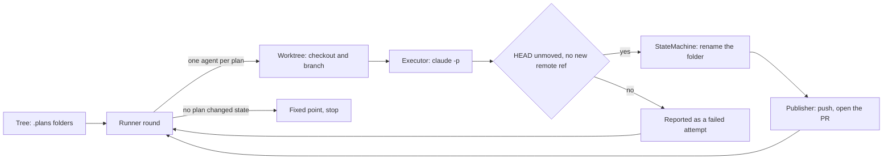

# CLAUDE.md

This file provides guidance to Claude Code (claude.ai/code) when working with code in this repository.

## What this is

A Ruby gem whose CLI (`agentilda`, with `tilda` as a symlink beside it) keeps a project's `.plans/` directory joined up with its GitHub pull requests and Linear issues, then drives specialist Claude subagents over those plan folders until nothing moves.

This repo is the tool. It does not keep plans of its own, and it has no `.plans/` directory. The workflow it implements is documented at length in `README.md`, which is worth reading once before touching `status.rb` or `state_machine.rb`.

## Repository state, read this before running anything

There are no commits yet. All 103 paths are staged for an initial commit.

The gem was carved out of the `~/.agents` monorepo and still refers to parts of it that did not come along:

| Missing                                                  | Referenced by                                                       |
| -------------------------------------------------------- | ------------------------------------------------------------------- |
| `bin/install`, `bin/setup`                               | `spec/install_spec.rb`, `justfile` recipes `install` and `build`    |
| `scripts/install-sources`, `configuration.schema.json`   | `spec/install_sources_spec.rb`, `spec/configuration_schema_spec.rb` |
| `bin/setup-worktree`                                     | `spec/setup_worktree_spec.rb`, `Worktree::SEEDER`                   |
| `lefthook.yml`                                           | `justfile` recipe `lefthook`                                        |
| `workflow/README.md`, `just doctor`, `configuration.yml` | `README.md`, `blah.md`                                              |

So the suite is red on arrival. The baseline is **648 examples, 121 failures**, all of them in five files: 118 across the four orphan spec files above, and 3 seeding examples in `spec/agentilda/worktree_spec.rb`. A failure anywhere else is yours.

`blah.md` is a stray fragment of the monorepo README, not a document anything reads.

## Commands

Ruby 4.0.x under rbenv. There is no `.ruby-version`, so activate before every Ruby command:

```bash
eval "$(rbenv init -)"

bundle exec rspec                                    # whole suite
bundle exec rspec spec/agentilda/ordinal_spec.rb     # one file
bundle exec rspec spec/agentilda/runner_spec.rb:42   # one example, by line
bundle exec rspec -e "parse"                         # by example name
just test                                            # the same, through the justfile
./exe/agentilda --help                               # the CLI, from the checkout
```

SimpleCov starts on every rspec run, not only under `COVERAGE=true`, so a single-file run still prints a whole-library coverage figure. Ignore it. `spec/spec_helper.rb` computes `REPO_ROOT` as two levels up from `spec/`, which in this layout is the parent of the repository, so the coverage badge lands in `~/github/kigster/docs/badges/`. Another leftover from `workflow/`.

### Linting does not currently run

`just lint` shells out to `bundle exec rubocop` and `just format` to `rubocop -a`. This repo has no `.rubocop.yml` and no `.standard.yml`, so both walk up to `~/.rubocop.yml` and `~/.standard.yml`, which pull in `rubocop-rspec`, `rubocop-rails-omakase` and `standard-rails`. None of those are in this bundle, and both linters die on load.

Write to standard's style anyway. The gem's dev group depends on `standard`, and the code is already shaped for it, down to the `# standard:disable Style/StderrPuts` comment in `exe/agentilda`. A project-local `.standard.yml` plus a `justfile` change from `rubocop` to `standardrb` is the fix, if you are asked for one.

## Architecture

### The folder name is the state

`.plans/003.00-⭐️-tax-rule-dsl` is plan `003.00`, state Planned, slug `tax-rule-dsl`. There is no database and no status column. A transition renames a directory through `Agentilda.move_directory`, which prefers `git mv` so the folder's history follows it.

Two consequences shape most of the code:

- A `Status` declares the files it cannot be honest without (`requires`) plus an `invariant` lambda. That one lambda is asked in both directions: `StateMachine` asks it of a destination before moving there, and `resync dirs` asks it of the state a folder currently claims. Adding a second definition for either direction is how the two would disagree.
- Firing an event is a real side effect on disk, so asking a question about a folder must never fire one.

### Nothing is written down twice

The code repeatedly explains, in comments, which duplicated table burned it. Before adding a constant, check whether the fact is already derived from one of these:

| Fact                                                 | Source of truth                                    | Read back by                                                                      |
| ---------------------------------------------------- | -------------------------------------------------- | --------------------------------------------------------------------------------- |
| Status vocabulary, emoji, required files, invariants | `lib/agentilda/status.rb`, `STATUSES`              | `documentation.rb`, `diagram.rb`, `reporter.rb`, `index.rb`                       |
| Which transitions are legal                          | `lib/agentilda/state_machine.rb`, the `aasm` block | `StateMachine.inbound`, `.outbound`, `.edge?`, `Status#terminal?`, both renderers |
| Numbering rules                                      | `lib/agentilda/ordinal.rb`                         | `documentation.rb`, `creator.rb`                                                  |
| Which agent handles which state                      | `agents/*.md` frontmatter                          | `Agents`, `Roster`, `Runner` routing, `Executor` tool grants                      |

`agentilda docs` regenerates the whole conventions document from the first three. Hand-writing any of those tables reintroduces the bug the derivation exists to kill.

A status answers to its key and its emoji, and to nothing else. The synonym table that used to sit in `status.rb` went stale pointing six words at a state that no longer existed, so there is deliberately no alias map.

### Layout

```
exe/agentilda          resolves its own BUNDLE_GEMFILE, so the binary works from any project root
lib/dry/cli/banner.rb  vendored dry-cli banner, patched for color control
lib/agentilda/
  status.rb            STATUSES, the invariants, the block-notation regexes (B1/A1)
  state_machine.rb     aasm topology, SPINE, PREFERENCE, FAMILIES
  ordinal.rb           NNN.MM identity, set once, never renumbered
  feature.rb           one decoded folder name, plus titleize and its acronym tables
  tree.rb              a .plans directory, decoded and ordered
  pull_request.rb      rows parsed out of pull-requests.md
  creator.rb, brief.rb minting a folder and scaffolding its opening spec.md
  resync.rb            dirs (folder name vs contents) and prs (PR title prefixes)
  adoption.rb          gives an orphan pull request a retroactive plan of its own
  agent.rb, roster.rb  loading agents/*.md and reporting on them
  viewer.rb            hands a Markdown file to `open` or to mdfried
  runner.rb            the round loop, run until a fixed point
  executor.rb          one `claude -p` invocation, and the autonomy boundary
  transcript.rb        parses --output-format stream-json into a spinner phrase
  worktree.rb          a git worktree and branch per plan
  publisher.rb         push the branch, open the [NNN.MM](X) pull request
  linear/              one-way export of .plans to Linear projects and issues
  documentation.rb     `agentilda docs`, the conventions, derived
  diagram.rb           `agentilda states`, the same machine drawn for a terminal
  index.rb, reporter.rb, tally.rb   INDEX.md, the status table, the token bill
  ui.rb                boxes, spinners, concurrency, color
  cli.rb               the dry-cli registry; nothing but requires and register
  cli/base.rb          shared flags, tree_for, refuse, the dry-run footer
  cli/<command>/       one file per command (create/create.rb, run/run.rb, …),
                       subcommands/ under the prefixed groups (agents, resync,
                       linear); linear/linear.rb is the shared Team base
```

### The run loop



`Runner#call` stops at a fixed point, a round in which no plan changed state, or when nothing is left that an agent may touch. Blocked plans (⭕️ and 🅱️) are stepped around, never assigned. `--isolation worktree` gives each plan its own checkout and runs `jobs` agents at once; `--isolation shared` is one tree, serial, and needs no git. Each round does exactly one serial resync on the main tree.

### The autonomy boundary

`Executor` enforces "docs plus code, but nothing leaves the machine" twice over, because a prompt is a request and only a check is a guarantee:

- Before: `--disallowedTools` withholds `WebFetch` and `WebSearch` (unless the agent declares `network: true`), and `FORBIDDEN_COMMANDS` is passed as `Bash(<cmd>:*)` specifiers. An agent's `may:` frontmatter can lift some of those, but never anything in `UNGRANTABLE` (`git push`, `gh pr merge`).
- After: the harness verifies `HEAD` did not move and no new remote ref appeared.

Approving a pull request is grantable because it is reversible, visible and attributable. Merging is not. Keep that line where it is.

Raw NDJSON traces land in `Dir.tmpdir/agentilda-traces` on purpose, outside the repo, so the after-check has nothing extra to learn to ignore. `Executor::TRACE_DIR` carries the `jq` incantations for reading one back.

## Conventions in the code

- STDOUT carries the deliverable, STDERR carries progress. `UI` draws every box on STDERR so tables stay pipeable, and `Reporter#render`, `Roster#list`, `Tally#render` and friends return strings while printing nothing.
- Anything that writes to disk, GitHub or Linear is a dry run until `--commit`.
- `Data.define` for value objects, everywhere. Endless method definitions (`def open? = state.match?(...)`) are idiomatic here.
- YARD on public methods, with `@param` and `@return`. Comments explain why, usually by naming the specific failure the code prevents. Match that density; it is the house style, not decoration.
- `GitHub` and `Linear::API` are seams. The suite injects doubles into both and never reaches the network.
- Specs build real `.plans` trees in temp directories through `PlansFixture` and the `:tree` tag. Do not mock the filesystem. Faking it would test the fake.
- `spec_helper.rb` forces `NO_COLOR=1` so assertions test content on every machine. Cover the colored path deliberately, by stubbing `UI.color?`.
- `lib/agentilda.rb` requires each component behind a `File.exist?` guard, which is why `description.rb` and `resolver.rb` can be named in the list without existing.

## When adding a state

1. Add a `Status` to `STATUSES` in `status.rb`, with its `requires` and its `invariant`.
1. Give it an event in the `aasm` block in `state_machine.rb`, and decide whether it belongs on `SPINE`, in `PREFERENCE`, or inside a `FAMILIES` group.
1. Point an agent at it through `handles:` in `agents/*.md`, unless it is a state only a human moves.
1. Place it in `linear/mapping.rb`, in `PLACEMENTS` or in `UNPLACED`. That table is hand-written rather than derived, and a spec asserts every entry in `STATUSES` appears in exactly one of the two, so skipping this step fails the suite rather than importing the new state silently as Backlog.
1. Run `agentilda docs` and `agentilda states`. Both derive from `STATUSES` and the `aasm` block, so neither needs editing.
