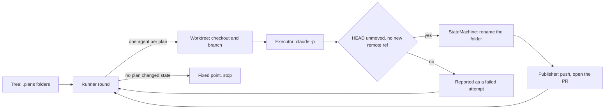

# CLAUDE.md

This file provides guidance to Claude Code (claude.ai/code) when working with code in this repository.

## What this is

This is a CLI-based ruby gem with executables (`agentilda`, with `tilda` as an alias) providing rich multi command/sub-command interface to Agentic Software Development.


The gem's responsibilities are:

* creating and properly renaming at the right state transitions spec folders that by the default live under `.plans` folder (override with an environment variable `$PLANS_DIR`)
  * Creating a seed `spec.md` files based on very limited information, and passing it to a human for editing.
* running one or more agents on one or more plans concurrently using the state machine defined for each plan, and the agents that do the work to move plan from one state to the next.
* maintaining project's `.plans/` directory sync'ed up with its GitHub pull requests and Linear issues, then drives specialist Claude subagents over those plan folders until nothing moves.

This repo is the tool. It does not keep plans of its own, and it has no `.plans/` directory. The workflow it implements is documented at length in `README.md`, which is worth reading once before touching `plans/status.rb` or `plans/state_machine.rb`.

## Repository state, read this before running anything

The suite is green: `bundle exec rspec` reports 0 failures, with 3 pending seeding examples in `spec/agentilda/vcs/worktree_spec.rb` (they need `bin/setup-worktree`, which did not come along from the `~/.agents` monorepo). A failure anywhere is yours.

## Commands

Ruby 4.0.x under rbenv. There is no `.ruby-version`, so activate before every Ruby command:

```bash
eval "$(rbenv init -)"

bundle exec rspec                                    # whole suite
bundle exec rspec spec/agentilda/plans/ordinal_spec.rb    # one file
bundle exec rspec spec/agentilda/engine/runner_spec.rb:42 # one example, by line
bundle exec rspec -e "parse"                         # by example name
just test                                            # the same, through the justfile
./exe/agentilda --help                               # the CLI, from the checkout
```

SimpleCov starts on every rspec run, not only under `COVERAGE=true`, so a single-file run still prints a whole-library coverage figure. Ignore it. `spec/spec_helper.rb` computes `REPO_ROOT` as two levels up from `spec/`, which in this layout is the parent of the repository, so the coverage badge lands in `~/github/kigster/docs/badges/`. Another leftover from `workflow/`.

### Linting

`just lint` runs `bundle exec rubocop` against the project's `.rubocop.yml`, which inherits `.rubocop_todo.yml`. Keep it at zero offenses. The todo file lists paths, so a moved file must move there too.

## Architecture

### The folder name is the state

`.plans/003.00-⭐️--tax-rule-dsl` is plan `003.00`, state Planned, slug `tax-rule-dsl`. There is no database and no status column. A transition renames a directory through `Agentilda.move_directory`, which prefers `git mv` so the folder's history follows it.

Two consequences shape most of the code:

- A `Status` declares the files it cannot be honest without (`requires`) plus an `invariant` lambda. That one lambda is asked in both directions: `StateMachine` asks it of a destination before moving there, and `resync dirs` asks it of the state a folder currently claims. Adding a second definition for either direction is how the two would disagree.
- Firing an event is a real side effect on disk, so asking a question about a folder must never fire one.

### Nothing is written down twice

The code repeatedly explains, in comments, which duplicated table burned it. Before adding a constant, check whether the fact is already derived from one of these:

| Fact                                                 | Source of truth                                    | Read back by                                                                      |
| ---------------------------------------------------- | -------------------------------------------------- | --------------------------------------------------------------------------------- |
| Status vocabulary, emoji, required files, invariants | `lib/agentilda/plans/status.rb`, `STATUSES`        | `documentation.rb`, `diagram.rb`, `reporter.rb`, `index.rb`                       |
| Which transitions are legal                          | `lib/agentilda/plans/state_machine.rb`, `aasm`     | `StateMachine.inbound`, `.outbound`, `.edge?`, `Status#terminal?`, both renderers |
| Numbering rules                                      | `lib/agentilda/plans/ordinal.rb`                   | `documentation.rb`, `creator.rb`                                                  |
| Which agent handles which state                      | `agents/*.md` frontmatter                          | `Agents::Registry`, `Roster`, `Runner` routing, `Executor` tool grants            |

`agentilda docs` regenerates the whole conventions document from the first three. Hand-writing any of those tables reintroduces the bug the derivation exists to kill.

A status answers to its key and its emoji, and to nothing else. The synonym table that used to sit in `status.rb` went stale pointing six words at a state that no longer existed, so there is deliberately no alias map.

### Layout

Every directory under `lib/agentilda/` is a namespace with a module file of the same name. That file is the facade: a few module methods (`Plans.tree`, `Lifecycle.create`, `Agents.registry`, `Engine.runner`, `Execution.executor`, `Vcs.worktree`, `Presentation.documentation`) that the CLI calls instead of constructing classes. Reach into a namespace from outside only through its facade, unless you need a value type such as `Plans::Status`.

```
exe/agentilda            resolves its own BUNDLE_GEMFILE, so the binary works from any project root
lib/agentilda.rb         Zeitwerk loader, move_directory, plans_on_ref
lib/agentilda/
  plans/                 Agentilda::Plans — the plan model, no processes, no network
    status.rb            STATUSES, the invariants, the block-notation regexes (B1/A1)
    state_machine.rb     aasm topology, SPINE, PREFERENCE, FAMILIES
    ordinal.rb           NNN.MM identity, set once, never renumbered
    feature.rb           one decoded folder name, plus titleize and its acronym tables
    tree.rb, subject.rb  a .plans directory, decoded and ordered; one folder as the machine sees it
    pull_request(s).rb   rows parsed out of pull-requests.md
    ledger.rb            the dated notes agents sign with, read from markdown and from state.json
    plan_state.rb        state.json in each plan folder: stages, signatures, messages; schemas/plan-state.schema.json
    mailbox.rb           how a pair talks, append-only and numbered, kept in state.json
    spec.rb              spec.md frontmatter: lane, frontend, depth, per-phase adapter/model/effort
    index.rb, dev_work.rb  INDEX.md; the dev/none no-plan prefixes
  lifecycle/             Agentilda::Lifecycle — operations that create, rename or drain plans
    creator.rb, brief.rb minting a folder and scaffolding its opening spec.md
    resync.rb            dirs (folder name vs contents) and prs (PR title prefixes)
    adoption.rb          gives an orphan pull request a retroactive plan of its own
    unblocker.rb         drains answered questions out of blocked.md
    lanes.rb             moves plan- and quick-lane plans past the phases they skip
    completion.rb        copies the spec's task-completed-when and how-to-verify into plan.md
  agents/                Agentilda::Agents — agents/*.md loaded (Registry), one definition (Agent), the report (Roster),
                         Profile (adapter, model, effort for one plan), Routing (lanes, toggles, needs)
  adapters/              Agentilda::Adapters — claude, codex, pi: argv and transcript per CLI; Stream reads generic JSONL
  engine/                Agentilda::Engine — the round loop
    runner.rb            run configuration, until a fixed point
    dispatcher.rb        the tick loop: assign, poll, settle, rename
    state_file.rb        restart state; board.rb, tally.rb, progress_log.rb what the run shows and costs
  execution/             Agentilda::Execution — one agent invocation
    executor.rb          one agent invocation through its adapter, and the autonomy boundary
    child.rb, clock.rb, control.rb   the process, its advisory timeout, its control file
    transcript.rb        parses --output-format stream-json into a spinner phrase
  vcs/                   Agentilda::Vcs — worktree.rb, publisher.rb (push, open the PR), github.rb (the gh seam)
  presentation/          Agentilda::Presentation — dashboard, console, keyboard, screen/ratatui,
                         documentation.rb (`agentilda docs`), diagram.rb (`agentilda states`), reporter.rb, viewer.rb
  support/               collapsed by Zeitwerk, so these stay Agentilda::UI, ::Config, ::Markdown, ::Frontmatter
  linear/                one-way export of .plans to Linear projects and issues
  evals/                 Agentilda::Evals — per-agent cases (evals/cases/<agent>/<id>.yml), deterministic
                         checks per depth, offline scoring of recordings, --live runs in a temp repo
  cli.rb                 the dry-cli registry, and the dry-cli-help `help` block that titles it
  cli/base.rb            shared flags, tree_for, refuse, the dry-run footer
  cli/<command>/         one file per command (create/create.rb, run/run.rb, …),
                         subcommands/ under the prefixed groups (agents, resync,
                         linear, mail); linear/linear.rb is the shared Team base
```

Inside `cli/`, `CLI::Agents`, `CLI::Index`, `CLI::Worktree`, `CLI::Resync` and `CLI::Linear` shadow library names, so code there writes `Agentilda::Agents` in full.

### The run loop


```mermaid
flowchart LR
  T[Tree: .plans folders] --> R[Runner round]
  R -->|one agent per plan| W[Worktree: checkout and branch]
  W --> E[Executor: claude -p]
  E --> X{HEAD unmoved, no new remote ref}
  X -->|yes| S[StateMachine: rename the folder]
  X -->|no| FAIL[Reported as a failed attempt]
  S --> P[Publisher: push, open the PR]
  P --> R
  FAIL --> R
  R -->|no plan changed state| DONE[Fixed point, stop]
```

`Runner#call` stops at a fixed point, a round in which no plan changed state, or when nothing is left that an agent may touch. Blocked plans (⭕️ and 🅱️) are stepped around, never assigned. `--isolation worktree` gives each plan its own checkout and runs `jobs` agents at once; `--isolation shared` is one tree, serial, and needs no git. Each round runs `resync dirs` twice on the main tree, serially: once before agents are assigned, so a folder whose name lags its contents goes to the right agent under the right name, and once after every agent has been joined, so what the round reports is what is on disk. A chain hands a plan to one agent at a time and stops short of a state two agents handle as a pair; the next round starts the pair together.

### The autonomy boundary

`Executor` enforces "docs plus code, but nothing leaves the machine" twice over, because a prompt is a request and only a check is a guarantee:

- Before: `--disallowedTools` withholds `WebFetch` and `WebSearch` (unless the agent declares `network: true`), and `FORBIDDEN_COMMANDS` is passed as `Bash(<cmd>:*)` specifiers. An agent's `may:` frontmatter can lift some of those, but never anything in `UNGRANTABLE` (`git push`, `gh pr merge`).
- After: the harness verifies `HEAD` did not move and no new remote ref appeared.

Approving a pull request is grantable because it is reversible, visible and attributable. Merging is not. Keep that line where it is.

Raw NDJSON traces land in `Dir.tmpdir/agentilda-traces` on purpose, outside the repo, so the after-check has nothing extra to learn to ignore. `Executor::TRACE_DIR` carries the `jq` incantations for reading one back.

## Conventions in the code

- STDOUT carries the deliverable, STDERR carries progress. `UI` draws every box on STDERR so tables stay pipeable, and `Reporter#render`, `Roster#list`, `Tally#render` and friends return strings while printing nothing.
- Anything that writes to disk, GitHub or Linear is a dry run until `--commit`.
- `Data.define` for value objects, everywhere. Endless method definitions (`def open? = state.match?(...)`) are idiomatic here.
- YARD on public methods, with `@param` and `@return`. Comments explain why, usually by naming the specific failure the code prevents. Match that density; it is the house style, not decoration.
- `GitHub` and `Linear::API` are seams. The suite injects doubles into both and never reaches the network.
- Specs build real `.plans` trees in temp directories through `PlansFixture` and the `:tree` tag. Do not mock the filesystem. Faking it would test the fake.
- `spec_helper.rb` forces `NO_COLOR=1` so assertions test content on every machine. Cover the colored path deliberately, by stubbing `UI.color?`.
- `lib/agentilda.rb` loads everything through Zeitwerk. File path and constant must agree; `support/` and the `cli/<command>/` directories are collapsed.

## When adding a state

1. Add a `Status` to `STATUSES` in `status.rb`, with its `requires` and its `invariant`.
1. Give it an event in the `aasm` block in `state_machine.rb`, and decide whether it belongs on `SPINE`, in `PREFERENCE`, or inside a `FAMILIES` group.
1. Point an agent at it through `handles:` in `agents/*.md`, unless it is a state only a human moves.
1. Place it in `linear/mapping.rb`, in `PLACEMENTS` or in `UNPLACED`. That table is hand-written rather than derived, and a spec asserts every entry in `STATUSES` appears in exactly one of the two, so skipping this step fails the suite rather than importing the new state silently as Backlog.
1. Run `agentilda docs` and `agentilda states`. Both derive from `STATUSES` and the `aasm` block, so neither needs editing.
