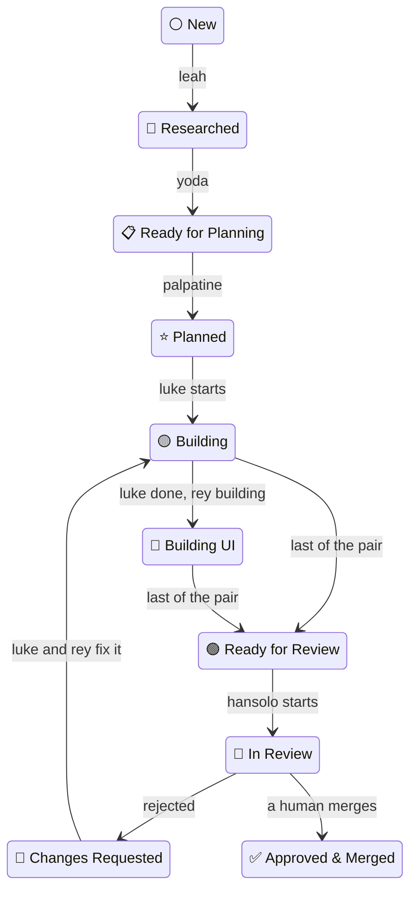

# Agentilda

[](https://dl.circleci.com/status-badge/redirect/gh/kigster/agentilda/tree/main) 

Agentilda turns a short feature description into a reviewed pull request. You write the brief; a team of seven Claude Code agents researches it, specifies it, plans it, builds it and reviews it. You merge.

It is a Ruby gem with one command, `agentilda`, also installed as `tilda`. The agents are defined in [`agents/`](agents/).

## Install

```bash
gem install agentilda agent-lock -N
hash -r
tilda --help
```

`agent-lock` (the `alock` command) stops agents sharing a checkout from overwriting each other's files.

Both commands have tab completion. Add this to `~/.zshrc` (or use `bash` in `~/.bashrc`):

```bash
eval "$(tilda completion zsh)"
eval "$(alock completion zsh)"
```


## Quick start

Run these from the root of your project:

```bash
tilda create tax rule dsl   # creates .plans/000.00-⚪️ → tax-rule-dsl/spec.md and opens it
                            # finish the brief in spec.md, then save it
tilda run                   # dry run: shows which agent would take which plan
tilda run --commit          # runs the agents until no plan changes state
tilda list-plans            # every plan, its state and its pull requests
```

The agents stop at an approved pull request. Merging it is up to you.

## How it works

### The folder name is the state

Every feature is one folder under `.plans/`, named `NNN.MM-<emoji> → <slug>`:

```text
.plans/000.00-✅ → dev-foundation
       001.00-🟡 → tenancy-households
       001.01-🕰️ → schedule-k1-backfill      # shipped first, documented afterwards
       002.00-⚪️ → tax-rule-dsl
```

- **The number** is set once and never changes. Branches, pull request titles and `pull-requests.md` all join on it. `MM` is `00` for a normal plan; `01` to `99` marks a retroactive plan slotted in after the fact.
- **The emoji** is the state. A folder may only claim a state its files prove, such as `spec.md`, `plan.md` or `pull-requests.md`, and the tool refuses any other move.
- **The name** contains spaces and emoji, so quote it in a shell.

`tilda states` draws every state and transition. [`docs/WORKFLOW.md`](docs/WORKFLOW.md), generated by `tilda docs`, is the full reference.

### The lifecycle



A plan can also leave the main path. It stops at ⭕️ Technical Block or 🅱️ Product Block when a human has to decide something. It ends at 💩 Scrapped by Review, ☢️ Deferred or ❌ Discarded when it won't be built.

### The agents

| Agent               | Takes plans at | Moves them to       | Writes                                 | Job                                                                                      |
| :------------------ | :------------- | :------------------ | :------------------------------------- | :--------------------------------------------------------------------------------------- |
| `leah-researcher`   | ⚪️             | 🔎                  | `spec.md`                              | Researches the brief in parallel and appends a `## Research` chapter                     |
| `yoda-writer`       | 🔎, 🕰️         | 📋                  | `spec.md`                              | Writes the full spec (goals, non-goals, scope), or `blocked.md` when a human must answer |
| `palpatine-planner` | 📋             | ⭐️                  | `plan.md`                              | Splits the spec into independent work units, one plan each for back end and front end    |
| `luke-backend`      | ⭐️, 🟡, 🔴     | 🟢                  | `plan-backend.md`, `pull-requests.md`  | Builds the data, domain, API and tests                                                   |
| `rey-frontend`      | ⭐️, 🟡, 🔴     | 🟢                  | `plan-frontend.md`, `pull-requests.md` | Builds the interface against Luke's API and proves the two halves work together          |
| `hansolo-reviewer`  | 🟢, 👀         | 👀 approved, 🔴, 💩 | `pull-requests.md`                     | Reviews the diff against the plan; rejects at most twice; never merges                   |
| `lando-broker`      | ⭕️, 🅱️         | ⭐️                  | `plan.md`                              | Folds your answers from `blocked.md` back into the spec and plan                         |

Luke and Rey work at the same time, in the same worktree, toward one pull request. They talk through `mailbox.md` in the plan folder, using `tilda mail send` and `tilda mail read`.

Run `tilda agents list` for the same table, or `tilda describe <agent>` to read one agent's prompt.

### Unblocking a plan

The loop never assigns a blocked plan (⭕️ or 🅱️) to an agent. Write your answers into the plan's `blocked.md`, then:

```bash
tilda unblock 003            # what is 003 still waiting on?
tilda unblock 003 --commit   # fold the answered questions into spec.md and plan.md
```

Partial answers are fine. The plan stays blocked until the last question is answered.

## Commands

```bash
tilda create tax rule dsl              # a new plan: 003.00-⚪️ → tax-rule-dsl
tilda create --from notes/dsl.md       # a new plan named by the file's frontmatter title
tilda create --after 002 k1 sync       # a retroactive plan: 002.01-🕰️ → k1-sync
tilda list-plans                       # every plan, its state and its pull requests
tilda index                            # write .plans/INDEX.md
tilda states                           # the state machine, as a diagram
tilda docs -o docs/WORKFLOW.md         # regenerate the conventions from the code
tilda run --commit --plan 003          # run the agents on specific plans
tilda unblock 003 --commit             # fold answered blocks back in
tilda worktree 003                     # create and seed a worktree for one plan
tilda resync dirs                      # rename folders whose emoji their contents contradict
tilda resync prs                       # add missing [NNN.MM] prefixes to pull request titles
tilda linear import TAX -p 'Tax DSL'   # mirror the plans into Linear
```

> [!IMPORTANT]
> **Every command that writes is a dry run until you add `--commit`.** Read what it would do first.

## Running the agents

```bash
tilda run                                  # dry run: who would take what
tilda run --commit                         # the whole tree, one worktree per plan, in parallel
tilda run --commit -j 4                    # at most four agents at once
tilda run --commit --plan 003,005.01       # only these plans
tilda run --commit --agent yoda-writer --prompt "Rework the risks section first"
tilda run --commit --skip hansolo-reviewer # everyone but the reviewer; its plans wait
tilda run --commit --model opus            # one model for every agent
tilda run --commit --timeout 600           # at most ten minutes per agent
tilda run --commit --rounds 1              # at most one round per agent per plan
tilda run --commit --max-tokens 200000     # token budget per agent invocation
tilda run --isolation shared               # one checkout, one agent at a time, no git needed
```

If you just created several plans, run them with a single `--plan` list. Separate bare `run` calls each loop over the whole tree, so their worktrees would overlap.

The loop stops when a full round changes no plan's state. It also stops when every plan in scope is done, blocked, or out of rounds.

### Safety rails

- **Isolation.** By default every plan gets its own git worktree and branch, `<user>/NNN.MM-slug`, so agents on different plans share nothing. Parallel runs require it: `--isolation shared` runs one agent at a time.
- **Agents cannot publish.** They may write source, tests and their plan's documents, but may not commit, push or touch a pull request. The tool enforces this twice: it withholds those commands from the agent, and afterwards checks that `HEAD` did not move.
- **The harness publishes.** When a plan finishes, the harness commits the branch, pushes it and opens a pull request titled like `[002.00](A) Tenancy Households`. Pass `--dont-push-anything` to leave the work uncommitted in its worktree.
- **Nothing merges automatically.** An approval leaves the plan at 👀 until you merge.
- **Disk over claims.** A plan moves only when the files its new state requires exist. If an agent reports success but wrote nothing, the tool records it as interrupted.

### Limits

| Limit  | Declared by the agent         | Flag           | Default     |
| :----- | :---------------------------- | :------------- | :---------- |
| Clock  | `timeout:` in its frontmatter | `--timeout`    | 900 seconds |
| Rounds | `rounds:` (at most 5)         | `--rounds`     | 1           |
| Tokens | none                          | `--max-tokens` | unmetered   |

Flags can only tighten what an agent declares, never loosen it. Each agent is told its clock and its token budget in its prompt.

As its time runs out, the agent is warned at 10, 5 and 1 minute left, then asked to stop. If it is still running 60 seconds after that, it is killed. A token budget works the same way: the agent is told the number, and the tool aborts it once it goes over.

Defaults for `run` can live in `~/.local/config/agentilda.json`:

```json
{ "run": { "timeout": 1800, "jobs": 4 } }
```

A typed flag beats the file, and the file beats the built-in default. The file accepts `timeout`, `jobs`, `rounds`, `log` and `max_tokens`. It never accepts `commit`.

### Keys during a run

When you run it in a terminal, `run` shows a table of the running agents and listens for keys:

| Key      | What it does                                                                   |
| :------- | :----------------------------------------------------------------------------- |
| `h`      | show or hide this help                                                         |
| `?`      | about agentilda                                                                |
| `s`, `↓` | select the next running agent; `↑` moves back                                  |
| `k`      | mark the selected agent to be killed (STOP, 15 seconds, then `kill -9`)        |
| `x`      | give the selected agent 10 more minutes, per press                             |
| `ENTER`  | apply the pending kills and extensions                                         |
| `ESC`    | discard the pending changes, then clear the selection                          |
| `w`      | ask every running agent to wrap up as fast as possible                         |
| `n`      | ask agents to save their work and stop; the loop continues with the next agent |
| `q`      | save, stop everything and quit, after a 60-second grace period                 |
| `ctrl-c` | interrupt the run                                                              |

`k` and `x` do nothing until you press `ENTER`, so a slip of the finger cannot kill an agent.

### How agents hand off

An agent never renames its plan folder. Instead, it signs the document it owns, and the harness moves the folder based on the signature:

```text
> [!NOTE]
>
> [2026-09-04 11:29:20 AM PDT] [ agent: leah-researcher   status: Started, round 1 ]
> [2026-09-04 11:44:03 AM PDT] [ agent: leah-researcher   status: Completed, round 1 ]
> [2026-09-04 11:44:04 AM PDT] [ next: yoda-writer ]
```

| Status                            | What the harness does                                               |
| :-------------------------------- | :------------------------------------------------------------------ |
| `Completed`                       | moves the folder on, if the files the next state requires are there |
| `Blocked`                         | parks the folder at ⭕️, or at 🅱️ when the note says `product`       |
| `Almost completed`, `Interrupted` | gives the agent another round, up to its limit                      |

Suppose an agent stops without signing, because it crashed, timed out or was killed. The harness signs `Interrupted` for it. If the work is on disk anyway, the harness also signs `Completed` for it. The run's own state, such as process ids and token counts, lives in `.plans/tmp/agentilda-state.json`. A later run picks up where a dead one stopped.

## GitHub and Linear

- **`resync dirs`** renames folders whose emoji their contents contradict. For example, a ⚪️ with a `plan.md` becomes ⭐️. It is safe to run repeatedly.
- **`resync prs`** adds the `[NNN.MM]` prefix to pull request titles. It works from the branch name first, then from the diff. It reports anything ambiguous and never changes it, even with `--commit`. It needs `gh`.
- **`linear import TEAM`** creates one Linear issue per plan and one child issue per work unit. It only goes one way: nothing edited in Linear comes back. It uses `LINEAR_API_KEY`, or with `--format json` it hands the same data to the Linear MCP server.

## From Claude Code

The `/plan-create`, `/plan-run`, `/plan-status` and other `/plan-*` slash commands wrap this same binary. They also add checks, such as confirming the scope and `--commit` before a run. They ship with [agentilda-ai-setup](https://github.com/kigster/agentilda-ai-setup). Use them inside a Claude Code session, and the binary everywhere else.

## Development

```bash
just test         # rspec
just lint         # standardrb
just format       # standardrb --fix, then mdformat
just ci           # lint, then tests with coverage
just update-workflow   # regenerate docs/WORKFLOW.md
```

The executables in `exe/` find their own `Gemfile`, so they behave the same whether they are run from `PATH` or from another project's root.

______________________________________________________________________

© 2026 Konstantin Gredeskoul
