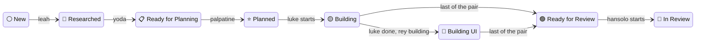

# The Agentilda Ruby Gem

This gem implements an agentic workflow using five specialized agents defined in the `./agents` directory.

The best resource that describes it in detail is the result of running `tilda docs -o <file>` command, or the file [docs/WORKFLOW.md](docs/WORKFLOW.md).

The gem offers a CLI command `tilda` (as well as `agentilda`) that performs a slew of commands aimed at producing, updating, keeping in sync any project's root directory `.plans`, that will initially contain just the `spec.md` and pull requests documents in the `.plans`, and drives a team of specialist agents over them. The agents implement the following workflow:

```
# Happy path
  ⚪️ New ──▶
    🔎 Researched ──▶
       📋 Ready for Planning ──▶
          ⭐️ Planned ──▶
             🟡 Building ──▶
                🎨 Building UI ──▶
                   🟢 Ready for Review ──▶
                      👀 In Review ──▶
                         ✅ Approved
```

## Agents

There are a total of six individual agents that are named after the "StarWars®" theme. But before any of them can do their work you should probably drop a specification into one of the folders under `.plans` with the name of your feature. You do this with the help of the script `bin/create-plan-folder`:

```bash
bin/create-plan-folder -h

USAGE:
  create-plan-folder [-D <dir>] <status> <topic words...>

WHERE:
  -D <dir>   Enclosing directory (default: .)

DESCRIPTION:
  Status is a name or the emoji itself:

  white  | spec               ⚪️   spec.md only, not yet planned
  blue   | planned  | plan    🔵   spec.md + plan.md
  yellow | open     | wip     🟡   PR raised, not yet merged
  green  | done               🟢   all PRs merged
  red    | declined           🔴   decided never
  hole   | blocked            ⭕️   needs a human decision (write blockers.md)
  brown  | later    | defer   🟤   deliberately deferred (state the trigger)
  purple | merged             🟣   PR-level status; see note below

EXAMPLES:
  create-plan-folder spec implement login and logout functionality
  create-plan-folder [ -D docs/plans ] spec implement agentic workflow CLI
```

If you execute the two examples above ( without overriding the enclosing directory), you'll end up with `.plans` folder with the following directories inside:

```
.plans/001-⚪️ → implement-login-and-logout-functionality
.plans/002-⚪️ → implement-agentic-workflow-cli
```

The idea behind these colored circles is they effectively represent the state the folder is currently in, and make it easy to visually identify problematic stories, blocked stories, and so on.

The gem implements a state machine internally using the `aasm` gem. The directories follow almost the entire graph, which you can review by running `tilda states`.

Speaking of running `tilda` , a help screen, and then we'll move onto the agents.


### Agents — Who Are They?

-
- `leah-researcher.md` is the first one to graresearch,
- then a written specification,
- then a plan,
- then a frontend end, backend,
- submit PR,
- and perform an adversarial review.

Install the gem with `gem install agentilda` and then run `tilda -h` for more options. It's also recommended to add command completion to your shell. Eg, for zsh:

```bash
# ~/.zshrc
grep -q agentilda "${HOME}"/.zshrc || echo 'eval "$(agentilda completion zsh)"' >> "${HOME}/.zshrc"
```

______________________________________________________________________

## The Workflow

```bash
just              # pick a recipe
just test         # rspec
just lint         # standardrb (reports; never rewrites)
just format       # standardrb --fix, then mdformat
just ci           # lint + coverage
just doctor       # what bin/install would copy and link, touching nothing
```

CircleCI runs the suite and the linter, and asserts `bin/setup` reaches a fixed point by running it twice and diffing — the bug it exists to prevent is drift going unnoticed, not a first run failing.

Nothing here installs anything. The other half of the repository, the part that decides which skills, plugins and coding agents a machine should have, is documented in [the top-level README](../README.md).

```bash
agentilda --help          # or `tilda`, a symlink beside it
agentilda states          # the state machine, as a diagram
agentilda list-plans      # every plan, its state, its pull requests
```

______________________________________________________________________

## Spec → Plan → Build

This repo comes with an opinionated and formalized workflow for designing product features and moving forward.

Every project keeps its plans in a `.plans/` directory. Each feature gets one folder, and **the folder's name is its state**.

```
.plans/000.00-⚪️ → initial-spec
       001.00-✅ → dev-foundation
       001.01-✅ → schedule-k1-backfill   ← shipped between 001 and 002,
       002.00-⭐️ → tenancy-households        specified afterwards
```

Three phases, each with a file that proves it happened:

| Phase     | State    | The file that proves it |
| :-------- | :------- | :---------------------- |
| **spec**  | ⚪️ New   | `spec.md`               |
| **plan**  | ⭐️ Ready | `plan.md`               |
| **build** | 🟡 → ✅  | `pull-requests.md`      |

A folder may not claim a phase whose file is missing. That is not a convention anyone has to remember — it is a state machine with guards, and the tool refuses transitions whose requirements do not hold.

The canonical folder spelling is `NNN.MM-<emoji> → <slug>`, with **a spaced arrow after the emoji**: an emoji renders two cells wide and visually swallows a bare dash beside it. Folders named with the older `--` or single-dash separator still decode, and `resync dirs` migrates them on contact — first to the canonical spelling under the status they already claim, then, in a separate rename, to the status their contents justify. The spaces do mean the path wants quoting in a shell.

### The lifecycle, step by step

A feature moves through the specialists one state at a time, and never further than its own documents currently justify. The spine, with the agent that drives each hop:



Step by step:

1. **⚪️ New.** `agentilda create tax rule dsl` mints `.plans/003.00-⚪️ → tax-rule-dsl/`. For a genuinely new feature it also scaffolds `spec.md` with a title and four fixed headings (*What we are trying to achieve*, *Why it matters*, *What already exists*, *What research needs to settle*), makes a best-effort attempt at them from what the project already has on disk, and opens it. You finish the brief by hand.
1. **🔎 Researched.** `leah-researcher` fans work out across parallel sub-agents and appends spec.md's `## Research` chapter: themes, findings, licensing, a closing `### Findings, Conclusion & References`. Nobody else may write that heading. It *is* the state transition, so an empty one seeds a lie.
1. **📋 Ready for Planning.** `yoda-writer` turns the brief plus the research into a complete specification: Goal, Non-Goals, In/Out of scope, Open questions, Conclusion. Or it writes `blocked.md` instead, when a question is a human's to answer, not a guess. It closes by leaving an empty `plan.md` beside the spec; that blank file is what the harness reads as "ready for planning".
1. **⭐️ Planned.** `palpatine-planner` fills `plan.md` with the finished spec's non-overlapping work units, sized for independent sub-agents, and splits them by discipline into `plan-backend.md` and `plan-frontend.md`.
1. **🟡 Building → 🎨 Building UI → 🟢 Ready for Review.** `luke-backend` and `rey-frontend` build at the same time, in the same worktree, toward one pull request; Luke's start is what makes the folder 🟡. Luke writes `implementation-plan.md` first (the interfaces the front end will call, their shapes, their errors, who owns which files, and the test that will prove the halves are joined), then builds the back end: schema, domain, API, source and tests, no commits. Rey builds the interface against the API being written beside it rather than the one the spec imagined, loads the design skills as it goes, and runs the integration test named in the contract: a front end green against a stub and a back end green against a test client are two passing suites and no working feature. Units that own disjoint files are built as one concurrent wave rather than in series. If Luke signs `Completed` first the folder holds at 🎨 while Rey finishes; when the last of the pair signs `pull-requests.md` the folder becomes 🟢 and the pull request titled `[003.00] …` opens, for what both halves built. A plan with no front-end work says so and passes through.
1. **👀 In Review → 🔴 Changes Requested, ✅ Approved, or 💩 Scrapped.** `hansolo-reviewer` takes the folder to 👀 the moment it starts, reads the diff against the plan, and records its verdict in the note of its `pull-requests.md` line: `(rejected 1/2)` or `(rejected 2/2)` sends the folder to 🔴 for the pair to fix, and a pull request may be rejected twice at most; `(approved)` approves the pull request and leaves the folder 👀 until a human merges; `(slop)` writes `rewrite.md` and the folder becomes 💩. Nothing merges automatically: approving is reversible and attributable, merging changes a branch everyone else builds on, and that line is enforced in code, not just in the prompt.

Off to the side, at any point: ⭕️/🅱️ **Blocked** (an engineering or product decision only a human can make) and ☢️ **Deferred** or ❌ **Discarded**. Blocked plans are never assigned to an agent by the loop; one that could move them would make the states meaningless. `agentilda states` draws the whole machine, every legal transition included.

Blocks drain by hand, and in pieces. Answers are written into `blocked.md` as they arrive, and `agentilda unblock 003 --commit` hands the folder to `lando-broker`, which folds each answered question into the document it was stopping (`spec.md` for what and why, `plan.md` for how and in what order), deletes it, and deletes the file once nothing is left. `blocked.md` holds open questions and nothing else, so the pass that empties it is the pass that lets the folder out of ⭕️. Three answers out of four is a normal run: the plan stays blocked on the fourth, which is the truth.

### How you invoke it

Both paths end up running the same `exe/agentilda` binary, which `tilda` is a symlink to. The question is just who's driving.

- **Directly, from a terminal or a script**: `agentilda create …`, `agentilda run --commit`, etc. (see "Day to day" below). This is the whole tool; nothing about it requires Claude.
- **As a Claude Code slash command**, via `src/commands/*.md` (`/plan-create`, `/plan-research`, `/plan-run`, `/plan-status`, `/plan-resync-dirs`, `/plan-resync-prs`, `/plan-docs`, `/plan-insert`, `/plan-linear-import`). Each one is a thin wrapper around the same binary, plus the guardrails that erode if left to memory. `/plan-create` won't seed a `## Research` heading or write Goals ahead of the research. `/plan-run` insists you confirm scope, `--commit`, and parallelism before it runs anything.

Use the slash commands inside a Claude Code session, since they carry the constraints. Use the binary directly for scripting, CI, or any other agent. `skills/` and `agents/*.md` are a separate concern: those are Claude's general skill/specialist library, not part of invoking `agentilda` itself.

**The full conventions are generated, never hand-written:**

```bash
agentilda docs -o context/workflow.md
```

The status vocabulary and transition table live in `lib/agentilda/status.rb` and `state_machine.rb`, the numbering rules in `ordinal.rb`, and the document is derived from all three. This system previously had three hand-maintained copies of that table and they disagreed — the folder-creation script could mint statuses the reader did not recognise, and could not mint six that it required.

### The number is an identity

`NNN.MM`, always. `000.00` is the first plan of a project; after that it is the highest major plus one. `MM` is `00` for an ordinary plan and `01`–`99` for a **retroactive** one — work that shipped with no specification and was documented afterwards.

`001.01` is a *sibling of 001 that arrived later*, not a part of it.

The number is set once and never changes: branch names, pull request titles and every `pull-requests.md` join on it, and renumbering breaks all of them silently. `status` reports any number claimed by two folders.

______________________________________________________________________

## Day to day

```bash
agentilda create tax rule dsl          # 003.00-⚪️ → tax-rule-dsl
agentilda create --from notes/dsl.md   # named by the file's frontmatter title; its body opens spec.md
agentilda create --after 002 k1 sync   # 002.01-⬜️ → k1-sync (retroactive)
agentilda list-plans                   # the table; exits 1 if a name lies
agentilda resync dirs                  # folder emoji vs folder contents
agentilda resync prs                   # [NNN.MM] prefixes on PR titles
agentilda mail send --plan 003 --from luke-backend --to rey-frontend "…"   # leave a message for the other half
agentilda mail read --plan 003 --for rey-frontend                          # what is waiting, numbered
agentilda linear import --prefix TAX   # the plans, as Linear projects and issues
agentilda docs                         # regenerate the conventions
agentilda states                       # the state machine, as a diagram
agentilda run --commit --plan 003      # hand specific plans to the agents
```

**Everything that writes is a dry run until `--commit`.** Folder names and pull request titles are things other people join on; changing one silently is how work ends up filed under a plan that did not do it.

### `resync dirs`

Renames folders whose emoji their contents do not support — a ⚪️ that has grown a `plan.md` becomes ⭐️; a ✅ with an open pull request is walked back to 🟡. It records *why* for each rename, and it is idempotent.

It will never reclassify between ⭕️ Blocked and 🅱️ Product Blocked. Those share an invariant on purpose — both mean "a human must decide" — and only the folder name records *which* human.

### `resync prs`

Reads the branch name first, then the diff, and only when the diff touches exactly one plan. Anything ambiguous is **reported and never edited**, even with `--commit`. A pull request that resolves to no plan is proposed as `[dev]` and marked *assumed*, because asserting "this implements no specification" is the author's call, not the tool's. Where even that cannot be asserted the marker is `[none]`, which claims nothing and leaves the question open.

Requires `gh`. If `gh` prints nothing while exiting zero — the signature of an invalid `GH_TOKEN` shadowing a working keyring login — the tool says so rather than reporting an empty repository.

### `linear import`

Each plan folder becomes a Linear **project**; each `PR-n` work unit inside its `plan.md` becomes an **issue** in that project, carrying the pull requests that implement it. `--prefix` is the team key — the part before the dash in `TAX-41` — and Linear assigns the numbers itself.

It runs **one way**. The folder is the source of truth and Linear is a window onto it; nothing typed into Linear travels back to `.plans`.

The whole decision is made from disk, which is what makes the dry run worth reading: it is not a description of what a push would do, it is the object the push consumes. Each plan then records what it owns in a committed `linear.md`, and that record — a fingerprint per issue — is what makes the second run cost nothing.

Two transports apply the same plan:

```bash
agentilda linear import --prefix TAX --commit        # needs LINEAR_API_KEY
agentilda linear import --prefix TAX --format json   # for /plan-linear-import, over MCP
```

The JSON is shaped as the Linear MCP server's own `save_project` and `save_issue` arguments, so both transports read one contract and cannot drift apart.

Two states — 💩 Scrapped by Review and 😱 Rolled Back — are **not imported at all**. Where they belong on a board is a statement about how a team works, not about the plan, and this tool does not know that. It says so and skips them; deciding is one entry in `Linear::PLACEMENTS`.

A pull request that names no work unit its plan declares is likewise **reported, never guessed at** — filing it under the nearest unit would bury exactly the discrepancy worth seeing.

______________________________________________________________________

## The multi-agent harness

Specialists are defined in `agents/*.md`. The frontmatter routes them (`handles:`/`advances_to:` are exactly what `agentilda run` reads to decide who takes a plan); the body is the prompt. An agent's `model:` picks what it runs on; `run --model NAME` overrides that for every agent in the run, typed flag beating declared frontmatter. An agent's `timeout:` does the same for its clock; `leah-researcher` declares 1200 because research has no natural stopping point and will otherwise fill whatever it is given. `ledger:` names the documents the agent signs, and `starts_as:` and `holds_at:` the states the harness moves a folder to when the agent starts and while its partner is still building; the ledger section below is how those lines drive the loop.

| Agent               | Handles    | Advances to                           | Signs                                  | Does                                                         |
| :------------------ | :--------- | :------------------------------------ | :------------------------------------- | :----------------------------------------------------------- |
| `leah-researcher`   | ⚪️         | 🔎                                    | `spec.md`                              | fans out parallel research, writes the `## Research` chapter |
| `yoda-writer`       | 🔎, 🕰️     | 📋                                    | `spec.md`                              | writes Goal/Non-Goals/Conclusion, leaves a blank `plan.md`   |
| `palpatine-planner` | 📋         | ⭐️                                    | `plan.md`                              | decomposes the spec into concurrent work units, three plans  |
| `luke-backend`      | ⭐️, 🟡, 🔴 | 🟢 (🟡 on start, 🎨 while rey builds) | `plan-backend.md`, `pull-requests.md`  | back end: data, domain, API, tests                           |
| `rey-frontend`      | ⭐️, 🟡, 🔴 | 🟢                                    | `plan-frontend.md`, `pull-requests.md` | interface against the contract; proves the halves join       |
| `hansolo-reviewer`  | 🟢, 👀     | 🔴 / 👀 approved / 💩                 | `pull-requests.md`                     | adversarial review; two rejections at most, never merges     |
| `lando-broker`      | ⭕️, 🅱️     | ⭐️                                    | `plan.md`                              | folds answered blocks into spec.md/plan.md                   |

```bash
agentilda run                              # dry run: who would take what
agentilda run --commit                     # one git worktree per plan, in parallel
agentilda run --commit -j 4                # …four at a time
agentilda run --isolation shared           # one tree, serial; no git needed
agentilda run --commit --plan 003,005.01   # only these plans, see below
agentilda run --commit --timeout 600       # cap every agent at ten minutes; a shorter clock of its own still wins
agentilda run --commit --rounds 1          # one round per agent per plan, whatever each declares
agentilda run --commit --agent yoda-writer --prompt "Rework the risks section first"
agentilda run --commit --skip hansolo-reviewer   # everyone but the reviewer; its plans wait
agentilda run --commit --model opus        # this model for every agent, whatever each declares
agentilda run --commit --max-tokens 200000 # per-invocation budget, stated to the agent and enforced
agentilda unblock 003                      # what 003 is still waiting on a human for
agentilda unblock 003 --commit             # fold in whatever has been answered
agentilda states                           # the whole machine, as a diagram
```

### Handing off several plans at once with `--plan`

`run` with no `--plan` loops the **whole tree**. That is exactly wrong right after a batch step creates several plans at once: a bare `run` per `create` starts N overlapping whole-tree loops, each claiming worktrees for plans the others are also touching. `--plan NNN,NNN.MM,...` scopes a round to just the plans named, refusing up front if one doesn't exist rather than silently running everything, and it scopes pushing along with it. The shape that works: create every plan, verify each with `status`, then one `run --commit --plan ...` handoff at the end. Full constraints for that shape (the four headings, what a brief must never write, when to block instead of guess) live in `src/commands/plan-create.md`.

### The ledger: how an agent hands off

An agent never renames its plan folder. It signs the document it owns and the harness reads the signature. Each definition's `ledger:` names what it may sign: `spec.md` for the researcher and the writer, `plan.md` for the planner and the broker, `plan-backend.md` or `plan-frontend.md` plus `pull-requests.md` for the pair, `pull-requests.md` alone for the reviewer. An entry is one line inside a GitHub `NOTE` alert, written once when the agent starts and once when it stops:

```
> [!NOTE]
>
> [2026-09-04 11:29:20 AM PDT] [ agent: leah-researcher   status: Started, round 1 ]
> [2026-09-04 11:44:03 AM PDT] [ agent: leah-researcher   status: Completed, round 1 ]
> [2026-09-04 11:44:04 AM PDT] [ next: yoda-writer ]
```

The status is one of five words, `Started`, `Completed`, `Almost completed`, `Interrupted` or `Blocked`, followed by the round and an optional note in parentheses. The note is where a verdict lives: `Completed, round 1 (approved)` from the reviewer, `Blocked, round 2 (product)` from anyone who needs a product decision rather than an engineering one. A line that looks like an entry but does not parse is reported, never dropped: an agent that wrote "Done" has said nothing the harness can act on, and silence would read as a stall.

The loop polls those documents once a second and acts on the last word each agent wrote. `Completed` moves the folder to the agent's `advances_to:` state, provided the destination's own files justify it; a `Completed` the disk does not support is reported as a failure and nothing is renamed. `Blocked` parks the folder at ⭕️, or at 🅱️ when the note says `product`. `Almost completed` and `Interrupted` earn another round, up to the agent's own `rounds:`. A `next:` line may follow `Completed` and names who should take the plan next: the harness prefers that agent when it handles the new state, and says so when it does not, so a wrong name reports rather than stalls. The pair is the one case of two signatures on one plan: Luke and Rey each sign their own half, the folder holds at 🎨 if Luke finishes first, and moves to 🟢 when the last of them signs `pull-requests.md`, which is also when the pull request opens.

The harness writes lines of its own, in bold so they cannot be mistaken for an agent's. An agent that stops without a closing entry, whether it crashed, ran out of clock or was killed from the keyboard, gets `**Interrupted**` with the reason; if the state it was advancing to is nevertheless justified on disk, the harness signs `Completed (signed by harness: work verified on disk)` on its behalf and the plan moves on. Everything the ledger cannot hold, which run wrote what, process ids, tokens, and whether the run that wrote a `Started` is still alive, goes to `.plans/tmp/agentilda-state.json`, rewritten every second. The directory is added to `.gitignore` the first time a run needs it, and the run says so. A harness that dies leaves the next one something to restart from: stages the dead run left `Started` are signed `Interrupted` and dispatched again.

### A pair's mailbox

`luke-backend` and `rey-frontend` build one plan in one worktree at the same time, as two separate `claude -p` processes. The channel between them is `mailbox.md` in the plan folder: append-only, one numbered and timestamped entry per message, written with `agentilda mail send` and polled with `agentilda mail read` between steps. Each half's prompt names the file, the partner and both commands, `--dir` included, so neither has to find the other among every Claude session on the machine, and the exchange is still there to read once the round is over. A message is delivered when the reader next polls, not when it is written, so the prompts tell each half to note an assumption in `implementation-plan.md` and carry on rather than wait.

### Steering one agent, or stepping around one

`--agent NAME` restricts the round to that one agent: plans in every other state are left unassigned, and a `next:` line naming anyone else is reported rather than honoured, so the restriction holds. An agent that handles none of the in-scope plans' current states is refused up front, naming the state each plan is in and the agent that would take it, rather than running an empty round that exits 0 in silence. `--prompt "…"` rides along with it, appending extra instructions to that agent's prompt for this run only; it refuses to work without `--agent`, because a sentence aimed at one specialist would otherwise reach every agent in the round.

`--skip NAME` (comma-separated for several) is the inverse: the named agent is never assigned, its plans simply wait, and the rest of the pipeline runs as usual. A skipped agent's plans wait where they stand until it is allowed back in; nothing else moves them. A misspelled name is refused rather than silently skipping nobody, and `--agent X --skip X` is refused as the contradiction it is.

### The keyboard, while a run is in flight

When STDIN is a terminal, the run draws a table of the agents in flight and listens for single keys. Some keys work the table; the rest reach the running agents:

| Key             | What it does                                                                                                      |
| :-------------- | :---------------------------------------------------------------------------------------------------------------- |
| `h` `?`         | show or hide the bindings                                                                                         |
| `s`, down arrow | select the next running agent; the up arrow moves the selection back                                              |
| `k`             | mark the selected agent to be killed: STOP, fifteen seconds, then `kill -9`                                       |
| `x`             | extend the selected agent's clock by ten minutes; every press adds ten more                                       |
| `ENTER`         | apply the pending kills and extensions                                                                            |
| `ESC`           | discard the pending changes, then clear the selection                                                             |
| `w`             | ask every running agent to wrap up the essential remainder as fast as possible                                    |
| `n`             | ask agents to write out what they have and stop; the loop continues, and whoever the ledger names next takes over |
| `q`             | write out, stop everything, and quit; agents get a 60-second grace to save, then are terminated                   |
| `ctrl-c`        | interrupt the run, as ever                                                                                        |

`k` and `x` are staged, not instant: select a row, mark it, and nothing happens until ENTER, so a slip of the finger cannot end an agent twenty minutes into its work. A killed agent is treated like any other that stopped without signing: the harness writes its `Interrupted` line, checks the disk, and signs `Completed` on its behalf if the work is there.

`claude -p` takes no input once started, so the keys work through a **control file** per invocation: the agent's prompt names the file and tells it to poll between steps; a keypress writes `WRAP_UP` or `STOP` into every file currently registered. Like the rest of the prompt that is a request — an agent mid-tool-call reacts at its next step — which is why `q` also arms a deadline the harness enforces: anything still running when the grace runs out is aborted, and `--timeout` remains the backstop behind that. Control files only exist when somebody is actually at the keys; a piped or scripted run gets neither the listener nor the polling instructions.

### Token budgets

`--max-tokens N` caps what one invocation may spend — input plus output, sub-agents included. The number is stated in the agent's prompt so it can plan the work to fit and write results to disk before the meter runs out; the harness aborts the invocation once the live token count crosses N, reported like a timeout. A prompt is a request, a check is a guarantee — the statement in the prompt is only honest because the meter makes it true.

### Timeouts, and defaults from a config file

Every agent runs against an advisory clock. An agent declares its own budget with `timeout:` in its frontmatter, and `--timeout` can only tighten it: whichever of the two is smaller applies, so a flag cannot hand an agent more time than its author thought it needed, and a quick run is one flag away. An agent that declares no clock gets 900 seconds; the flag is not needed for that. The agent is told the number it actually got, in its prompt, so no prose can name a figure that has gone stale.

The clock warns before it stops. It writes into the agent's control file `WARN: 10 minutes left`, then `WARN: 5 minutes left`, then `WRAP_UP: 1 minute left, write to disk now`, then `STOP` at zero; a warning already in the past when a short clock starts is skipped rather than told as a lie. Nothing is killed at STOP. Sixty seconds later a process still running is killed, and the harness signs its document `Interrupted` so the record agrees with what happened. The time left is drawn on the agent's row, and `x` at the keyboard adds ten minutes to a selected agent's clock, re-arming every warning against the new deadline.

`--rounds` is the other cap, and it too only tightens. Each agent declares with `rounds:` how many rounds it may take on one plan (default one, at most five); an `Almost completed` or `Interrupted` line spends one and earns the next, and `--rounds N` lowers that ceiling for every agent in the run. `Completed` and `Blocked` end an agent's rounds on that plan whatever the number says.

Defaults for `run` can live in `~/.local/config/agentilda.json`, keyed by command:

```json
{ "run": { "timeout": 1800, "jobs": 4 } }
```

A flag actually typed beats the file, the file beats the built-in, and an unreadable file is refused rather than silently ignored. The file can supply `timeout`, `jobs`, `rounds`, `log` and `max_tokens`, never `--commit`: a run that writes is something a person asks for each time.

### Isolation, and why it is the default

Under `--isolation worktree` each plan gets **its own git worktree on its own branch**, named `<user>/NNN.MM-slug`. Agents on different plans then share nothing, and the round runs genuinely in parallel — `cores - 2`, capped at 12.

Two agents editing one checkout produce no git conflict: same branch, same files, so the last writer simply wins and the loser's work vanishes with nothing anywhere to say it happened. A lock coordinates a shared tree; a worktree removes the sharing. **Concurrency is therefore refused without isolation** — `--isolation shared` forces one job.

The branch name is not decoration: `<user>/002.00-slug` is exactly what `resync prs` reads first, so the plan number carries itself from worktree creation to a merged pull request with nobody having to remember it.

Worktrees an agent left untouched are pruned. Dirty ones are kept — they are the output. Review one with `git -C <repo>.worktrees/<plan> diff`.

### When it stops

The loop ends when nothing is running and nothing is left to start: every plan in scope is settled, blocked, approved and awaiting merge, or has used up the rounds its agents may take on it. `q` ends it sooner. `settled?` reports when every plan is done or deliberately parked.

Progress is read from disk, never from what an agent claims. Folder names are reconciled with their contents before every dispatch, so a folder whose name lags (a run killed before its rename, a plan.md written by hand) goes to the agents its contents call for, under the name their prompts will read; a plan an agent is inside is left alone until that agent is done. A `Completed` line moves the folder only if the destination's own files are there, and an agent that stopped without signing is judged by what it left behind, so one that reports success but wrote nothing shows as `Interrupted`.

**Blocked plans are never assigned to anyone.** ⭕️ and 🅱️ mean a human decides; an agent that could move them would make the states meaningless. They are reported at the end with a pointer to their `blocked.md`.

### The autonomy boundary

Agents may read anything and write source, tests and a plan's own markdown. They may **not** commit, push, or create or edit a pull request.

That is enforced twice: `--disallowedTools` before, and a check that `HEAD` has not moved after. A round that committed is reported as a failure. A prompt is a request; a check is a guarantee, and only one of the two survives a model deciding it knows better.

______________________________________________________________________

## Working on the gem

The gem lives in `workflow/` and has its own `Gemfile` and `gemspec`, but the checks run from the repository root so that they see the installer half too:

```bash
just test         # rspec, from workflow/
just lint         # standardrb, from the root, across both halves
just ci           # both, the way CircleCI runs them
just docs         # regenerate the conventions from the state machine
```

`agentilda.gemspec` declares what the gem needs in order to run; the `Gemfile` beside it declares only what you need in order to work on it. The executables in `exe/` resolve `BUNDLE_GEMFILE` from their own location, so they behave the same run from `PATH` as from another project's root.

______________________________________________________________________

© 2026 Konstantin Gredeskoul
