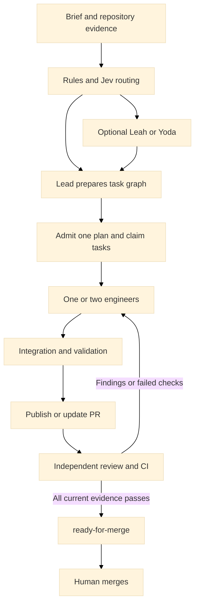

# A bounded software factory for Agentilda

Status: proposed architecture and implementation backlog, 2026-09-24. Runtime behavior is unchanged. This document answers the request for a plan that a lead and one or two engineers can implement as reviewed PRs.

## Recommendation

Keep the Ruby coordinator, existing worktree support, seven role definitions, and human-only merging. Replace the compulsory role procession with explicit task routing. Start with one active plan, at most two implementation workers, and no worker-created subagents. One lead owns the specification, interfaces, task graph, and integration. Research and specification editing become optional services. Review runs in a fresh session using a different model family, preferably a different coding CLI.

Jev advises on narrow decisions with explicit alternatives. Ruby enforces scheduling, dependency ordering, budgets, completion evidence, publication, and readiness. A model cannot declare CI green or override a conflicting file claim.

Success means less time and spend per correct, reviewable PR. Starting more agents is not itself progress. The reported 140M-token run is motivation, not a measured baseline: its traces were not audited for this proposal.

## Findings in this checkout

| Evidence | Consequence | Change |
| --- | --- | --- |
| `agents/leah-researcher.md`, Do steps 1-2: research fan-out and a project test run; 1,200-second timeout | Every new brief buys research orchestration and testing before scope is known | Bounded repository lookup only when an unanswered question requires it |
| `agents/yoda-writer.md`: re-read README, other plans and code; mandatory alternative framing and at least three non-goals | Already adequate briefs pay for another discovery and rewriting pass | Invoke only to repair missing acceptance criteria or ambiguity |
| `agents/palpatine-planner.md`: always write backend and frontend plans | Empty frontend work still becomes an agent assignment | Dispatch only tasks actually present |
| `agents/luke-backend.md`: explicitly uncapped subagents; both builders run full suites | Nested concurrency escapes the visible worker count and repeats validation | Coordinator owns all worker admission and validation |
| `lib/agentilda/cli/run/run.rb`: default jobs are CPU-derived, up to 12; tokens default to unmetered | Hardware capacity substitutes for a spending policy | Finite defaults, independent limits for plans and workers |
| `Dispatcher#dispatch` and `#next_dispatchable`: running jobs and role eligibility determine admission | No separate repository-wide active-plan budget or declared dependency graph | Persistent scheduler with an active-plan cap and task claims |
| `Executor#invocation`: hard-coded `claude`; model override applies to every role | A different name does not provide independent review | Provider adapters and a reviewer identity policy |
| `Dispatcher#verify_and_sign`, `Status::PLAN_HEADING`: interrupted work can advance from a heading | A partial artifact can look complete | Validated task results and acceptance evidence |
| `Publisher#publish`: commit, push, create; no existing-PR lookup in that method | Fix-and-republish needs idempotent update behavior, especially after a partial failure | Discover by repo and branch, reconcile commit/push/create separately |
| `agents/hansolo-reviewer.md`: approvals and comments; no readiness label contract | Human cannot rely on a current, deterministic ready queue | Harness-owned readiness calculation and label reconciliation |
| `CLAUDE.md`: says no commits, no `.ruby-version`, and missing `bin/setup`; all contradict this checkout | Stale setup guidance causes unnecessary work | Refresh instructions against current commands and CI |

These are source observations, not a performance profile or a current test-suite result. Existing timeouts, token metering, ledgers, state files, and process control are useful foundations; extend them rather than create competing implementations.

## Alternatives considered

1. Shorten the seven existing prompts. Cheapest immediate improvement, but it leaves compulsory stages, scheduling gaps, and weak evidence checks.
2. Add a deterministic coordinator with optional specialist tasks. Recommended. It reuses the code while making admission and completion testable.
3. Replace the coordinator with an autonomous manager agent. Flexible, but adds another costly reasoning loop and moves scheduling correctness into prose. Do not choose this for the first version.

## Workflow and ownership

Palpatine becomes the lead role, not another permanent running process. It writes one plan with acceptance criteria, task dependencies, interfaces, file ownership and validation commands. Specialists may answer a bounded design question; the lead remains the sole plan owner. Do not ask several agents to independently write competing plans.

Luke implements backend, CLI and general code tasks. Rey implements actual interface work, including terminal UI where appropriate. A Ruby repository can have UI work; language alone must not decide routing. For a backend-only change, Rey receives no invocation, including no paid invocation just to report that there is nothing to do.

Leah returns a short evidence packet: question, reusable code paths, relevant tests, unresolved facts. Start with at most five questions and a 600-word result. No full test suite as routine research. Permit a targeted reproduction when it answers a question. External research requires a named fact that local evidence cannot settle, such as an upstream compatibility change.

Yoda repairs an inadequate brief. Its output is an acceptance-criteria patch, not a literary rewrite. Preserve the user's intent; do not invent product decisions. Complete specs bypass Yoda. Lando remains a bounded resolver of explicit answers to blocked questions.

Han reviews the frozen diff, specification, acceptance results and relevant code in a fresh session. Provide implementation evidence, not the builder's entire conversation. Findings need a reproducible scenario and an actionable location. Different providers reduce shared blind spots but do not guarantee review quality.

## Scheduling and conflicts

Use two distinct limits: `max_active_plans: 1` and `max_workers: 2` as proposed defaults. These are new configuration fields, not current CLI flags. Lead/reviewer processes count toward workers. Native worker fan-out is disabled initially; later delegation must acquire a coordinator permit before spawning, including nested delegates.

An active plan occupies admission from planning through review and repair. A plan awaiting CI keeps its plan slot but releases process capacity. Ready, blocked, deferred and merged plans release active capacity. Start with `max_unmerged_prs: 2` so human review delays do not create an unlimited queue. Ready-but-unmerged plans retain conflict reservations: another plan touching their interfaces or owned paths waits for merge, even though the active slot is free.

Queue order is explicit user priority, then age. Repairs finish before fresh admissions. Do not use Jev to invent the user's business priorities. Persist admission, attempts, reservations, dependency satisfaction and budgets across process restarts. A second `tilda` for the same Git common directory must acquire the same exclusive scheduler lease or refuse to start. Detect live owners before recovering stale leases.

Start with one writer per plan worktree. Enable two writers only after file claims and frozen interfaces exist. Disjoint filenames are necessary but insufficient: schema changes, shared contracts, generated files, dependency manifests, lockfiles, routes and test databases can couple work. Claim paths and named resources. A broad rename claims its affected directory. A schema migration claims the schema resource. Only the lead changes contracts and shared manifests between worker waves.

Parallel writers must use enforced writable scopes or isolated task worktrees. Advisory `agent-lock` leases and after-the-fact diff checks alone cannot prevent lost writes. If a provider cannot restrict writes and a claim cannot be enforced, serialize. Task worktrees, when needed, branch from one frozen integration commit; the coordinator integrates in task dependency order and validates the combined result. Workers never cherry-pick or publish each other's work.

Cross-plan concurrency is a later opt-in with a maximum of two. First check explicit dependencies, write/write and write/read overlap, shared resources, unmerged reservations and base compatibility. Then ask Jev whether apparently disjoint changes alter the same behavior or interface. Uncertainty means serialize. Jev may veto concurrency; it cannot overrule a deterministic conflict. Recheck when claims or the base change. Recompute claims when workers discover extra files before granting further writes.

Dependent plans wait for a predecessor's human merge by default. Stacked PRs are a separate future feature, not an accidental consequence of concurrent worktrees.

## Durable contracts

Keep folder names as the authoritative lifecycle state in this iteration. Use one versioned `workflow.json` inside each plan for task definitions, routing decisions, attempts and evidence. It is authoritative for task execution, not a duplicate lifecycle status. Markdown is a human-readable view, not another independent task graph. Existing `StateFile` retains process heartbeat information.

Minimum records:

- Task: ID, owner role, acceptance IDs, dependencies, read paths, write paths, shared resources, command argv, timeout and token allowance.
- Decision: gate ID, evidence digest, question version, actual model ID, raw typed answer, policy outcome, fallback reason and timestamp.
- Attempt: unique ID, task ID, provider/model, input digest, exit reason, measured usage, changed paths and result artifact digest.
- Validation: candidate commit or tree digest, command/environment digest, exit status, log reference and completion time.
- Review: PR number, head SHA, base SHA, provider/model, findings and disposition.

Only the coordinator mutates `workflow.json`; workers return per-attempt result files. Use atomic writes under the repository lease. Validate schema versions and references, reject cycles, and refuse path traversal or claims outside the project. In-progress upgrades require an explicit migration command with a dry-run report and backup. Preserve old workflows under legacy mode until migrated; do not reinterpret a heading as a validated result.

## Budgets and context

These are starting experiment settings, not demonstrated optimal values:

| Work | Wall-clock allowance | Aggregate tokens per invocation | Required output |
| --- | --- | --- | --- |
| Jev decision batch | 10 seconds total including one retry | 8,000 input ceiling | Validated typed decisions |
| Leah repository lookup | 120 seconds | 25,000 | Evidence for named questions |
| Yoda clarification | 120 seconds | 20,000 | Acceptance-criteria patch or unresolved question |
| Palpatine planning | 240 seconds | 50,000 | Valid task graph and interfaces |
| Luke or Rey task | 600 seconds | 150,000 | Patch plus acceptance evidence |
| Han review | 300 seconds | 75,000 | Findings bound to current diff |
| Lando answer resolution | 120 seconds | 20,000 | Applied answers and remaining blockers |

Start with 600,000 total tokens per plan and 1,000,000 per run, including retries and delegated work. Persist spending so restarting cannot replenish it. Reserve each invocation's allowance atomically before admission, debit actual usage, and release unused reservation. Define wall time as a stop deadline, with a separately bounded shutdown grace. Limit each task to one automatic retry and each PR to two repair cycles. A repeated identical failure or no changed evidence stops immediately with a compact handoff. Larger features need explicit increased budgets or smaller plans.

Measure input, output, cache reads and cache writes separately. Track total context processed as well as provider-reported cost; 140M tokens including cached reads is not equivalent to 140M newly billed input tokens. Unknown usage remains unknown. If a subprocess cannot expose reliable usage, stop further admissions and report incomplete accounting rather than silently recording zero. Streaming enforcement may overshoot by usage reporting granularity; report this limit and keep reservations conservative. Cancellation must terminate descendants, not just the parent CLI.

Pass a task-specific context packet: acceptance criteria, paths, relevant interfaces, prior findings and validation summary. Cache repository inventory by commit plus working-tree digest. Give agents access to further files when required, but stop making every role read every plan. Cache test results only for identical source, dependencies, command and environment. Run focused tests while editing, then the full required project check once per integrated candidate before publication. Review or a change in the candidate invalidates affected evidence.

## Jev integration

Use a small Ruby HTTP adapter behind `DecisionClient#evaluate(state:, questions:, model:)`. The official API is `POST https://api.typesafe.ai/v1/systemone`, with Bearer authentication, and returns named answers plus usage. Choice offers labeled alternatives; Noul supplies a yes probability. Pin a tested model version and log the resolved version. Current documentation lists `jev-1.13.0`. Read `TYPESAFE_API_KEY` from the environment; a local dotenv loader must never print values. [API reference](https://docs.typesafe.ai/api), [model versions](https://docs.typesafe.ai/models).

| Junction | Narrow question / options | Code-controlled fallback |
| --- | --- | --- |
| Intake | Is relevant repository evidence missing? `sufficient`, `lookup`, `uncertain` | Lead does a bounded local lookup |
| Research | Does this named unresolved fact require upstream evidence? `local`, `external`, `uncertain` | Local lookup, then lead escalation |
| Spec quality | Are acceptance criteria actionable? `adequate`, `clarify`, `product_decision` | Lead checks; unresolved product choice blocks |
| Staffing | Which implementation disciplines are present? Separate backend and UI questions | Lead assigns actual tasks; explicit UI criteria cannot be skipped |
| Planning | Is the proposed task too broad for its budget? `bounded`, `split`, `uncertain` | Lead splits or revises |
| Admission | Do these two candidate plans change the same behavior or interface? | Serialize when uncertain or unavailable |
| Failure | Does supplied failure evidence suggest code, environment or transient infrastructure? | Owner investigates; no endless automatic retries |
| Model selection | Which of the configured, available capability tiers fits this task? | Configured standard tier; elevated risk uses stronger tier |

Batch independent intake questions against a small evidence packet. Dependent questions wait for new evidence. Cache by canonical state digest, rubric version and pinned model. Do not query Jev on every scheduler tick. It has no repository tools: provide evidence, and never interpret a terse answer as proof of an unseen fact.

Choice confidence is derived from the distribution, and Noul has no separate confidence field. Neither means verified correctness. Start routing in shadow mode; collect labeled decisions before enabling skips. Trial thresholds such as Choice confidence >= 0.90 and selected probability >= 0.95 are hypotheses, not guarantees. Tune per gate using held-out data and report false skips and abstention rates. [Confidence semantics](https://docs.typesafe.ai/confidence).

Reject malformed responses, missing answers, unknown alternatives and invalid probability values. Retry only transient failures once within the total deadline, respecting retry-after when it fits. Authentication/schema errors do not retry. Use conservative fallbacks when unavailable. Jev never authorizes a merge, changes an acceptance criterion, certifies tests, grants additional spend, or approves a PR.

## Review, CI and ready-for-merge

Implement a provider-neutral executor result and adapters for Claude and a second coding CLI. Configure builder and reviewer separately. Validate independence using actual provider/model identities, not role names. Prefer Claude builder and Codex reviewer or the reverse, subject to available authenticated tools. If strict independent review is unavailable, park as awaiting review; do not silently reuse the builder. Preserve process cancellation, permissions and usage reporting in both adapters. A global model override must not erase the review policy.

The coordinator owns commit, push, PR creation/update, CI polling and labels. Publication is an idempotent reconciliation: lookup branch PR, validate the candidate, commit selected task changes, push, then create or update. A push that succeeded before a network failure must not cause another PR on retry. Keep workers from staging unrelated or secret files. Never use unconstrained `git add -A` on a shared checkout.

Run independent review and remote CI concurrently after publishing a validated candidate. Route findings to the owning engineer, resolve or explicitly rebut them with evidence, publish the new head, and repeat within the repair budget. Review and test evidence for an older head cannot approve the new head. Infra failures may receive one bounded retry; recurring failures park with logs.

Add an explicit `ready_for_merge` lifecycle state. Keep the existing `approved` key's current merged semantics during migration and make UI labels unambiguous. Update state invariants, topology, reconciliation, Linear placement, dashboard and generated workflow documentation together.

Create `ready-for-merge` idempotently on each target repository if absent, preserving any existing label's metadata. Apply it only when all of these hold:

- The PR is open and not a draft; the assessed head SHA is still current.
- A fresh independent review has no unresolved blocking findings for the current head and assessed base.
- All required checks for that head pass, including status contexts from CircleCI or other providers. Pending, missing, cancelled or unknown is not success. If the repository has no required-check policy, require configured check names or an explicit no-CI policy.
- Required local validation passed on the same candidate content; the PR has no merge conflicts and satisfies the configured base freshness policy.
- Every acceptance criterion has evidence; no blocking dependency or product question remains.

Read head/base again immediately before labeling. Record the readiness evidence. Reconcile on pushes, new reviews, CI changes and base changes, removing the label on invalidation. A bounded polling process or webhook consumer is required for freshness after a run exits; document the polling window. A label is advisory and must not replace branch protection. Human merge remains the only merge path.

GitHub identity and model independence are separate concerns. If the automation uses the PR author's GitHub account, do not assume it can approve its own PR. Record the independent model verdict as a check/comment and label; use a separately authorized bot identity where formal GitHub approval is required. Product integration should explicitly configure permission to publish these artifacts.

## Braintrust tracing

The official Ruby gem supports custom OpenTelemetry spans and Ruby evaluations; its SDK is beta, so pin a tested version. Initialize explicitly with automatic instrumentation disabled, then instrument selected in-process clients. Claude/Codex child-process model calls need a transcript bridge or supported child telemetry; loading a Ruby gem in the parent does not instrument them. [Ruby SDK](https://github.com/braintrustdata/braintrust-sdk-ruby).

Proposed trace hierarchy: run, plan, decision/task, provider call/tool/validation/publish/review. Propagate trace context explicitly across Ruby threads. Normalize child events into spans only where timestamps and identities are available. Mark absent nested telemetry rather than fabricate call-level visibility. Deduplicate partial and final usage events.

Capture plan/task/attempt IDs, source and prompt digests, provider and resolved model, routing/fallback, queue time, execution time, cache usage, retries, validation result, PR/head/base and final outcome. Keep local accounting authoritative. Export failures must not retry agent work. Bound the telemetry queue and shutdown flush; retain sanitized local summaries when export fails. Content capture defaults off. Exclude environment values, authorization headers and `.env`; export only allowlisted/redacted payload fields. Use `BRAINTRUST_API_KEY` independently of the TypeSafe key.

## Evals and acceptance metrics

The new `evals/` directory contains a starter case corpus and evaluation contract. It is design data, not an implemented runner or a measured benchmark. Cover all seven roles, routing, scheduling and the PR lifecycle.

Use deterministic scorers first: relevant tests pass, write scope honored, required criteria preserved, no stale readiness, valid task graph, budget bounded. Use human-labeled examples for routing. Use independent model graders only for semantic judgments that cannot be tested directly; do not let Jev grade its own routing decisions as ground truth.

Maintain separate development and held-out cases grouped by problem family, so near-duplicates cannot leak between them. Run offline fixture/replay checks in ordinary CI. Run credentialed live agent evals as an explicit cost-capped job, never on untrusted fork code with secrets. Start with a small manually initiated smoke set, then schedule broader runs only once accounting is proven. Record model versions, prompt/config digests and dataset versions in Braintrust experiments.

Compare the old and new workflows on the same pinned fixture repos with three repetitions per live case. Report median/p95 time, total tokens, billed/estimated cost, correct completion, unnecessary invocations, false skips, conflicts, repair count, and false-ready rate. Separate model time from queue, tests and CI time. Initial targets: halve median pre-build overhead and total context tokens on simple tasks, with no loss of acceptance-test success and zero false-ready results on the release safety corpus. These are targets to test, not promised speedups.

## Implementation backlog

This is a PR-sized delivery plan. Each item has a separate review boundary. Use focused failing specs for the named failure cases, implement, run those specs, then run the repository gate. A lead reviews integration changes; the second engineer reviews adapters/evals. For two engineers, combine engineers A and B sequentially. Do not run all PRs concurrently merely because this table has multiple owners.

| PR | Owner | Dependencies | Deliverable |
| --- | --- | --- | --- |
| 1 | Lead | None | Persistent budgets, admission cap and no nested fan-out |
| 2 | A | PR 1 event/result contracts | Braintrust bridge and local usage accounting |
| 3 | Lead | PR 1 | Versioned task graph and real completion evidence |
| 4 | B | PR 3 routing contract | Jev adapter, shadow routing and optional stages |
| 5 | A | PR 1 executor contract | Second executor and independent review policy |
| 6 | Lead | PRs 3, 5 | Repeatable publication, repair loop and readiness label |
| 7 | B | PRs 2, 4, 5, 6 | Runnable evals, comparison reports and release gates |
| 8 | Lead + A | PRs 3, 4, 6, 7 | Opt-in parallel task and cross-plan admission |

### PR 1: Stop uncontrolled spending

- [ ] Modify `config.rb`, `cli/run/run.rb`, `runner.rb`, `dispatcher.rb`, `executor.rb`, `state_file.rb` and builder prompts. Add `budget.rb` and `scheduler.rb` with `reserve`, `consume`, `release` and `admit` operations under one repository lease.
- [ ] Default to one active plan and one writing worker. Enforce finite per-attempt, per-plan and per-run allowances. Remove native Task grants until permits can be enforced. Include attempts across restarts.
- [ ] Add specs for two simultaneous reservations exceeding the cap, second coordinator refusal, restart after partial spend, descendant termination, and a paused CI plan retaining admission. Verify no agent starts when the budget is exhausted.
- [ ] Expose effective limits and stop reasons in dry-run output and the dashboard. Publish normalized attempt events for PR 2 and adapter integration.

### PR 2: Trace what actually runs

- [ ] Add `telemetry.rb`, modify `transcript.rb`, `executor.rb`, `runner.rb` and `agentilda.gemspec`. Pin the selected Braintrust version after Ruby 4.0.6 compatibility verification.
- [ ] Emit run/attempt spans and normalized usage without exporting raw content. Add decision and validation hooks that later PRs can call. Define `Telemetry#span(name, attributes:)` with a no-op implementation when disabled.
- [ ] Use recorded transcript fixtures to verify partial/final events are counted once, child events correlate correctly, concurrent threads retain their own parents, secrets are redacted and export failure does not rerun work.
- [ ] Add one explicitly enabled live smoke procedure; local replay tests require no credentials.

### PR 3: Plan only necessary work

- [ ] Add `workflow.rb`, `task_graph.rb` and schema validation. Modify `status.rb`, `state_machine.rb`, `dispatcher.rb`, `agents.rb`, `agent.rb`, `subject.rb` and the planner/worker prompts.
- [ ] Define `TaskGraph#ready(completed_ids:)`, task claim records and a coordinator-owned result validator. Validate unknown dependency IDs, cycles, acceptance coverage and output evidence.
- [ ] Replace heading-based interrupted completion for migrated plans. A killed planner leaving `# Plan` stays interrupted. A completed backend-only graph schedules no frontend process.
- [ ] Make the lead own interfaces before dispatch; workers request amendments. Add dry-run migration and compatibility fixtures for old folders. Regenerate `docs/WORKFLOW.md` from the state definitions.

### PR 4: Add Jev where judgment is useful

- [ ] Add `decisions/client.rb`, `decisions/policy.rb` and versioned rubrics. Modify config and the routing seam from PR 3; update Leah/Yoda prompts for bounded optional work.
- [ ] Implement the documented HTTP request and response validation, total deadline, one transient retry, versioned cache and conservative fallback. Read credentials without exposing them to logs or decision state.
- [ ] Test malformed JSON, missing answer, out-of-range probability, low confidence, 401, 429, timeout, cache invalidation and unavailable model. Explicit UI criteria must survive an incorrect skip recommendation.
- [ ] Ship in shadow mode. Enable individual automatic gates only after PR 7 reports held-out performance; deterministic routing remains available without a TypeSafe key.

### PR 5: Make review independent

- [ ] Extract current invocation/stream behavior into `providers/claude.rb`; add `providers/codex.rb` and `providers/registry.rb`. Keep `Executor` responsible for lifecycle, budgets and policy. Verify supported CLI flags against installed versions during implementation.
- [ ] Give both adapters `run(task:, context:, limits:, on_event:)` and a normalized result with provider/model, usage, exit reason and artifacts. Unsupported capabilities fail preflight explicitly.
- [ ] Add builder/reviewer configuration and model-family validation. Han consumes structured evidence and emits structured findings. Keep publication in the coordinator.
- [ ] Test different identities, unavailable reviewer, global model override, cancellation and malformed provider output. Verify equivalent permission boundaries; do not map Claude flags blindly onto Codex.

### PR 6: Close the PR loop

- [ ] Add `validation.rb`, `review.rb` and `readiness.rb`; extend `publisher.rb`, `github.rb`, `pull_requests.rb`, `dispatcher.rb`, status/topology, Linear placement and UI.
- [ ] Define `Readiness#evaluate(pr_snapshot:, validation:, review:, dependencies:)` as a pure decision returning ready/reasons. Apply GitHub mutations separately with head rechecks.
- [ ] Discover the existing PR by branch. Recover from commit-success/push-failure and push-success/create-timeout. Validate selected files before commit. Configure the project validation command explicitly.
- [ ] Test stale review SHA, changed base, pending/missing/failed CircleCI statuses, no-CI policy, label removal, author-account approval refusal, bounded repair loops and no merge invocation.
- [ ] Add bounded readiness reconciliation after the run through an explicit watch command or documented service deployment. Prove a new push removes readiness within its configured polling interval.

### PR 7: Make quality and spend measurable

- [ ] Turn `evals/cases.jsonl` into executable fixtures under `evals/fixtures/`; add `evals/run.rb`, deterministic scorers and per-agent entry points. Add offline/live recipes to `justfile` and an offline CI job.
- [ ] For code tasks, create tiny repositories with failing acceptance tests and expected ownership. Evaluate actual resulting code rather than whether the response claims success. Use replay fakes for GitHub mutations.
- [ ] Run each of the seven agent roles and all workflow gates against positive, negative and ambiguous cases. Add injected secret strings, misleading repo instructions, interrupted processes and stale-commit cases.
- [ ] Produce a Braintrust comparison with model/prompt/config versions, cost caps and held-out results. Block releases on deterministic safety failures; treat the small starter corpus as insufficient evidence for statistical claims.

### PR 8: Admit proven parallel work

- [ ] Add `claims.rb`; extend scheduler/worktree management and decision policy. Start with task-level concurrency inside one active plan. Add cross-plan concurrency only after those fixtures pass.
- [ ] Test disjoint files sharing a schema, independent docs/code, path renames, symlink/path escape, unexpected writes, shared test ports, stale lease recovery and a ready-but-unmerged conflicting plan.
- [ ] Enforce writer isolation or remain serial. Integrate from a frozen base in dependency order and validate combined output. Jev may only veto an otherwise eligible pair.
- [ ] Compare throughput, conflicts and spend against serial mode. Keep the default at one active plan unless measured improvement justifies changing it.

## Delivery discipline and rollout

First land PR 1. Develop telemetry and the task graph in parallel only after their event/result interfaces are fixed; they share executor/dispatcher integration, which the lead owns. Land those integration edits sequentially. Engineer B can prepare eval fixtures while provider work proceeds. Two or three engineers should have at most two implementation branches awaiting integration, not eight speculative branches.

For every PR: focused verification, full repository gate, independent review, corrections, another full gate after code changes, push, remote CI, then readiness. In this repository use `.agent/saul-gooodman` if present; otherwise `just ci` invokes lint and tests. Current CircleCI runs RuboCop and RSpec. Establish the actual baseline first; do not accept the stale failure inventory in `CLAUDE.md` as permission to ship failing checks.

Retain the legacy workflow behind an explicit mode during rollout. New bounded mode starts opt-in, then becomes default after fixture and live comparisons. Disabling Jev or Braintrust must preserve deterministic operation and local accounting. Reverting prompts alone must not erase persistent budgets or readiness evidence.

The first useful release is PRs 1-3: less uncontrolled work, visible spending, and validated tasks. The next release adds optional routing and the reviewed-PR loop. Concurrency is last. A faster factory that manufactures unreviewable branches is still making the wrong product.
