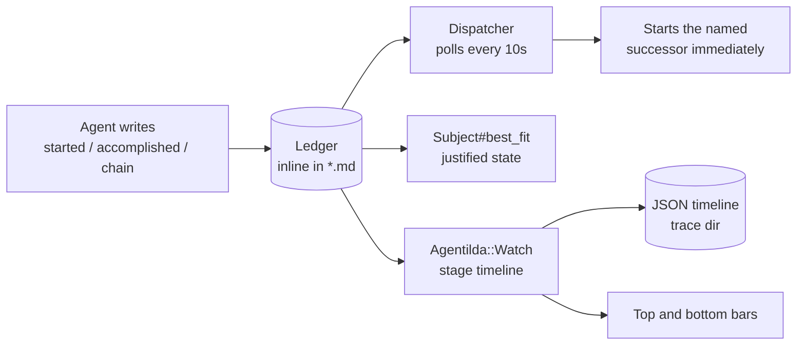
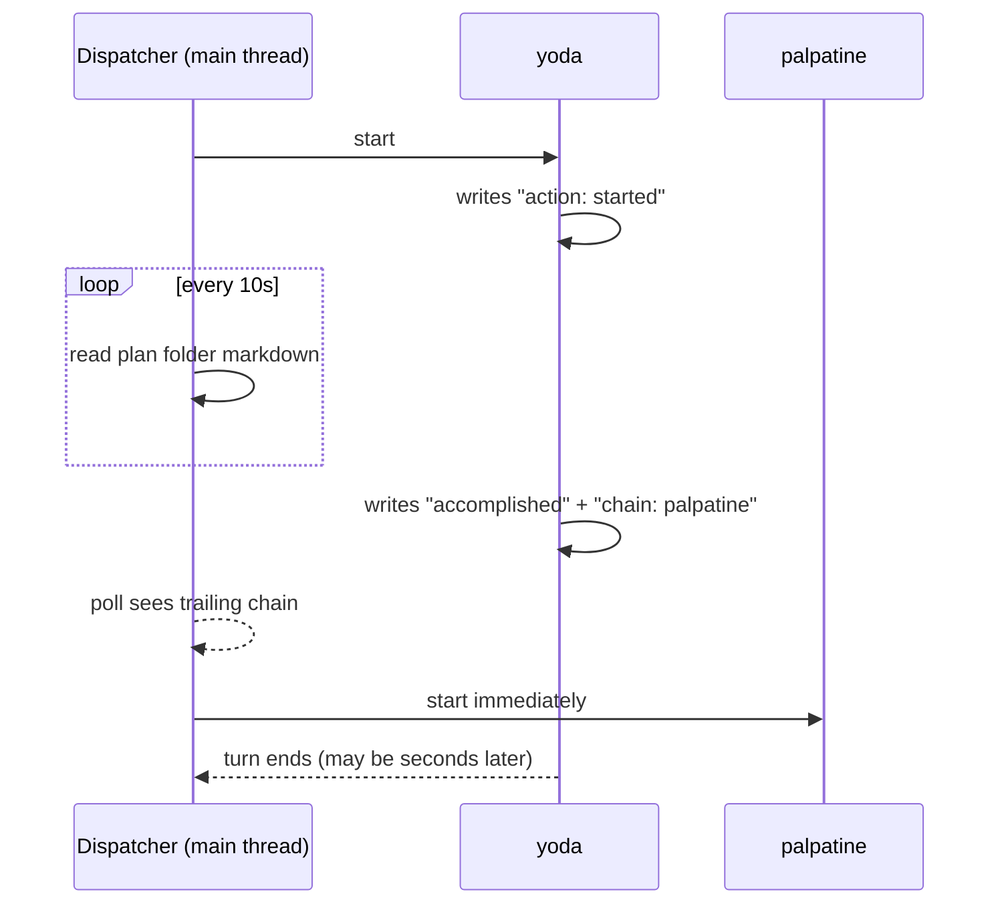
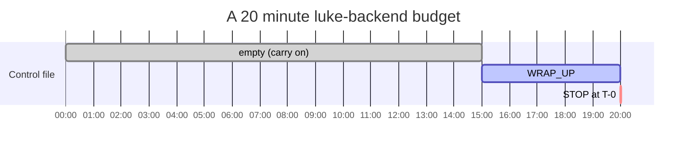
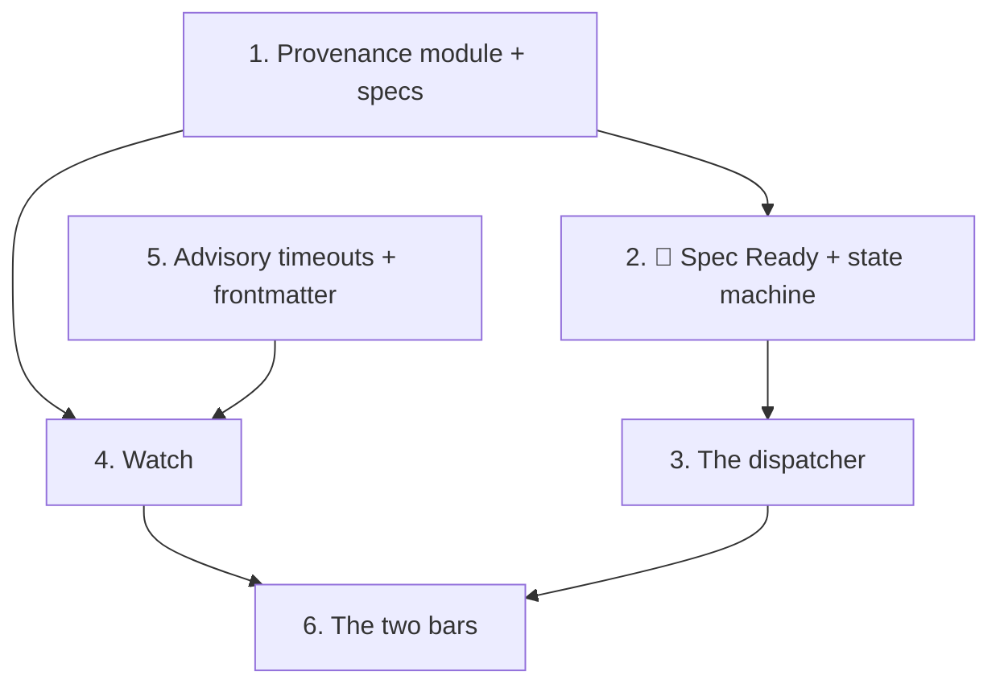

# The Agent Ledger, Advisory Timeouts, and the Two Status Bars

Date: 2026-09-05 Status: Design, awaiting approval

## The problem, in one run

A real run over plan `020.00` produced this:

```text
round 1
  020.00        yoda-writer     no change       completed - 11 tool calls
round 2
  020.00        yoda-writer     no change       completed - 20 tool calls

1 plan addressed - 2 rounds - 6m02s - 1.0 agents at a time
```

`yoda-writer` ran twice, succeeded twice, and the plan never moved. `palpatine-planner` was never invoked. The loop then conceded on two dry rounds and stopped, with the work unfinished and nothing in the output saying why.

Three separate defects meet in that transcript, and this document addresses all three plus the display that would have made them visible.

### Defect 1: a state whose invariant names a file written by the agent that handles it

`status.rb:151` declares:

```ruby
key: :planned, emoji: "⭐️", label: "Planned", requires: %w[spec.md plan.md]
```

`plan.md` is written by `palpatine-planner`, and `palpatine-planner` has `handles: [planned]`. So a plan must already **be** ⭐️ Planned before the agent that produces the evidence for ⭐️ Planned is ever offered the work. Nothing can enter the state legitimately.

`yoda-writer` declares `advances_to: planned` and renames its folder to ⭐️ on the way out. Then the per-round serial `Resync::Dirs` pass (`runner.rb:212`) computes `best_fit`, finds no `plan.md`, concludes 🔎 Researched, and renames the folder straight back. The chain in `Runner#attempt` then reads `further_of(current)`, gets `researched`, sees `fit.key == from`, and breaks. Every round after that repeats it exactly.

### Defect 2: chaining infers the handoff instead of being told it

`Runner#attempt` decides who runs next by re-reading the folder and guessing from its contents and its name. That inference is why defect 1 is fatal rather than cosmetic: an agent that finished its work correctly has no way to say so.

### Defect 3: the timeout kills

`Executor#call` passes `timeout:` to `TTY::Command`, which terminates the child. A long chain is therefore capped by its slowest single agent, and an agent that needed thirty more seconds to write its output loses everything it had not already flushed.

## What we are building

Four changes, in dependency order.

1. **A ledger, and a dispatcher that polls it.** Agents stamp what they did into the documents they write. The main thread re-reads those documents every ten seconds and starts the next agent the moment one names it.
1. **🏁 Spec Ready.** A new state between 🔎 Researched and ⭐️ Planned, which makes ⭐️ Planned honest.
1. **Advisory timeouts.** The clock warns and asks; it never kills.
1. **A watch and two bars.** One object records every stage, and two pinned lines render it.

______________________________________________________________________

## 1. The ledger

Every agent stamps the section it owns, on the way in and on the way out.

```markdown
## Research

> [!NOTE]
>
> [2026-09-04.13:34:33PM PST | agent: leah | purpose: research | action: started]

...the chapter...

> [!NOTE]
>
> [2026-09-04.13:44:33PM PST | agent: leah | purpose: research | action: accomplished]
> [2026-09-04.13:45:21PM PST | agent: yoda | purpose: pre-planning | action: chain]
```

The last line is the important one. `action: chain` names the agent that runs **next**, so the harness is told the handoff rather than inferring it. Reading the ledger backwards for the most recent `chain` entry answers both "is the previous stage finished" and "who takes it from here" in a single lookup.

### Entry grammar

One entry per line, inside a GitHub alert blockquote:

```text
[<timestamp> | agent: <name> | purpose: <phase> | action: <verb>]
```

| Field       | Meaning                                                                                             |
| ----------- | --------------------------------------------------------------------------------------------------- |
| `timestamp` | `YYYY-MM-DD.HH:MM:SSAM/PM TZ`, local time with the zone spelled out                                 |
| `agent`     | The short name (`leah`), resolved against the roster by prefix as `Agents#match` already does       |
| `purpose`   | Free text naming the phase: `research`, `pre-planning`, `planning`, `backend`, `frontend`, `review` |
| `action`    | One of the verbs below, and nothing else                                                            |

### The action vocabulary

This is a closed set. An unrecognised verb is a parse failure that gets reported, never a silently ignored line.

| Verb               | Meaning                                                                             |
| ------------------ | ----------------------------------------------------------------------------------- |
| `started`          | This agent has begun. Written before any real work.                                 |
| `accomplished`     | The assignment is done. The only verb that earns a `chain`.                         |
| `almost completed` | Substantially done, something remains. No chain; the same agent gets another round. |
| `interrupted`      | Stopped early, by `STOP` or by its own judgement. No chain; the same agent resumes. |
| `blocked`          | A question only a human can settle. No chain; `blocked.md` carries the question.    |
| `chain`            | Names the agent that runs next. Written last, on the line after `accomplished`.     |

### The agent writes all of it, from one identical paragraph

Every agent writes its own opening block, its own outcome verb, and its own `chain` line. Nothing about the ledger is written by the harness.

The paragraph instructing it is **literally identical for every agent**, because it is not copied into the seven definition files at all. `Executor#ledger_section` renders it into every prompt the same way `time_budget_section` and `control_section` already do, so there is exactly one copy of the wording and it cannot drift between agents. The only per-invocation substitutions are the agent's own name, its `purpose`, and the name of its successor, which the harness resolves from `advances_to` and hands to the agent so the agent does not have to know the roster.

```text
## The ledger - write this at the start and at the end

Before you do any work, append to the document you are about to write:

    > [!NOTE]
    >
    > [<now> | agent: leah | purpose: research | action: started]

When you finish, append:

    > [!NOTE]
    >
    > [<now> | agent: leah | purpose: research | action: accomplished]
    > [<now> | agent: yoda | purpose: pre-planning | action: chain]

Write `accomplished` only if your assignment is genuinely complete. If it is
not, write `almost completed`, `interrupted` or `blocked` instead, and write
NO `chain` line. The `chain` line is what starts the next agent, and writing
it over unfinished work starts them on unfinished work.
```

> [!IMPORTANT]
> The `chain` line is an instruction that takes effect within ten seconds of being written, whether or not the agent has ended its turn. Writing it early does not reserve a place in a queue; it starts another agent on work that is not finished.

### Where entries live

Inline, in the markdown the agent was already writing, exactly as sketched above. Not in a separate ledger file.

The reason is the reason this codebase gives everywhere else: a second copy of a fact is a copy that drifts. The provenance a human wants to see when reading `spec.md` and the provenance the state machine routes on are the same fact, so they are stored once. `Agentilda::Provenance` scans every `*.md` in the plan folder, which are files the harness already reads.

> [!CAUTION]
> An agent that rewrites `spec.md` wholesale can drop earlier entries. `Watch` absorbs every entry it sees on each poll and writes a JSON timeline outside the repository, which no agent can rewrite, for the same reason traces live there. The ledger is the live signal; the timeline is the durable record.
>
> Dropping entries cannot replay a handoff, either: the dispatcher acts on a `chain` entry once, keyed by plan, agent and timestamp, so an entry that reappears after a rewrite is recognised as one already honoured.

### What reads it



Three consumers, none of which guess any more:

- **The dispatcher** on the main thread polls for a trailing `chain` entry and starts the named successor immediately. See section 1.1.
- **`Subject#best_fit`** derives the justified state from the last `accomplished` entry, so `Resync::Dirs` stops renaming a folder backwards past work that genuinely happened. The emoji in the folder name becomes a rendering of the ledger rather than an independent claim about it.
- **`Agentilda::Watch`** builds its stage timeline from the same entries, which is why a run that dies still leaves a readable history.

## 1.1 The dispatcher

The main thread is the puppet master. It knows which plan folder each running agent is writing into, and every **10 seconds** it re-reads that folder's markdown. When a folder's ledger **ends** on an `action: chain` entry, that is the signal: the named successor is started immediately.



> [!IMPORTANT]
> The successor starts when the `chain` line **appears**, not when the previous agent's process exits. Those are different moments and the gap between them is exactly what this design is buying back. `yoda` writing its closing block and then spending forty seconds tidying up no longer costs `palpatine` forty seconds.

Consequences to handle explicitly:

| Question                                              | Answer                                                                                                                                |
| ----------------------------------------------------- | ------------------------------------------------------------------------------------------------------------------------------------- |
| Do predecessor and successor overlap?                 | Briefly, yes. The predecessor is finishing; the successor is starting. Both hold a job slot.                                          |
| What if no slot is free?                              | The successor is queued and started by the first poll after a slot frees. The `chain` entry is not consumed until it actually starts. |
| Can one `chain` line start the successor twice?       | No. Each `chain` entry is keyed by plan, agent and timestamp, and the dispatcher records which it has acted on.                       |
| What if the predecessor writes `chain` and then dies? | The successor already started. That is the intended behaviour: the predecessor said the work was done.                                |
| What if the successor is already running?             | Ignored, logged. An agent is never started twice on one plan.                                                                         |
| What if `chain` names an unknown agent?               | Refused and reported on the plan's line, rather than silently doing nothing.                                                          |

Ten seconds is a deliberate number: fast enough that a handoff feels immediate against agents that run for ten to twenty minutes, slow enough that polling a handful of small markdown files costs nothing measurable.

`Runner#attempt`'s existing in-task chain loop, `further_of`, and `MAX_CHAIN_HOPS` are all removed. The dispatcher replaces them, and the round boundary stops being the unit at which handoffs happen.

### New modules

| File                          | Holds                                                                                                                                                                |
| ----------------------------- | -------------------------------------------------------------------------------------------------------------------------------------------------------------------- |
| `lib/agentilda/provenance.rb` | `Entry` (a `Data`), the one regex, the renderer, `Provenance.for(feature)` returning entries in file-then-line order. Nothing else in the codebase knows the syntax. |
| `lib/agentilda/dispatcher.rb` | The 10 second poll, the honoured-`chain` set, and the decision to start a successor                                                                                  |
| `lib/agentilda/watch.rb`      | Stages, the JSON timeline, and what the bars read                                                                                                                    |

______________________________________________________________________

## 2. 🏁 Spec Ready

Inserting one state resolves defect 1 without weakening any invariant.


| State         | Means                                       | Justified by                                                  |
| ------------- | ------------------------------------------- | ------------------------------------------------------------- |
| 🔎 Researched | The topic has been researched               | `accomplished` by leah, or the existing `## Research` heading |
| 🏁 Spec Ready | The spec is finished, nobody has planned it | `accomplished` by yoda                                        |
| ⭐️ Planned    | `plan.md` exists, building has not started  | `spec.md` and `plan.md`, unchanged                            |

⭐️ Planned keeps `requires: %w[spec.md plan.md]` and becomes honest, because `palpatine-planner` now writes `plan.md` on the way **in** rather than being the agent that handles the state.

Accepting the existing `## Research` heading as an alternative proof for 🔎 matters: hand-written and pre-existing plan folders have no ledger, and a change that invalidated every folder already on disk would be a migration disguised as a feature.

### Knock-on changes

| File                          | Change                                                                                                 |
| ----------------------------- | ------------------------------------------------------------------------------------------------------ |
| `status.rb`                   | `spec_ready` entry in `STATUSES`, between `researched` and `planned`                                   |
| `state_machine.rb`            | `SPINE`: `researched -> spec_ready -> planned`; `PREFERENCE` gains `spec_ready`; a `finish_spec` event |
| `agents/yoda-writer.md`       | `advances_to: spec_ready`                                                                              |
| `agents/palpatine-planner.md` | `handles: [spec_ready]`, `advances_to: planned`                                                        |
| `agents/luke-backend.md`      | `handles: [planned, rejected]`                                                                         |
| `agents/rey-frontend.md`      | `handles: [planned, rejected]`                                                                         |

🟡 Building keeps its meaning, "the back end is under way". `luke-backend` renames the folder to 🟡 when it starts rather than inheriting it from `palpatine-planner`, so the board distinguishes work in flight from work queued.

Adding a state makes `docs/img/plan-spec-build.png` stale. `just docs` regenerates the mermaid source; the hand-drawn image needs redrawing separately, and that is called out rather than quietly skipped.

______________________________________________________________________

## 3. Advisory timeouts

The clock stops killing. It warns, then asks, and that is all it does.



| Moment | What happens                                                              |
| ------ | ------------------------------------------------------------------------- |
| T-5min | `WRAP_UP` written to the invocation's control file. The line turns amber. |
| T-0    | `STOP` written. The line turns red and reads `[wrapping]`.                |
| after  | Nothing. The agent runs until it ends its own turn.                       |

`Control::WRAP_UP` and `Control::STOP` already exist and every agent prompt already tells the agent to poll its control file, so this reuses the whole mechanism rather than inventing one. What changes in `Executor#call` is that `timeout:` is no longer handed to `TTY::Command`; a watchdog thread writes the two words at the two moments instead.

> [!WARNING]
> The consequence, accepted deliberately: **a wedged agent runs until you press `q`.** Nothing else bounds it. `q` keeps its existing 60 second grace and its hard abort, so there is still a way out, but it is now a key somebody presses rather than something the harness does on its own.

### Short budgets

An agent with a 5 minute budget would see `WRAP_UP` at t=0, which is not a warning but a starting instruction. So the warning fires at `min(300, timeout / 2)` seconds before the deadline. `hansolo-reviewer` at 300s is warned at 2m30s, which is a warning.

### `--timeout` becomes a cap

Today `Executor#timeout_for` reads `agent.timeout || @timeout`, so an agent's frontmatter wins outright and `--timeout` cannot tighten it. The new rule, which is what was asked for:

```ruby
def timeout_for(agent) = [agent.timeout, @timeout].compact.min
```

A command-line `--timeout` only affects agents whose own budget is longer. An agent already tighter than the flag keeps its own number.

______________________________________________________________________

## 4. Frontmatter: budgets and sub-agent limits

Two frontmatter keys the application reads and states in the prompt, so the number the agent is told and the number enforced can never disagree.

| Agent               | `timeout` | `subagents` | Rationale                                        |
| ------------------- | --------- | ----------- | ------------------------------------------------ |
| `leah-researcher`   | 600       | `0..2`      | Research fans out, but two helpers is the budget |
| `yoda-writer`       | 600       | `0..`       | Unbounded; yoda's helpers are cheap and parallel |
| `palpatine-planner` | 600       | `1..9`      | Must fan out at least once; nine is the ceiling  |
| `luke-backend`      | 1200      | `0..`       | Plans, builds, tests                             |
| `rey-frontend`      | 1200      | `0..`       | Plans, builds, tests                             |
| `hansolo-reviewer`  | 300       | `0`         | One review, called immediately                   |

`subagents` parses as a Ruby range literal in the frontmatter (`0..2`, `1..9`, `0..`). `Agent#subagents` returns a `Range`; `Executor#subagent_section` renders it into the prompt beside the existing time and token budgets. A lower bound above zero is stated as a requirement, not a permission.

> [!NOTE]
> Two figures were given for `hansolo-reviewer`, ten minutes and then five. Five is taken, on the grounds that the later and more specific statement wins. Say so if that is backwards.

### luke and rey

Their prompts gain the sequence that was asked for, replacing the current "start building" opening:

1. **Divide the work first.** Agree the split and the API contract with each other over `SendMessage` before either writes code.
1. **Each writes its own plan.** `plan-backend.md` and `plan-frontend.md`, each documenting the agreed contract from its own side, so the contract is recorded twice from two directions and a disagreement is visible on disk.
1. **Implement.** Each half, with unit coverage of every unit it owns.
1. **Combine and verify.** One worktree, both halves, the project's own checks green.
1. **Then open the pull request.** One, or two if the halves genuinely separate, and never before step 4 passes.

The pairing itself is not new. What is new is that step 1 and step 2 are named as deliverables rather than assumed.

______________________________________________________________________

## 5. `Agentilda::Watch`

One object, owned by the main thread, holding every stage of every plan.

```ruby
Stage = Data.define(:ordinal, :agent, :purpose, :started_at, :ended_at, :action, :up, :down, :subagents)
```

It is populated from two sides, which is what makes it survive a crash: the dispatcher's 10 second poll feeds it every ledger entry it reads anyway, and the live `Runner` feeds it token counts and process ids that never reach the ledger. `Watch#absorb(entry)` and `Watch#observe(attempt)` are the two doors.

The poll is shared rather than duplicated. The dispatcher is already reading every running plan's markdown on a timer; `Watch` is the second reader of that same read, not a second timer over the same files.

| Output         | Where                                             |
| -------------- | ------------------------------------------------- |
| Live bars      | The two pinned lines, read every repaint          |
| Progress log   | `UI.log`, one line per stage boundary             |
| JSON timeline  | `<trace_dir>/run-<pid>-timeline.json`, at the end |
| Closing report | A stage table beside the existing `Tally`         |

The JSON timeline is the durable copy the ledger is not. An agent cannot rewrite it, because it lives outside the repository for the same reason traces do.

______________________________________________________________________

## 6. The two bars

Drawn with an ANSI scroll region: `DECSTBM` reserves row 1 and the last row, and the spinners keep scrolling between them exactly as they do today. `TTY::Spinner::Multi` is untouched, the run stays in the scrollback, and a pipe or a CI log gets today's behaviour unchanged because `UI.animate?` is already the gate.

```text
▓ opus-5 · 3 plans: 020.00 021.00 022.00 · ▓▓▓▓░░░░░░ 12:41 / ~50:00
────────────────────────────────────────────────────────────────────
 ⠹ 9:12 ↑1.5M ↓11k  020.00 yoda-writer [99605, round 02]: writing...
 ⠹ 4:03 ↑220k ↓2k   021.00 leah-researcher [99612, round 02]: ...
 ✓ ⏳ 2m14s          022.00 leah-researcher [done]
────────────────────────────────────────────────────────────────────
 3 plans · 5 agents busy · ↑ 2.7M ↓ 22k
```

**Top bar.** The model name in dark green, every plan currently in flight, and a progress bar measuring elapsed wall clock against the summed remaining budgets: for each plan, the sum of the timeouts of the agents that still have to touch it, divided by the job slots. Re-derived each round, so the estimate shortens as plans finish rather than standing still.

**Bottom bar.** White background, black text, as asked. Plans being worked, total agents busy, and cumulative tokens up and down for the whole run.

**Finished lines** gain `⏳` and the elapsed time beside the agent's name, and read `[done]`:

```text
 ✓ ⏳ 2m14s  022.00 leah-researcher [done]
```

### Risks in this piece

| Risk                               | Handling                                                                   |
| ---------------------------------- | -------------------------------------------------------------------------- |
| Terminal resize breaks the region  | Trap `SIGWINCH`, recompute, redraw both bars                               |
| Region left set after a crash      | `at_exit` and an `ensure` around the loop restore the full screen          |
| Terminal without `DECSTBM` support | `UI.animate?` already gates it; fall back to today's unpinned output       |
| Bars overwrite spinner output      | Both bars are drawn outside the region, with the cursor saved and restored |

______________________________________________________________________

## Testing

| Area          | How                                                                                                                                                                                                                                                                                                                        |
| ------------- | -------------------------------------------------------------------------------------------------------------------------------------------------------------------------------------------------------------------------------------------------------------------------------------------------------------------------- |
| `Provenance`  | Parse and render round-trip; malformed entries; entries spread over several files; an agent that dropped earlier entries                                                                                                                                                                                                   |
| State machine | 🏁 inserted; a folder with a yoda `accomplished` is 🏁 and stays 🏁 after `Resync::Dirs`; the exact `020.00` transcript as a regression example                                                                                                                                                                            |
| Dispatcher    | A trailing `chain` starts the named successor on the next poll, without waiting for the predecessor to exit; the same entry never starts it twice; `almost completed` and `interrupted` start nobody; an unknown successor is refused and reported; a successor with no free slot starts at the first poll after one frees |
| Timeouts      | `WRAP_UP` at the warning moment, `STOP` at the deadline, the child never signalled; `min` capping of `--timeout`; the short-budget clamp                                                                                                                                                                                   |
| `Watch`       | Stages absorbed from a ledger and observed from a runner agree; the JSON timeline round-trips                                                                                                                                                                                                                              |
| Bars          | Rendered against a fake screen; region restored on a raised exception; `animate? == false` draws nothing                                                                                                                                                                                                                   |

Coverage stays where the project already holds it. The `020.00` transcript becomes a named regression example, because a bug that silently costs six minutes and produces a green box deserves a test that says its name.

## Non-goals

- **Merging.** ✅ Approved stays settled and nothing in this change merges a pull request.
- **Replacing `best_fit` entirely.** It keeps its contents-based reasoning for folders with no ledger, which is every folder that exists today.
- **A general-purpose TUI.** The two bars are two lines, not a framework.
- **Bounding a wedged agent.** Explicitly given up in section 3. `q` is the answer.

## Order of work



Sections 1, 2 and 3 are the bug fix and are worth landing on their own: they are what makes a run get past `yoda-writer`. Sections 4, 5 and 6 are the display and the budgets, and depend on the ledger existing.
